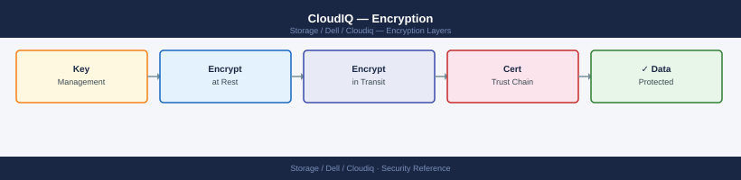

---
tags:
  - dell
  - security
---
# CloudIQ — Encryption

CloudIQ data encryption settings, key management integration, and encryption compliance reporting.

*Applies to: CloudIQ*

> Part of the [CloudIQ](../index.md) reference.

---

| Layer | Protection |
|---|---|
| Telemetry in transit (SCG to Dell) | TLS 1.2 or higher; certificate-pinned connection from SCG to Dell SRS endpoint |
| Telemetry at rest (Dell cloud) | Encrypted at rest in Dell's cloud infrastructure |
| Portal access | HTTPS (TLS 1.2+); sessions protected by Dell's cloud infrastructure |
| Data content | Telemetry contains configuration metadata and performance statistics only — no user data, file contents, or host data is transmitted |

CloudIQ telemetry does not include: file names, directory paths, user credentials, application data, or any content stored on the managed arrays.

## Before you begin

- **Access:** Storage admin credentials (cluster admin or equivalent)
- **Change management:** security changes require CAB approval in most environments
- **Rollback plan:** document current state before any security control change
- **Testing:** validate in a non-production environment first where possible

---

---

## See also

- [Cloudiq — Hardening](hardening/)
- [Cloudiq — Authentication](authentication/)
- [Cloudiq — Access Control](access-control/)
