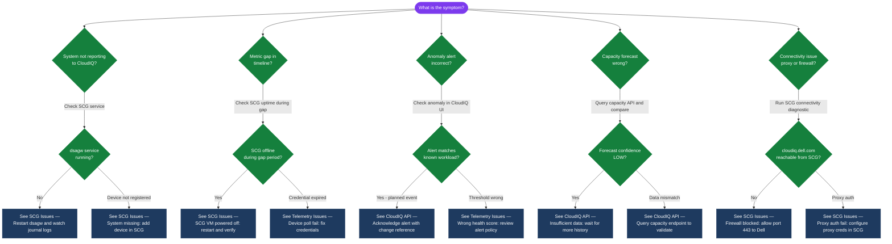

---
tags:
  - dell
  - troubleshooting
search:
  boost: 1.5
---
# Dell CloudIQ Common Issues


```bash
# SSH to the SCG appliance
ssh admin@<scg-mgmt-ip>

# Check the core telemetry forwarding service
systemctl status dsagw

# If stopped or failed — restart it
systemctl restart dsagw

# Watch logs live for telemetry errors
journalctl -u dsagw -f
# Look for: "connection refused", "TLS handshake failed", "authentication error"
```

```bash
# Reproduce the failure with verbose output
CLIENT_ID="<your-client-id>"
CLIENT_SECRET="<your-client-secret>"

curl -v -X POST "https://cloudiq.apis.dell.com/auth/oauth/v2/token" \
  -H "Content-Type: application/x-www-form-urlencoded" \
  -d "grant_type=client_credentials&client_id=${CLIENT_ID}&client_secret=${CLIENT_SECRET}"

# Common error responses:
# HTTP 401: invalid_client — wrong client_id or client_secret
# HTTP 400: invalid_grant — grant_type value incorrect (must be 'client_credentials')
# HTTP 403: forbidden — credential exists but has been revoked or expired
```
```bash
# Step 1: Test the webhook endpoint externally (from a machine that has internet access)
curl -X POST "<your-webhook-url>" \
  -H "Content-Type: application/json" \
  -d '{"test": true, "source": "cloudiq-test"}' \
  -v

# Expected: HTTP 200 (or 201) response from the endpoint
# If HTTP 000 or connection refused: the endpoint is not reachable from the internet
# If HTTP 4xx: the endpoint is reachable but the payload format or auth is wrong

# Step 2: Review webhook configuration in CloudIQ
# Settings → Notifications → Webhook → inspect the endpoint URL and any custom headers

# Step 3: Send a test notification from CloudIQ
# Settings → Notifications → Webhook → Send Test
# Then check the endpoint for the incoming request

# Step 4: For ServiceNow webhook failures — check the ServiceNow scripted REST API logs:
# ServiceNow → System Log → Application Logs → filter by "cloudiq" or the REST API script name
```
```bash
# Query current capacity state to validate against CloudIQ forecast
TOKEN="<your-token>"
BASE="https://cloudiq.apis.dell.com/rest/v1"
SYSTEM_ID="<your-system-id>"

curl -s -X GET "${BASE}/systems/${SYSTEM_ID}/capacity" \
  -H "Authorization: Bearer ${TOKEN}" | python3 -m json.tool

# Key fields to check:
# total_subscribed_capacity_gb — logical allocated to hosts (thin provisioning)
# total_used_capacity_gb       — physical data actually written
# total_physical_capacity_gb   — total raw usable
# percent_used                 — physical used percentage
# days_to_full                 — forecast horizon
# forecast_confidence          — LOW/MEDIUM/HIGH; LOW means insufficient data
```
```bash
# Full SCG connectivity diagnostic sequence
# Run on the SCG appliance (SSH as admin)

echo "=== dsagw service status ==="
systemctl status dsagw

echo "=== DNS resolution ==="
nslookup cloudiq.dell.com
nslookup esrs3.emc.com

echo "=== Network connectivity ==="
curl -k --max-time 10 https://cloudiq.dell.com && echo "cloudiq.dell.com: REACHABLE" || echo "cloudiq.dell.com: UNREACHABLE"
curl -k --max-time 10 https://esrs3.emc.com   && echo "esrs3.emc.com: REACHABLE"   || echo "esrs3.emc.com: UNREACHABLE"

echo "=== Registered devices ==="
dsagw list-devices 2>/dev/null || echo "dsagw CLI not available — check SCG web UI"

echo "=== Recent dsagw log errors ==="
journalctl -u dsagw --since "1 hour ago" | grep -iE "error|fail|refused|timeout" | tail -20
```
```bash
# Acknowledge an anomaly alert (dismiss as known/planned)
ALERT_ID="<alert-id>"
curl -s -X PATCH "${BASE}/alerts/${ALERT_ID}" \
  -H "Authorization: Bearer ${TOKEN}" \
  -H "Content-Type: application/json" \
  -d '{
    "state": "ACKNOWLEDGED",
    "acknowledge_note": "Known: scheduled batch workload spike. CHG0012345"
  }' | python3 -m json.tool
```

```d2
direction: down

symptom: Identify Symptom {shape: diamond}
diagnostic_flow: "Diagnostic Flow" {shape: rectangle}
verify_resolution: "Verify resolution" {shape: rectangle}
resolution: Resolve or Escalate {shape: oval}

symptom -> diagnostic_flow: investigate
symptom -> verify_resolution: investigate
diagnostic_flow -> resolution
verify_resolution -> resolution
```

## Diagnostic Flow



---

## Before you begin

- **Access:** Storage admin credentials (cluster admin or equivalent)
- **Gather first:** recent error message text, event timestamps, and affected object names
- **Scope:** confirm whether the issue affects a single object, host, cluster, or site
- **Escalation:** open a vendor support ticket before running any destructive step
- **Logging:** document each command and output — required if escalation is needed

---

---

## Verify resolution

- Confirm the original symptom no longer occurs
- Check logs for any residual errors related to the issue
- Monitor for 10–15 minutes to confirm the fix is stable

---

## See also

- [Cloudiq — Diagnostics](diagnostics/)
- [Cloudiq — Escalation](escalation/)
- [Cloudiq — Health Checks](../operations/health-checks/)
