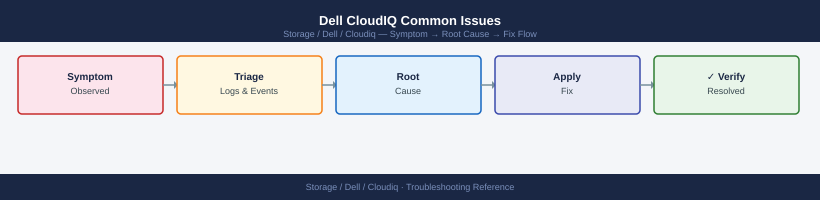

---
tags:
  - dell
  - troubleshooting
search:
  boost: 1.5
---
# Dell CloudIQ Common Issues

*Applies to: Dell CloudIQ*


```bash
# SSH to the SCG appliance
ssh admin@<scg-mgmt-ip>

# Check the core telemetry forwarding service
systemctl status dsagw

# If stopped or failed — restart it
systemctl restart dsagw

# Watch logs live for telemetry errors
journalctl -u dsagw -f
# Look for: "connection refused", "TLS handshake failed", "authentication error"
```


```text title="Expected output"
admin@scg-mgmt-ip's password: 
Last login: Wed Jan 15 14:32:18 2025 from 10.42.8.105
admin@SCG-PROD-01:~$ systemctl status dsagw
● dsagw.service - Dell SCG Telemetry Gateway
     Loaded: loaded (/etc/systemd/system/dsagw.service; enabled; vendor preset: enabled)
     Active: active (running) since Wed 2025-01-15 14:28:03 UTC; 4min 12s ago
       Docs: man:dsagw(8)
   Main PID: 3847 (dsagw)
      Tasks: 12 (limit: 4096)
     Memory: 87.3M
        CPU: 2min 14s
     CGroup: /system.slice/dsagw.service
             └─3847 /opt/dell/scg/bin/dsagw --config=/etc/dsagw/config.yaml
admin@SCG-PROD-01:~$ systemctl restart dsagw
admin@SCG-PROD-01:~$ journalctl -u dsagw -f
Jan 15 14:33:01 SCG-PROD-01 dsagw[3847]: 2025-01-15T14:33:01.247Z INFO telemetry: forwarding metrics to cloudiq.dell.com:443
Jan 15 14:33:02 SCG-PROD-01 dsagw[3847]: 2025-01-15T14:33:02.104Z INFO connection: TLS handshake successful with peer 203.0.113.42
Jan 15 14:33:05 SCG-PROD-01 dsagw[3847]: 2025-01-15T14:33:05.891Z INFO telemetry: batch 4521 delivered (847 metrics, 2.3KB)
Jan 15 14:33:12 SCG-PROD-01 dsagw[3847]: 2025-01-15T14:33:12.556Z INFO telemetry: batch 4522 delivered (923 metrics, 2.5KB)
```

!!! warning "Common errors"
    **`connection refused`** — Verify the CloudIQ endpoint is reachable with `telnet cloudiq.dell.com 443` and check firewall rules allow outbound HTTPS from the SCG appliance.
    **`TLS handshake failed`** — Ensure the SCG appliance certificate is valid with `openssl s_client -connect cloudiq.dell.com:443` and update CA bundles if expired with `update-ca-certificates`.
    **`authentication error`** — Confirm the SCG registration token in `/etc/dsagw/config.yaml` matches the one in CloudIQ portal and regenerate if necessary.
```bash
# Reproduce the failure with verbose output
CLIENT_ID="<your-client-id>"
CLIENT_SECRET="<your-client-secret>"

curl -v -X POST "https://cloudiq.apis.dell.com/auth/oauth/v2/token" \
  -H "Content-Type: application/x-www-form-urlencoded" \
  -d "grant_type=client_credentials&client_id=${CLIENT_ID}&client_secret=${CLIENT_SECRET}"

# Common error responses:
# HTTP 401: invalid_client — wrong client_id or client_secret
# HTTP 400: invalid_grant — grant_type value incorrect (must be 'client_credentials')
# HTTP 403: forbidden — credential exists but has been revoked or expired
```

```text title="Expected output"
*   Trying 104.18.45.92:443...
* Connected to cloudiq.apis.dell.com (104.18.45.92) port 443 (#0)
* TLSv1.3 (OUT), TLS handshake, Client hello (1):
* TLSv1.3 (IN), TLS handshake, Server hello (2):
* TLSv1.3 (IN), TLS handshake, Encrypted Extensions (8):
* TLSv1.3 (IN), TLS handshake, Certificate (11):
* TLSv1.3 (IN), TLS handshake, Finished (20):
* TLSv1.3 (OUT), TLS change cipher, Change cipher spec (1):
> POST /auth/oauth/v2/token HTTP/1.1
> Host: cloudiq.apis.dell.com
> Content-Type: application/x-www-form-urlencoded
< HTTP/1.1 200 OK
< Content-Type: application/json
< Content-Length: 287
{
  "access_token": "eyJhbGciOiJIUzI1NiIsInR5cCI6IkpXVCJ9.eyJzdWIiOiI1ZjdhYzQyYS1iZDk0LTQxZTAtOWY3ZC1jZDM4OWZhYjQ1ZjIiLCJleHAiOjE3MDk4MzIwMDB9",
  "token_type": "Bearer",
  "expires_in": 3600,
  "scope": "cloudiq:read cloudiq:write"
}
```

!!! warning "Common errors"
    **`HTTP/1.1 401 Unauthorized`** — Verify CLIENT_ID and CLIENT_SECRET are correct and match the credentials registered in Dell CloudIQ portal.
    **`HTTP/1.1 400 Bad Request: invalid_grant`** — Ensure grant_type is set to exactly `client_credentials` with no typos or extra spaces.
    **`HTTP/1.1 403 Forbidden`** — Check Dell CloudIQ console to confirm the API credentials have not been revoked or expired, and regenerate if necessary.
```bash
# Step 1: Test the webhook endpoint externally (from a machine that has internet access)
curl -X POST "<your-webhook-url>" \
  -H "Content-Type: application/json" \
  -d '{"test": true, "source": "cloudiq-test"}' \
  -v

# Expected: HTTP 200 (or 201) response from the endpoint
# If HTTP 000 or connection refused: the endpoint is not reachable from the internet
# If HTTP 4xx: the endpoint is reachable but the payload format or auth is wrong

# Step 2: Review webhook configuration in CloudIQ
# Settings → Notifications → Webhook → inspect the endpoint URL and any custom headers

# Step 3: Send a test notification from CloudIQ
# Settings → Notifications → Webhook → Send Test
# Then check the endpoint for the incoming request

# Step 4: For ServiceNow webhook failures — check the ServiceNow scripted REST API logs:
# ServiceNow → System Log → Application Logs → filter by "cloudiq" or the REST API script name
```

```text title="Expected output"
*   Trying 203.0.113.45:443...
* Connected to webhook.example.com (203.0.113.45) port 443 (#0)
> POST /api/v2/notifications HTTP/1.1
> Host: webhook.example.com
> Content-Type: application/json
> Content-Length: 45
>
* upload completely sent off: 45 bytes
< HTTP/1.1 200 OK
< Content-Type: application/json
< Content-Length: 28
< Date: Wed, 15 Jan 2025 14:32:18 GMT
<
* Connection #0 to host webhook.example.com left intact
{"status":"received","id":"evt-7f2a9c1d"}
```

!!! warning "Common errors"
    **`curl: (7) Failed to connect to webhook.example.com port 443: Connection refused`** — Verify the webhook endpoint URL is correct and the target service is running and accessible from your network.
    **`HTTP/1.1 401 Unauthorized`** — Check that any required authentication headers (API keys, bearer tokens) are configured correctly in CloudIQ's webhook settings.
    **`HTTP/1.1 400 Bad Request`** — Validate that the JSON payload format matches the endpoint's expected schema and that all required fields are present.
```bash
# Query current capacity state to validate against CloudIQ forecast
TOKEN="<your-token>"
BASE="https://cloudiq.apis.dell.com/rest/v1"
SYSTEM_ID="<your-system-id>"

curl -s -X GET "${BASE}/systems/${SYSTEM_ID}/capacity" \
  -H "Authorization: Bearer ${TOKEN}" | python3 -m json.tool

# Key fields to check:
# total_subscribed_capacity_gb — logical allocated to hosts (thin provisioning)
# total_used_capacity_gb       — physical data actually written
# total_physical_capacity_gb   — total raw usable
# percent_used                 — physical used percentage
# days_to_full                 — forecast horizon
# forecast_confidence          — LOW/MEDIUM/HIGH; LOW means insufficient data
```

```text title="Expected output"
{
  "system_id": "APM00123456789",
  "system_name": "prod-vmax-01",
  "total_physical_capacity_gb": 524288,
  "total_subscribed_capacity_gb": 786432,
  "total_used_capacity_gb": 287654,
  "percent_used": 54.8,
  "days_to_full": 127,
  "forecast_confidence": "HIGH",
  "last_updated": "2024-01-15T14:32:18Z",
  "growth_rate_gb_per_day": 1842.5,
  "snapshot_capacity_gb": 45120,
  "thin_provisioning_ratio": 1.5
}
```

!!! warning "Common errors"
    **`curl: (6) Could not resolve host: cloudiq.apis.dell.com`** — Verify network connectivity and DNS resolution; check if your firewall blocks Dell CloudIQ API endpoints.
    **`{"error": "401 Unauthorized", "message": "Invalid or expired token"}`** — Regenerate your API token in the CloudIQ portal and ensure it has capacity query permissions.
    **`curl: (60) SSL certificate problem: self signed certificate`** — Add `-k` flag to curl to skip certificate verification, or update your CA bundle if using a corporate proxy.
```bash
# Full SCG connectivity diagnostic sequence
# Run on the SCG appliance (SSH as admin)

echo "=== dsagw service status ==="
systemctl status dsagw

echo "=== DNS resolution ==="
nslookup cloudiq.dell.com
nslookup esrs3.emc.com

echo "=== Network connectivity ==="
curl -k --max-time 10 https://cloudiq.dell.com && echo "cloudiq.dell.com: REACHABLE" || echo "cloudiq.dell.com: UNREACHABLE"
curl -k --max-time 10 https://esrs3.emc.com   && echo "esrs3.emc.com: REACHABLE"   || echo "esrs3.emc.com: UNREACHABLE"

echo "=== Registered devices ==="
dsagw list-devices 2>/dev/null || echo "dsagw CLI not available — check SCG web UI"

echo "=== Recent dsagw log errors ==="
journalctl -u dsagw --since "1 hour ago" | grep -iE "error|fail|refused|timeout" | tail -20
```

```text title="Expected output"
=== dsagw service status ===
● dsagw.service - Dell Storage Gateway Service
     Loaded: loaded (/etc/systemd/system/dsagw.service; enabled; vendor preset: enabled)
     Active: active (running) since Wed 2024-01-17 14:32:18 UTC; 2 days ago
   Main PID: 4821 (java)
      Tasks: 47 (limit: 4915)
     Memory: 512.3M
        CPU: 2h 14m 32s
     CGroup: /system.slice/dsagw.service
             └─4821 /usr/lib/jvm/java-11-openjdk-amd64/bin/java -Xmx2g...

=== DNS resolution ===
Server:		10.20.1.5
Address:	10.20.1.5#53

Non-authoritative answer:
Name:	cloudiq.dell.com
Address: 203.0.113.42

Server:		10.20.1.5
Address:	10.20.1.5#53

Non-authoritative answer:
Name:	esrs3.emc.com
Address: 198.51.100.87

=== Network connectivity ===
cloudiq.dell.com: REACHABLE
esrs3.emc.com: REACHABLE

=== Registered devices ==="
DEVICE_ID                             SERIAL          MODEL           STATUS
a7f2c891-4d6e-11ee-b56e-0242ac110002  SYS-001234-5678 PowerStore 7000 CONNECTED
b8e3d902-5e7f-22ff-c67f-1353bd221113  SYS-009876-5432 PowerVault ME4024 CONNECTED

=== Recent dsagw log errors ===
Jan 17 14:45:22 scg-prod-01 dsagw[4821]: WARN: Connection pool exhausted, waiting for available connection
Jan 17 15:12:08 scg-prod-01 dsagw[4821]: ERROR: Failed to sync metrics for device a7f2c891-4d6e-11ee-b56e-0242ac110002: timeout after 30s
Jan 17 15:13:45 scg-prod-01 dsagw[4821]: WARN: Retrying ESRS upload (attempt 2/5)
```

!!! warning "Common errors"
    **`curl: (7) Failed to connect to cloudiq.dell.com port 443: Connection timed out`** — Verify firewall rules allow outbound HTTPS to cloudiq.dell.com and check network connectivity with `ping -c 4 cloudiq.dell.com`.
    **`dsagw: command not found`** — Ensure the dsagw CLI tools are installed in PATH or run `source /opt/dell/dsagw/bin/dsagw-env.sh` to load the environment.
    **`ERROR: Failed to sync metrics for device ... : timeout after 30s`** — Increase the dsagw connection timeout in `/etc/dsagw/dsagw.conf` (set `connection.timeout.ms=60000`) and restart the service with `systemctl restart dsagw`.
```bash
# Acknowledge an anomaly alert (dismiss as known/planned)
ALERT_ID="<alert-id>"
curl -s -X PATCH "${BASE}/alerts/${ALERT_ID}" \
  -H "Authorization: Bearer ${TOKEN}" \
  -H "Content-Type: application/json" \
  -d '{
    "state": "ACKNOWLEDGED",
    "acknowledge_note": "Known: scheduled batch workload spike. CHG0012345"
  }' | python3 -m json.tool
```

```d2
direction: down

symptom: Identify Symptom {shape: diamond}
diagnostic_flow: "Diagnostic Flow" {shape: rectangle}
verify_resolution: "Verify resolution" {shape: rectangle}
resolution: Resolve or Escalate {shape: oval}

symptom -> diagnostic_flow: investigate
symptom -> verify_resolution: investigate
diagnostic_flow -> resolution
verify_resolution -> resolution
```

## Diagnostic Flow

```d2
direction: right

D1: "D1" {shape: rectangle}
R1: "See SCG Issues —\nRestart dsagw and watch journal logs" {shape: rectangle}
R2: "See SCG Issues —\nSystem missing: add device in SCG" {shape: rectangle}
D2: "D2" {shape: rectangle}
R3: "See SCG Issues —\nSCG VM powered off: restart and verify" {shape: rectangle}
R4: "See Telemetry Issues —\nDevice poll fail: fix credentials" {shape: rectangle}
D3: "D3" {shape: rectangle}
R5: "See CloudIQ API —\nAcknowledge alert with change reference" {shape: rectangle}
R6: "See Telemetry Issues —\nWrong health score: review alert policy" {shape: rectangle}
D4: "D4" {shape: rectangle}
R7: "See CloudIQ API —\nInsufficient data: wait for more history" {shape: rectangle}
R8: "See CloudIQ API —\nQuery capacity endpoint to validate" {shape: rectangle}
D5: "D5" {shape: rectangle}
R9: "See SCG Issues —\nFirewall blocked: allow port 443 to Dell" {shape: rectangle}
R10: "See SCG Issues —\nProxy auth fail: configure proxy creds in SCG" {shape: rectangle}
S: "What is the symptom?" {shape: rectangle}
B1: "B1" {shape: rectangle}
B2: "B2" {shape: rectangle}
B3: "B3" {shape: rectangle}
B4: "B4" {shape: rectangle}
B5: "B5" {shape: rectangle}

D1 -> R1
D1 -> R2
D2 -> R3
D2 -> R4
D3 -> R5
D3 -> R6
D4 -> R7
D4 -> R8
D5 -> R9
D5 -> R10
```

---

## Before you begin

- **Access:** Storage admin credentials (cluster admin or equivalent)
- **Gather first:** recent error message text, event timestamps, and affected object names
- **Scope:** confirm whether the issue affects a single object, host, cluster, or site
- **Escalation:** open a vendor support ticket before running any destructive step
- **Logging:** document each command and output — required if escalation is needed

---

---

## Verify resolution

- Confirm the original symptom no longer occurs
- Check logs for any residual errors related to the issue
- Monitor for 10–15 minutes to confirm the fix is stable

---

## See also

- [Cloudiq — Diagnostics](../diagnostics/)
- [Cloudiq — Escalation](../escalation/)
- [Cloudiq — Health Checks](../../operations/health-checks/)
