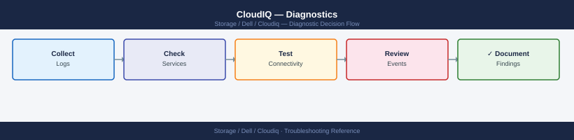
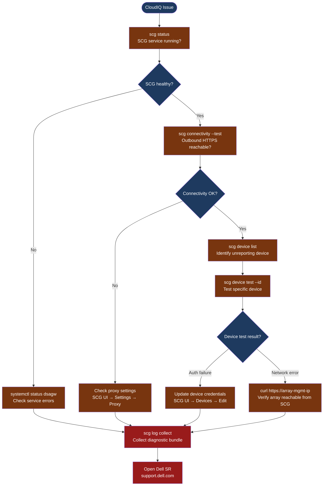

---
tags:
  - dell
  - troubleshooting
search:
  boost: 1.5
---
# CloudIQ — Diagnostics

<div class="kb-summary">
CloudIQ diagnostic commands: check SCG service health, test outbound connectivity, verify per-device polling, collect log bundles, and diagnose proxy-related connectivity failures.

*Applies to: Dell CloudIQ / Secure Connect Gateway (SCG)*
</div>





```d2
direction: down

symptom: Identify Symptom {shape: diamond}
step_1_check_scg_service_health: "Step 1 — Check SCG service health" {shape: rectangle}
step_2_test_outbound_connectivity_to: "Step 2 — Test outbound connectivity to CloudIQ" {shape: rectangle}
step_3_list_and_test_devices: "Step 3 — List and test devices" {shape: rectangle}
step_4_read_scg_log_files: "Step 4 — Read SCG log files" {shape: rectangle}
step_5_collect_support_bundle: "Step 5 — Collect support bundle" {shape: rectangle}
log_locations: "Log locations" {shape: rectangle}
resolution: Resolve or Escalate {shape: oval}

symptom -> step_1_check_scg_service_health: investigate
symptom -> step_2_test_outbound_connectivity_to: investigate
symptom -> step_3_list_and_test_devices: investigate
symptom -> step_4_read_scg_log_files: investigate
symptom -> step_5_collect_support_bundle: investigate
symptom -> log_locations: investigate
step_1_check_scg_service_health -> resolution
step_2_test_outbound_connectivity_to -> resolution
step_3_list_and_test_devices -> resolution
step_4_read_scg_log_files -> resolution
step_5_collect_support_bundle -> resolution
log_locations -> resolution
```

## Before you begin

- **Access:** SSH to the SCG appliance as `admin`; SCG web UI (`https://<scg-ip>`); CloudIQ portal (`cloudiq.dell.com`) with admin role
- **Gather first:** which specific arrays are not reporting in CloudIQ, how long the gap has been, and the SCG version from SCG UI → Settings → About
- **Scope:** confirm whether the issue affects all arrays (SCG or outbound problem) or a specific array (device credential or network problem)
- **Proxy note:** if the SCG is behind a proxy, all outbound connectivity tests must route through it — verify the proxy allows HTTPS to `cloudiq.dell.com` and `esrs3.emc.com` on port 443

---

## Step 1 — Check SCG service health

```bash
# SSH to the SCG appliance
ssh admin@<scg-ip>

# Check SCG service status
scg status
# Expected output (healthy):
#   SCG Service: Running
#   Version: <version>
#   Connected to CloudIQ: Yes
#   Last sync: <timestamp within last 15 minutes>

# Check the underlying dsagw gateway service
systemctl status dsagw
# Expected: active (running); no recent restart loops
# If status shows failed: check dsagw log with journalctl -u dsagw -n 100

# Check disk space on SCG appliance
df -h /
# SCG log accumulation can fill disk; alert if < 20% free
```

**If SCG service is not running:**
1. `systemctl start dsagw` to restart; wait 30 seconds and re-check `scg status`
2. If service fails to start: check `/var/log/dsagw/` for startup errors
3. If disk is full: `du -sh /var/log/dsagw/*` to identify large log files

---

## Step 2 — Test outbound connectivity to CloudIQ

```bash
# Test HTTPS connectivity to all required CloudIQ endpoints
scg connectivity --test
# Expected: all endpoints show "Reachable"
# If any show "Unreachable" or "Timeout" — the proxy or firewall is blocking traffic

# Manual connectivity test (if scg tool is unavailable)
curl -v --max-time 30 https://cloudiq.dell.com
# Expected: TLS handshake succeeds; HTTP 200 or redirect

# Test legacy ESRS endpoint (required for some SCG versions)
curl -v --max-time 30 https://esrs3.emc.com
# Expected: TLS handshake succeeds; HTTP response

# Check DNS resolution for CloudIQ
nslookup cloudiq.dell.com
# Expected: resolves to a public IP address (not NXDOMAIN or SERVFAIL)

# Check proxy configuration (if proxy is in use)
env | grep -i proxy
# Compare to SCG UI → Settings → Proxy settings
```

**If connectivity test fails:**
1. Verify the proxy is configured correctly in SCG UI → Settings → Proxy
2. Test proxy connectivity directly: `curl -v --proxy http://<proxy-host>:<port> https://cloudiq.dell.com`
3. Engage the network team to confirm outbound HTTPS is allowed from the SCG IP to cloudiq.dell.com

---

## Step 3 — List and test devices

```bash
# List all devices registered with SCG
scg device list
# Output columns: Device ID, Name, Type, Status, Last Poll Time
# Look for: devices with Status = "Error" or Last Poll Time = stale (> 60 minutes ago)

# Test connectivity to a specific device
scg device test --id <device_id>
# Expected: Authentication OK; API reachable
# Failure output includes: the specific error (auth failed, connection refused, TLS error)

# For arrays with management interfaces — test directly from SCG
curl -sk https://<array-management-ip>/
# Expected: HTTP 200 (or redirect to login) from the array management API
# If connection refused: the SCG cannot reach the array management interface

# For PowerStore / Unity — test specific API
curl -sk -u admin:<password> "https://<array-ip>/api/rest/system?fields=name,model"
# Expected: JSON with system name and model

# Verify SCG polling interval
# SCG UI → Settings → Polling Interval (default: 5 minutes)
```

---

## Step 4 — Read SCG log files

```bash
# Live SCG application log
tail -100 /var/log/scg/scg.log | grep -i "error\|fail\|warn"
# Shows: polling errors, upload failures, authentication issues per device

# dsagw telemetry gateway log (uploads to CloudIQ)
tail -100 /var/log/dsagw/dsagw.log | grep -i "error\|fail\|connection"
# Shows: TLS handshake errors, proxy errors, connection resets

# SCG telemetry forwarding logs (per-device)
ls -lth /var/log/dsagw/
# Files named by device; check the specific device's log file

# System journal for service crashes
journalctl -u dsagw -n 100 --no-pager
journalctl -u scg -n 100 --no-pager 2>/dev/null || true

# All-in-one diagnostic snapshot
{
  echo "=== scg status ==="
  scg status
  echo "=== scg connectivity --test ==="
  scg connectivity --test
  echo "=== scg device list ==="
  scg device list
  echo "=== disk space ==="
  df -h /
  echo "=== dsagw service ==="
  systemctl status dsagw
} > /tmp/cloudiq-diag-$(date +%F-%H%M).txt
```

---

## Step 5 — Collect support bundle

```bash
# Collect the full SCG diagnostic bundle for Dell SR
scg log collect --output /tmp/scg-bundle-$(date +%F).tar.gz
# The bundle includes: application logs, device poll history, config (credentials sanitised), system info

# Download from SCG via SCP
scp admin@<scg-ip>:/tmp/scg-bundle-*.tar.gz /tmp/
```

---

## Log locations

| Component | Path | What to look for |
|---|---|---|
| SCG application | `/var/log/scg/scg.log` | Polling errors, device auth failures |
| dsagw gateway | `/var/log/dsagw/dsagw.log` | TLS errors, upload failures to CloudIQ |
| Per-device telemetry | `/var/log/dsagw/<device-id>.log` | Per-system polling detail |
| CloudIQ audit log | CloudIQ portal → Admin → Audit Log | API calls, user actions, config changes |

---

## See also

- [CloudIQ — Common Issues](common-issues/)
- [CloudIQ — Escalation](escalation/)
- [CloudIQ — Health Checks](../operations/health-checks/)

## Verify resolution

- `scg status` shows `Connected to CloudIQ: Yes` with a recent `Last sync` timestamp
- `scg connectivity --test` shows all endpoints as `Reachable`
- `scg device list` shows all devices with `Status = OK` and `Last Poll Time` within the last poll cycle
- In CloudIQ portal: the previously missing systems appear in the Systems page with current data
- Monitor for 2 poll cycles (typically 10 minutes) to confirm stable reporting
