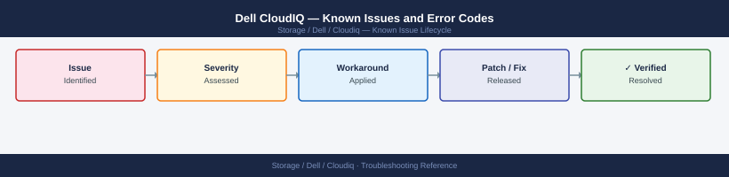

---
tags:
  - troubleshooting
  - cloudiq
  - dell
  - known-issues
---
# Dell CloudIQ — Known Issues and Error Codes

<div class="kb-summary">
Catalog of known CloudIQ bugs, error codes, and workarounds. CloudIQ is a SaaS platform — most issues are phone-home connectivity from on-premises arrays or SaaS portal access.

*Applies to: Dell CloudIQ SaaS*
</div>



```d2
direction: down

symptom: Identify Symptom {shape: diamond}
array_connectivity: "Array Connectivity" {shape: rectangle}
portal: "Portal" {shape: rectangle}
resolution: Resolve or Escalate {shape: oval}

symptom -> array_connectivity: investigate
symptom -> portal: investigate
array_connectivity -> resolution
portal -> resolution
```

## Before you begin

- CloudIQ phone-home uses outbound TCP 443 from array management IPs to `cloudiq.dell.com` and `esrs.dell.com`.
- Array connectivity issues show as `Array offline` in CloudIQ portal.
- Portal issues: check `status.dell.com` for CloudIQ outage status.

## Array Connectivity

| Error / Symptom | Affected Versions | Cause | Workaround / Fix | Fixed In |
|---|---|---|---|---|
| Array shows `Offline` in CloudIQ | Any | TCP 443 blocked from array management IP to cloudiq.dell.com | Open firewall; verify: `curl -sk https://cloudiq.dell.com` from array management network | N/A |
| Data stale in CloudIQ despite array healthy | Any | ESRS gateway connectivity intermittent | Check ESRS gateway (on-premises connector) status; restart ESRS gateway service | N/A |
| Array registered but no metrics visible | Any | Initial data collection takes up to 24 hours | Wait 24 hours post-registration before raising issue | N/A |

## Portal

| Error / Symptom | Affected Versions | Cause | Workaround / Fix | Fixed In |
|---|---|---|---|---|
| `Login failed` to cloudiq.dell.com | N/A | SSO provider (Dell SSO) unavailable | Check `status.dell.com`; try alternate browser; clear cookies | N/A |
| Alert emails not arriving | N/A | Notification rule disabled or email filter | Check CloudIQ → Notification Rules; verify email not in spam | N/A |

## See also

- [Dell CloudIQ — Common Issues](common-issues/)
- [Dell PowerStore — Known Issues](../../powerstore/troubleshooting/known-issues.md)
