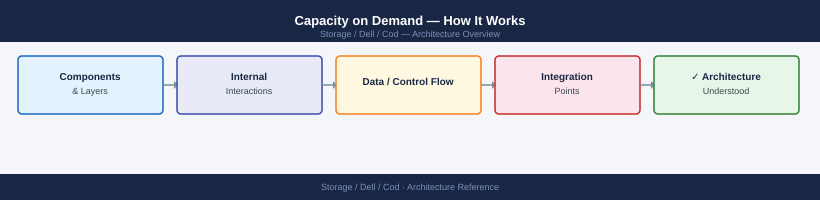
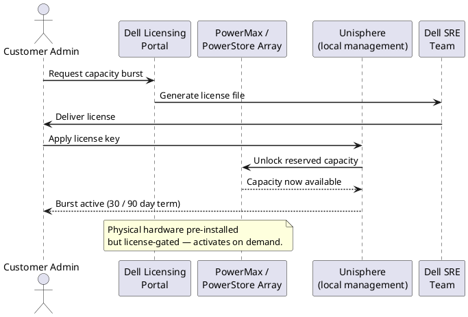
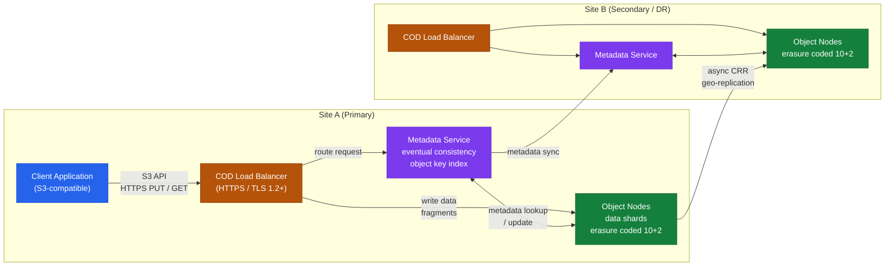

---
tags:
  - architecture
  - dell
---
# Capacity on Demand — How It Works

<div class="kb-summary">
How It Works reference covering Overview, Capacity Model, Object Storage Data Model, Data Protection Architecture, Multi-Site and Geo Replication, Access Control and Authentication, Namespace and Metadata Service, HA and Redundancy, Activation Flow, DR Site COD Architecture.

*Applies to: Cloud for Desktop (COD)*
</div>




## Overview

Capacity on Demand (COD) is a software-defined capacity licensing model for Dell PowerMax and VMAX arrays. Physical drives are installed in the array chassis at the factory but the capacity is logically locked at the array controller level until a COD license is applied. No truck roll or hardware change is required — activation is entirely software-driven through SYMCLI or Unisphere.

## Capacity Model

```d2
direction: right

ARRAY: "Dell Array\nPowerStore / PowerMax\n(on-premises" {shape: rectangle}
APEX: "Dell APEX\nCloud Console" {shape: rectangle}
ADMIN: "Storage Admin" {shape: rectangle}

ARRAY -> APEX
ADMIN -> APEX
```

## Object Storage Data Model

Dell COD object storage organises data using a flat namespace of **buckets** and **objects** rather than a traditional filesystem hierarchy.

**Buckets** are namespace containers — top-level logical partitions that hold objects. Each bucket is bound to a region and fault zone. Bucket names must be globally unique within the namespace. Buckets carry configuration metadata such as versioning policy, lifecycle rules, replication targets, and access policy.

**Objects** consist of three parts: the payload (arbitrary binary data, up to 5 TB per object in multipart mode), a system-assigned or user-provided **unique key** (the object name within a bucket), and user-defined and system-generated **metadata** stored as key-value pairs. Metadata is indexed separately from data for fast lookup.

**Regions and fault zones** map to physical data centre boundaries. Each region contains multiple fault zones (equivalent to availability zones). Object placement policy determines how many fault zones receive data shards. Objects written within a single region can be accessed from any node in that region without cross-site latency.

**S3 API compatibility** — COD exposes the Amazon S3 API surface including `PutObject`, `GetObject`, `DeleteObject`, `ListBuckets`, `ListObjects`, `CreateBucket`, and multipart upload operations. Applications built against S3 run against COD without code changes, requiring only an endpoint URL change. Object Lock (WORM) and versioning are also supported.

## Data Protection Architecture

COD uses **erasure coding** rather than traditional RAID to protect data. Erasure coding distributes data and parity fragments across a configurable number of nodes and failure domains so that a defined number of simultaneous failures can be tolerated without data loss.

A common protection profile is **10+2**: 10 data fragments and 2 parity fragments spread across 12 nodes. Any two nodes (or failure domains) can fail simultaneously with full data recovery from the remaining 10 fragments. Higher protection profiles such as 14+4 or 18+4 are available for environments with larger node counts or stricter durability requirements.

**Failure domains** can be configured at the node level, rack level, or site level. The erasure-coding policy enforces that no two fragments from the same stripe land in the same failure domain. This means a full rack power loss does not breach the protection threshold when rack-level failure domains are configured.

There is no traditional RAID group size limitation or rebuild hotspot problem. Rebuild after node loss is distributed across all surviving nodes, limiting per-node rebuild I/O to a small fraction of total cluster bandwidth.

| Protection Profile | Data Fragments | Parity Fragments | Overhead | Simultaneous Failures Tolerated |
|---|---|---|---|---|
| 10+2 | 10 | 2 | ~17% | 2 nodes |
| 14+4 | 14 | 4 | ~22% | 4 nodes |
| 18+4 | 18 | 4 | ~18% | 4 nodes |

## Multi-Site and Geo Replication

COD supports **Cross-Region Replication (CRR)** to synchronise bucket contents across geographically separated sites for DR and compliance purposes.

**Active-passive topology** — one site is the primary write endpoint. Objects written to the primary site are replicated asynchronously to one or more secondary sites. The RPO is a function of replication lag (typically seconds to minutes depending on WAN bandwidth). In a DR event, the secondary site is promoted to active by updating DNS or load-balancer records.

**Active-active topology** — both sites accept writes and replicate bidirectionally. Conflict resolution uses last-write-wins based on object version timestamps. Active-active requires careful application design to avoid write conflicts on the same object key from both sites simultaneously.

**Consistency guarantees** — within a single site, COD provides read-after-write consistency for new object PUTs. Overwrite and delete operations are eventually consistent — a GET issued immediately after a DELETE may transiently return the old version. Across sites in a CRR configuration, consistency is eventual; applications must tolerate replication lag when reading from the secondary site.

Replication rules are configured per bucket and can filter by object key prefix or tag. Bidirectional replication can be scoped to specific prefixes to avoid infinite replication loops.

## Access Control and Authentication

COD access control follows the S3-compatible IAM model.

**IAM users and policies** — administrative users are created with named IAM identities. Permissions are granted through JSON policy documents attached to users or groups. Policies specify allowed or denied actions (`s3:PutObject`, `s3:GetObject`, `s3:DeleteBucket`, etc.) against specific bucket ARNs or key prefixes.

**Access key pairs** — each IAM user can have up to two active access key pairs (Access Key ID + Secret Access Key). Applications authenticate using AWS Signature Version 4 (SigV4) signing with these keys. Keys can be rotated without service interruption by keeping both the old and new key active during a rotation window.

**Bucket policies** — resource-based policies attached directly to a bucket. Bucket policies control which IAM principals (users, roles, anonymous) can perform which operations regardless of the user's IAM policy. Bucket policies are commonly used to enforce that all PutObject requests include server-side encryption, or to grant cross-account read access.

**ACLs** — legacy per-object or per-bucket access control lists. Dell recommends using IAM policies and bucket policies in preference to ACLs for new deployments. ACLs remain available for compatibility with older S3 clients.

**TLS enforcement** — all COD endpoints enforce TLS 1.2 or higher. Plain-text HTTP access can be blocked at the load balancer layer. Certificates can be managed with customer-provided CA certificates or Dell-managed PKI.

## Namespace and Metadata Service

COD separates **object metadata** from **object data** for performance and scalability.

Object metadata — bucket name, object key, content type, custom user metadata tags, ETag (MD5 or SHA-256), version ID, ACL, creation and modification timestamps — is stored in a distributed metadata service that runs independently from the data node layer. This separation means a `HeadObject` or `ListObjects` operation does not require reading any data fragments from storage nodes; it returns from the metadata tier directly.

The metadata service uses an **eventual consistency** model for cross-node propagation. Within a single metadata node, operations are strongly consistent. When a metadata update (object PUT, DELETE, versioning) propagates across the metadata cluster, a short window exists where different metadata nodes may return different responses to concurrent reads. Under normal operating conditions this window is milliseconds; under network partition it can extend until the partition heals.

**Namespace federation** — COD supports logical federation of namespaces across multiple sites. A federated namespace exposes a unified bucket and key namespace to clients while the underlying objects may reside on different regional clusters. Federation is configured through a global namespace service that maps bucket names to owning regions and forwards requests accordingly.

## COD Data Flow and Geo-Replication Architecture



---

## See also

- [Cod — Design Standards](../design-standards/)
- [Cod — Integrations](../integrations/)
