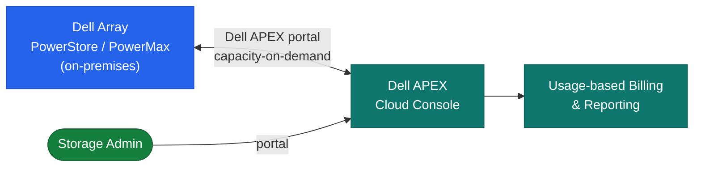

# Capacity on Demand — How It Works

## Overview

Capacity on Demand (COD) is a software-defined capacity licensing model for Dell PowerMax and VMAX arrays. Physical drives are installed in the array chassis at the factory but the capacity is logically locked at the array controller level until a COD license is applied. No truck roll or hardware change is required — activation is entirely software-driven through SYMCLI or Unisphere.

## Capacity Model



```
Total Installed Capacity (physical drives in chassis)
    │
    ├── Committed Active Capacity (baseline purchased)
    │       └── Available immediately — allocated to thin pools
    │
    └── COD Reserved Capacity (pre-installed, license locked)
            └── Unlocked in increments by applying COD license keys
                Each COD increment: 10–50 TiB raw depending on drive type
```

The drives are physically present and spin up normally. Array firmware prevents them from being allocated to any storage pool until the COD entitlement is applied. Activation is instantaneous — there is no data movement or rebuild required to bring COD capacity online.

## HA and Redundancy

COD does not change the HA characteristics of the array. The underlying redundancy (RAID, director mirroring, engine failover) applies equally to COD capacity once activated. COD capacity uses the same dual-director, dual-engine architecture as baseline capacity.

## Activation Flow

1. Identify capacity need — check `symcfg` / Unisphere for current pool utilisation
2. Purchase COD increment — Dell account team issues a license key tied to array SID
3. Download license file from Dell License Portal
4. Apply license via SYMCLI (`symlicense -sid <SID> install -file <license.xml>`) or Unisphere
5. Array discovers new capacity — new devices become available
6. Bind new devices to the appropriate thin pool
7. Verify via `symcfg` that pool capacity has increased
8. Raise change ticket — record activation in CMDB

## DR Site COD Architecture

Pre-install COD capacity at the DR site equal to the production site's expected peak. Under normal operations only the baseline DR capacity is active. On failover or DR test, activate the COD to match full production capacity.

```
Production Site          DR Site
────────────────         ──────────────────────────────
Active: 500 TiB    ──→   Active baseline: 200 TiB
                          COD reserved:   300 TiB  (activated on DR failover)
                          Total after activation: 500 TiB
```
