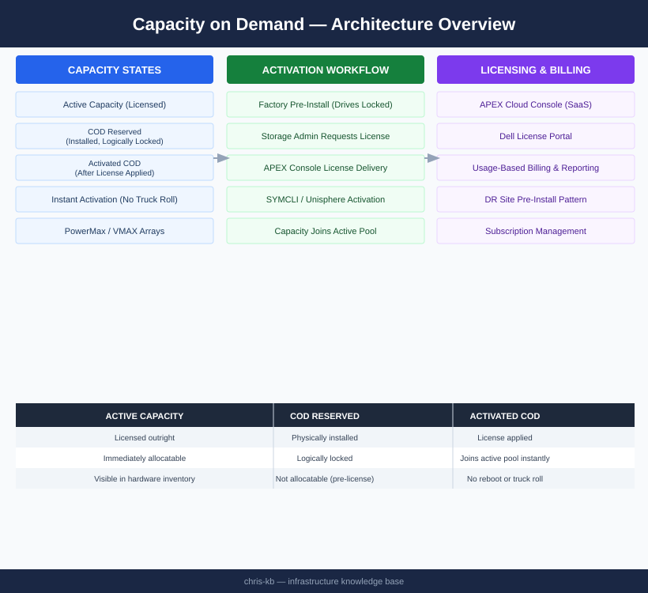

# Capacity on Demand — Architecture

<div class="kb-summary">
Software-defined capacity licensing for Dell PowerMax and VMAX arrays. Physical drives are pre-installed at the factory but logically locked until a COD license is applied — activation is instantaneous via SYMCLI or Unisphere with no truck roll required.
</div>

```text
┌──────────────────────────────────────── Dell COD Architecture ────────────────────────────────────────┐
│                                                                                                       │
│   ┌───────────────────────────────────────────────────────────────────────────────────────────────┐   │
│   │       COD (Capacity On Demand): pre-installed storage capacity unlocked via license key       │   │
│   │   Hardware installed at factory; additional capacity activated instantly with no I/O impact   │   │
│   │                Eliminates future expansion downtime; pay as capacity is needed                │   │
│   │             Supported on PowerStore, PowerMax, Unity, PowerScale product families             │   │
│   └───────────────────────────────────────────────────────────────────────────────────────────────┘   │
│                                                                                                       │
│    Array ships with reserved capacity → license key purchased → capacity unlocked live                │
│                                                                                                       │
│                  ▼                                ▼                                ▼                  │
│                                                                                                       │
│   ┌─────────────────────────────┐  ┌─────────────────────────────┐  ┌─────────────────────────────┐   │
│   │       Pre-installed HW      │  │      License Activation     │  │           Benefits          │   │
│   │      ─────────────────      │  │      ─────────────────      │  │      ─────────────────      │   │
│   │       Drives installed      │  │       License key file      │  │         No downtime         │   │
│   │       Logically locked      │  │       Applied via GUI       │  │        Instant expand       │   │
│   │       No config change      │  │         or REST API         │  │       Predictable cost      │   │
│   │     Physical at install     │  │       Immediate unlock      │  │        No truck roll        │   │
│   │      Validated at ship      │  │      Online activation      │  │       Capacity buffer       │   │
│   └─────────────────────────────┘  └─────────────────────────────┘  └─────────────────────────────┘   │
│                                                                                                       │
│   │     Product      │     COD type     │     Activation    │   Granularity    │    Max units     │   │
│   │ ──────────────── │ ──────────────── │ ───────────────── │ ──────────────── │──────────────────│   │
│   │    PowerStore    │   Capacity COD   │    License key    │      per TB      │      Varies      │   │
│   │     PowerMax     │     COD/FOD      │    License key    │      per TB      │    Model dep     │   │
│   │     Unity XT     │    COD drive     │    License key    │    per drive     │   Per chassis    │   │
│   │    PowerScale    │   Node license   │    License key    │     per node     │   Per cluster    │   │
│                                                                                                       │
│    Physical: drives/nodes present in hardware; logically invisible until license applied              │
│                                                                                                       │
│    Key terms:                                                                                         │
│                                                                                                       │
│    COD          = Capacity On Demand; pre-installed hardware unlocked via license key                 │
│    FOD          = Feature On Demand; software feature (e.g. protocol, function) unlocked similarly    │
│    License key  = Cryptographic string from Dell licensing portal; applied to specific array          │
│    Instant unlock= Capacity available within seconds of applying license; no reboot required          │
│    Capacity buffer= Buying COD upfront avoids lead time delays when capacity is urgently needed       │
│    Truck roll   = Physical site visit to install hardware; COD eliminates this for expansion          │
│    Online activation= COD licensed against specific array serial number; tied to that system          │
│    Logically locked= Drive/node present in hardware inventory but excluded from pool until unlocked   │
│    Validated at ship= Dell verifies all COD hardware functional before shipment                       │
│    No I/O impact= COD activation does not disrupt running workloads; fully online operation           │
│                                                                                                       │
└───────────────────────────────────────────────────────────────────────────────────────────────────────┘
```


<div class="kb-grid kb-grid-3">
<a class="kb-card" href="how-it-works/"><strong>How It Works</strong><span>How it works, integrations, and design standards.</span></a>
<a class="kb-card" href="integrations/"><strong>Integrations</strong><span>Integration with PowerMax, Unisphere, SYMCLI, and Dell License Portal.</span></a>
<a class="kb-card" href="design-standards/"><strong>Design Standards</strong><span>COD activation workflow, DR site pre-install patterns, and license management.</span></a>
</div>

## Capacity States

| State | Description |
|---|---|
| Active capacity | Licensed and immediately allocatable to thin pools and storage groups |
| COD reserved capacity | Physically installed; logically locked — visible in hardware inventory but not allocatable |
| Activated COD | Former reserved capacity after license applied — instantly joins the active pool |

## COD Model


