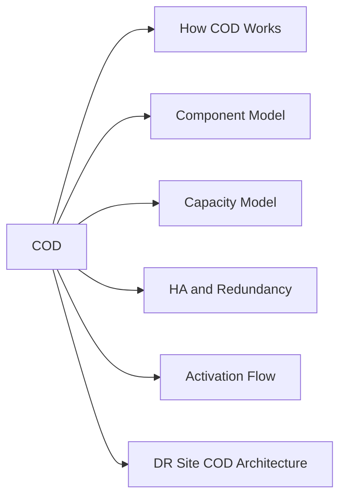

# COD — Architecture



## Overview

Capacity on Demand (COD) is a software-defined capacity licensing model for Dell PowerMax and VMAX arrays. Physical drives are physically installed in the array chassis at the factory or during a hardware add, but the capacity is logically locked at the array controller level until a COD license is applied. No truck roll or hardware change is required to activate reserved capacity — the unlock is entirely software-driven through SYMCLI or Unisphere.

## How COD Works

```
PowerMax Array Chassis
├── Active Capacity (licensed)
│   └── Available to Storage Groups and Thin Pools
└── COD Reserved Capacity (installed but locked)
    └── Appears in hardware inventory but unavailable for use
         └── On COD license activation → instantly joins active capacity pool
```

The drives are physically present and spin up normally. The array firmware prevents them from being allocated to any storage pool until the COD entitlement is applied. Activation is instantaneous — there is no data movement or rebuild required to bring COD capacity online.

## Component Model

| Component | Role |
|---|---|
| PowerMax Frame | Physical chassis containing both active and COD-reserved drives |
| HYPERMAX OS | Array operating system that enforces COD license gating at the director level |
| SYMCLI | Primary CLI for license management and COD activation |
| Unisphere for PowerMax | GUI and REST API layer for COD status and activation |
| Dell License Portal | Entitlement management — where COD license keys are held and downloaded |
| CloudIQ | Capacity forecasting — shows active vs. total installed capacity and COD headroom |
| Solutions Enabler (SE) | Required on the management host to run SYMCLI commands against the array |

## Capacity Model

```
Total Installed Capacity (physical drives in chassis)
    │
    ├── Committed Active Capacity (baseline purchased)
    │       └── Available immediately — allocated to thin pools
    │
    └── COD Reserved Capacity (pre-installed, license locked)
            └── Unlocked in increments by applying COD license keys
                Each COD increment typically: 10–50 TiB raw depending on drive type
```

Capacity pools grow instantly on license activation. No array reboot or reconfiguration is needed. After activation, the newly available drives must be bound into a thin pool or storage group to be usable by hosts.

## HA and Redundancy

COD does not change the HA characteristics of the PowerMax array. The underlying array's redundancy (RAID, director mirroring, engine failover) applies equally to COD capacity once activated. COD capacity is subject to the same dual-director, dual-engine architecture as baseline capacity.

## Activation Flow

```
1. Identify capacity need → check symcfg / Unisphere for current pool utilisation
2. Purchase COD increment → Dell account team issues license key tied to array SID
3. Download license file from Dell License Portal
4. Apply license via SYMCLI or Unisphere
5. Array discovers new capacity → new devices become available
6. Bind new devices to appropriate thin pool
7. Verify via symcfg that pool capacity has increased
8. Raise change ticket — record activation in CMDB
```

## DR Site COD Architecture

A common use pattern is to pre-install COD capacity at the DR site equal to the production site's expected peak. Under normal operations only the baseline DR capacity is active (lower cost). In a failover or declared DR test, COD is activated at the DR site to match full production capacity. This eliminates the risk of insufficient DR capacity during an actual event.

```
Production Site          DR Site
────────────────         ──────────────────────────────
Active: 500 TiB    ──→   Active baseline: 200 TiB
                          COD reserved:   300 TiB  (activated on DR failover)
                          Total after activation: 500 TiB
```
