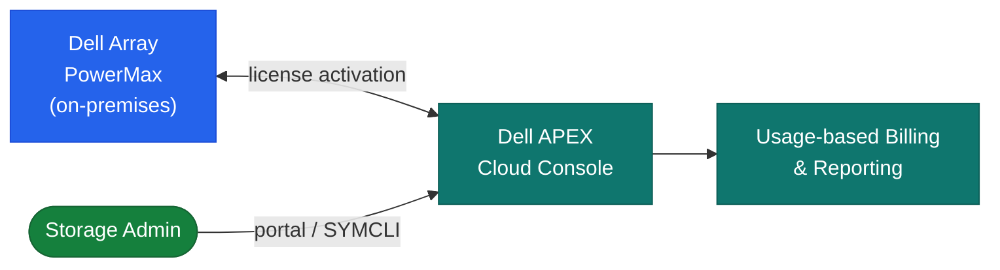

# Capacity on Demand — Architecture

Software-defined capacity licensing for Dell PowerMax and VMAX arrays. Physical drives are pre-installed at the factory but logically locked until a COD license is applied — activation is instantaneous via SYMCLI or Unisphere with no truck roll required.

<a class="kb-card" href="how-it-works/"><strong>How It Works</strong>How it works, integrations, and design standards.</a>
<a class="kb-card" href="integrations/"><strong>Integrations</strong>Integration with PowerMax, Unisphere, SYMCLI, and Dell License Portal.</a>
<a class="kb-card" href="design-standards/"><strong>Design Standards</strong>COD activation workflow, DR site pre-install patterns, and license management.</a>

## Capacity States

| State | Description |
|---|---|
| Active capacity | Licensed and immediately allocatable to thin pools and storage groups |
| COD reserved capacity | Physically installed; logically locked — visible in hardware inventory but not allocatable |
| Activated COD | Former reserved capacity after license applied — instantly joins the active pool |

## COD Model

