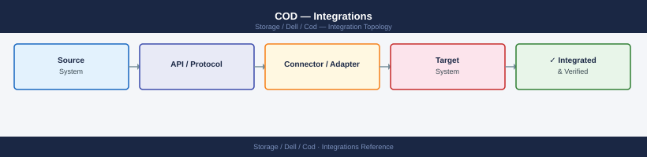

---
tags:
  - architecture
  - dell
---
# COD — Integrations


<div class="kb-summary">
Capacity on Demand integration with VMware, Unisphere, and storage management platforms.

*Applies to: Cloud for Desktop (COD)*
</div>



> Part of the [COD](../index.md) reference.

---

| Integration | Notes |
|---|---|
| Unisphere for PowerMax | Primary GUI for COD activation and license status; also exposes REST API for capacity queries |
| SYMCLI / Solutions Enabler | Command-line interface for license inspection, COD activation, and capacity discovery |
| Dell License Management Portal | Source of COD license key files; SID-tied entitlements managed here |
| CloudIQ | Provides capacity forecasting; shows active vs. total installed capacity and COD headroom |
| CMDB / change management | COD activations must be recorded as changes; CMDB updated after each activation |

---

```d2
direction: right

center: "Cloud On Demand" {shape: hexagon}
component_a: "Component A" {shape: rectangle}
component_b: "Component B" {shape: rectangle}
component_c: "Component C" {shape: rectangle}

center -> component_a
center -> component_b
center -> component_c
```

## See also

- [Cod — How It Works](how-it-works/)
- [Cod — Design Standards](design-standards/)
