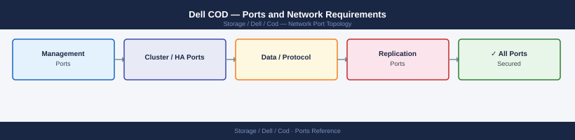

---
tags:
  - cod
  - dell
  - capacity-on-demand
  - networking
  - firewall
  - ports
---
# Dell COD — Ports and Network Requirements

<div class="kb-summary">
Firewall port reference for Dell COD (Capacity on Demand). COD is a capacity licensing model for PowerMax, not a separate software product. The relevant port is the ESRS/ConnectEMC call-home channel that validates COD entitlements.

*Applies to: Dell PowerMax COD licensing*
</div>



```d2
direction: right

center: "Cloud On Demand" {shape: hexagon}
callhome_esrs_required_for_cod_licen: "Call-Home (ESRS) — Required for COD License Validation" {shape: rectangle}
unisphere_management: "Unisphere Management" {shape: rectangle}
firewall_summary: "Firewall Summary" {shape: rectangle}

center -> callhome_esrs_required_for_cod_licen
center -> unisphere_management
center -> firewall_summary
```

## Call-Home (ESRS) — Required for COD License Validation

| Port | Protocol | Source | Destination | Purpose |
|---|---|---|---|---|
| 443 | TCP | PowerMax array management IP | esrs.dell.com | ESRS — COD license entitlement check and call-home |

## Unisphere Management

| Port | Protocol | Source | Purpose |
|---|---|---|---|
| 8443 | TCP | Admin workstations | Unisphere for PowerMax — view COD capacity status |

## Firewall Summary

| From | To | Ports | Notes |
|---|---|---|---|
| PowerMax mgmt IP | esrs.dell.com | 443 | Required for COD activation and validation |

## See also

- [Dell COD — Architecture](how-it-works/)
- [Dell PowerMax — Ports](../../powermax/architecture/ports.md)
- [Dell FOD — Ports](../../fod/architecture/ports.md)
