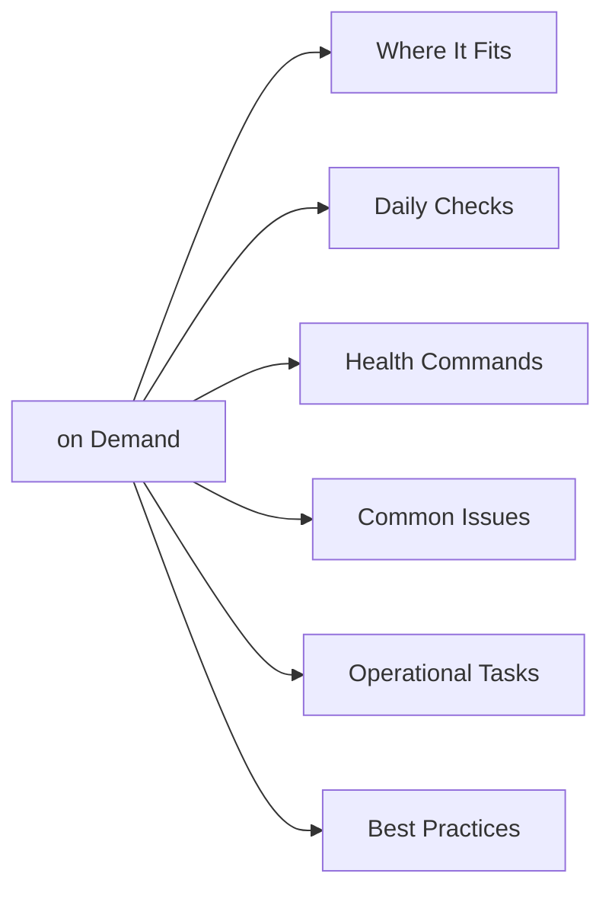

# Dell Capacity on Demand

<a class="kb-card" href="architecture/"><strong>Architecture</strong>HA topology, components, connectivity, and sizing.</a>
<a class="kb-card" href="standards/"><strong>Standards</strong>Naming conventions, build baseline, and configuration checklist.</a>
<a class="kb-card" href="lifecycle/"><strong>Lifecycle</strong>Version matrix, upgrade paths, EOL tracking, and refresh planning.</a>
<a class="kb-card" href="operations/"><strong>Operations</strong>Daily checks, health monitoring, maintenance tasks, and runbooks.</a>
<a class="kb-card" href="cli-reference/"><strong>CLI Reference</strong>Command reference by category with syntax and examples.</a>
<a class="kb-card" href="scripts/"><strong>Scripts</strong>Automation scripts for daily checks, health, incident triage, and validation.</a>
<a class="kb-card" href="troubleshooting/"><strong>Troubleshooting</strong>Common issues, diagnostic commands, log locations, and error codes.</a>

## Overview

Dell Capacity on Demand (COD) is a flexible capacity licensing model that allows additional storage capacity to be pre-installed in the array but held in reserve. When needed, the capacity is activated by purchasing and applying a COD license key — no physical truck roll required. COD is available on PowerMax, VMAX, and select mid-range platforms, and is commonly used to ensure headroom for unpredictable workload growth without committing to full upfront capital for capacity that may not be needed immediately.

## Where It Fits

| Use Case |
|---|
| Arrays expected to grow unpredictably where physically installing capacity ahead of time eliminates lead time risk |
| Capital budget management — defer activation costs until capacity is actually needed |
| DR headroom: pre-install capacity at the DR site that can be rapidly activated during a failover or test |
| Cloud migration projects where on-premises storage needs to temporarily scale up before workloads move off |
| Service provider environments where additional tenant capacity must be provisioned rapidly |

## Daily Checks

| Check | Command | Notes |
|---|---|---|
| Review total installed vs. activated capacity on each array with COD p |  |  |
| Check for COD license keys that are approaching expiry (some COD licen |  |  |
| Confirm activated capacity is being utilised; unused activated capacit |  |  |
| Review array capacity utilisation trend |  | if approaching the activated ceiling, plan the next COD activation |
| Verify COD inventory in Dell Support/MyService360 matches what is phys |  |  |

## Health Commands

~~~bash
# PowerMax — list all devices including COD reserved capacity
symcfg -sid <SID> show

# PowerMax — list physical drives and identify COD (not yet activated) drives
sympd list -sid <SID>

# PowerMax — show storage pool utilisation to determine how close to activated cap
symcfg -sid <SID> -pool -dp list

# Confirm COD license status for a PowerMax array
symlicense -sid <SID> list

# Unity — list pool capacity and identify over-subscribed pools
uemcli -d <host> -u admin -p <pass> /stor/pool show -detail

# PowerScale — show total cluster usable capacity including reserved pools
isi storagepool list
~~~

## Common Issues

| Symptom | Likely Cause | Action |
|---|---|---|
| Array approaching activated capacity ceiling | Growth faster than expected; next COD activation needed | Apply next COD license key via Unisphere or SYMCLI `symlicense`; purchase key from Dell account team |
| COD license key application fails | Wrong SID or license file format, or key already consumed | Verify SID matches the key; check `symlicense list` for current licenses; open Dell Support case |
| COD drives not visible after activation | Firmware needs to enumerate new capacity; requires array reconfig | Run `symcfg discover` or use Unisphere to trigger device discovery after license activation |
| Reserved COD capacity not showing as available after license applied | Array still binding new devices; may take several minutes | Wait for background binding to complete; monitor with `sympd list` or Unisphere |

## Operational Tasks

| Task | Command |
|---|---|
| Purchase a COD activation license from the Dell account team, specifying the tar |  |
| Apply the COD license key | `symlicense -sid <SID> install -file <license.xml>` |
| Verify activated capacity after applying | `symcfg -sid <SID> show` |
| Add newly activated drives to the appropriate thin pool or storage group to make |  |
| Track COD inventory and activation history in a runbook to avoid double-purchasi |  |

## Best Practices

| Recommendation | Detail |
|---|---|
| Pre-install COD capacity to cover at least 12 months of | Pre-install COD capacity to cover at least 12 months of projected growth to eliminate emergency procurement lead times |
| Activate COD in increments aligned with actual consumption | do not activate all reserved capacity at once as it incurs immediate cost |
| Store COD license key files in a secure, backed-up location (e.g., a password manager or secrets vault) | lost keys require Dell re-issuance |
| Include COD activation steps in DR runbooks so capacity at | Include COD activation steps in DR runbooks so capacity at the DR site can be activated rapidly during a real failover |
| Reconcile installed vs. activated capacity in the Dell | Reconcile installed vs. activated capacity in the Dell Support portal against what SYMCLI or Unisphere reports at least quarterly |
