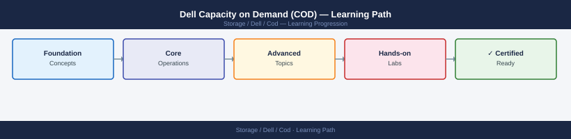

---
tags:
  - dell
  - learning-path
---
# Dell Capacity on Demand (COD) — Learning Path

Recommended reading order for Dell Capacity on Demand. Follow these stages in order to build a complete mental model before working with it in production.

*Applies to: Cloud for Desktop (COD)*

## Stage 1 — Architecture
**Goal**: Understand how COD pre-installs but locks physical drives and capacity, how activation unlocks them, and how COD pools integrate with PowerMax and PowerStore provisioning.

**Read in this order**:
- [How It Works](../architecture/how-it-works/) — COD model: physical drives are pre-installed in the array at factory but remain unlicensed (dark capacity); activation applies a license key to bring drives into service; COD pools on PowerMax and PowerStore; difference between COD and traditional capacity upgrades (no field installation); and cost model (pay-per-TB activated).
- [Design Standards](../architecture/design-standards/) — COD pool planning: how much dark capacity to pre-install vs activate at day one, activation trigger criteria (utilisation thresholds, workload growth rate), PowerMax COD pool assignment to storage groups, and PowerStore appliance COD tier configuration.
- [Integrations](../architecture/integrations/) — Unisphere for PowerMax COD pool management, PowerStore Manager COD activation, Dell License Management portal, CloudIQ capacity forecasting to predict COD activation timing, and Unisphere for PowerMax REST API for automated capacity reporting.

**Why first**: COD changes the capacity procurement model fundamentally. Understanding dark capacity and activation prevents emergency procurement situations when growth happens faster than expected.

---

## Stage 2 — Deployment
**Goal**: Understand the factory COD pre-installation, validate dark capacity inventory, and prepare activation runbooks.

**Read**:
- [Install & Upgrade](../operations/install-upgrade/) — Factory COD configuration verification, dark capacity inventory query via Unisphere/PowerStore Manager, license key generation from Dell License Management portal, activation procedure (zero-downtime), and post-activation pool validation.

**Why second**: Activation is non-disruptive but requires a valid license key. Having the activation runbook prepared before reaching capacity thresholds avoids operational delay.

---

## Stage 3 — Operations
**Goal**: Monitor dark capacity headroom, trigger activations at the right utilisation threshold, and manage COD pool assignments.

**Read in this order**:
- [Health Checks](../operations/health-checks/) — run the routine first on every shift; covers current activated capacity utilisation, dark capacity remaining (drives available to activate), COD pool assignments per storage group, and CloudIQ capacity forecast to estimated COD activation date.
- [CLI Reference](../operations/cli-reference/) — Unisphere REST API for COD pool queries, SYMCLI commands for PowerMax COD pool status, and PowerStore Manager CLI equivalents.
- [Procedures](../operations/procedures/) — COD activation (license key entry and drive bring-in), COD pool assignment to storage groups, deactivation (if applicable per contract), capacity reporting for finance, and emergency activation outside normal change windows.
- [Backup & Restore](../operations/backup-restore/) — Snapshot and replication impact of COD activation (no impact to running services), and ensuring backup targets have sufficient capacity before activating new COD pools.
- [Scripts](../operations/scripts/) — Automation: activated vs dark capacity ratio monitoring, CloudIQ API capacity forecast polling, and automated alert when utilisation reaches activation threshold.

**Why third**: The risk with COD is running out of activated capacity before a new activation can be processed. Operational monitoring closes this gap.

---

## Stage 4 — Security
**Goal**: Control who can activate COD capacity (a financially significant action) and audit all activation events.

**Read**:
- [Architecture](../architecture/) — COD security is managed through the underlying array's access control model (Unisphere RBAC for PowerMax, PowerStore Manager roles). There is no standalone COD security layer.

**Why fourth**: COD activation is a licence and cost event. Restrict it to storage administrators with budget authority, and ensure all activations are logged in the change management system.

---

## Stage 5 — Troubleshooting
**Goal**: Diagnose failed activations, license key errors, dark capacity inventory discrepancies, and unexpected capacity usage post-activation.

**Read**:
- [Common Issues](../troubleshooting/common-issues/) — License key rejected (wrong array serial or expired key), activation completes but drives not visible (firmware issue), dark capacity inventory shows fewer drives than expected (factory configuration error), and COD pool not assigned to correct storage group.
- [Diagnostics](../troubleshooting/diagnostics/) — Unisphere and PowerStore Manager event log review post-activation, SYMCLI symcfg show for PowerMax COD state, and Dell License Management portal audit log.
- [Escalation](../troubleshooting/escalation/) — When to engage Dell support for license key issues, factory configuration discrepancies, and drive bring-in failures that require field intervention.

**Why last**: Troubleshooting makes most sense once you know the normal operating state.

---

## See also

- [Cod — Procedures](../operations/procedures/)
- [Cod — Common Issues](../troubleshooting/common-issues/)
