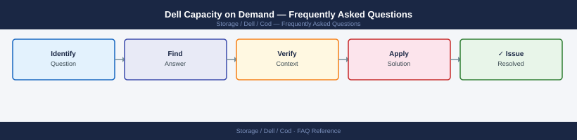

---
tags:
  - dell-cod
  - faq
  - operations
---
# Dell Capacity on Demand — Frequently Asked Questions

*Applies to: Dell Cloud Object Detachment*

Common questions about Dell Capacity on Demand operations, configuration, and troubleshooting. For step-by-step procedures, see the <a href="index.md">Operations</a> section.

## General

**Q: How do I check which CoD licences are active on a Dell array?**
A: For PowerMax: Unisphere → System → Licences → CoD. For PowerStore: PowerStore Manager → Settings → Licences. For Unity: Unisphere for Unity → System → Licences.

**Q: How do I check the current Dell Capacity on Demand version?**
A: `Unisphere → System → Licences → Capacity on Demand`

## Configuration

**Q: What is the default CoD capacity increment?**
A: CoD increments are defined in the purchase agreement and vary by array model. Typical increments: PowerMax 2500: 5 TB raw per increment. Confirm your entitlement in the CoD order documentation or Dell account portal.

**Q: How do I activate a CoD capacity increment?**
A: Log a request with Dell Support providing the array serial number and desired increment. Dell remotely activates the capacity increment and provides a licence key. Apply the key in Unisphere under System → Licences → Apply Licence.

## Operations

**Q: How do I plan for CoD capacity without disrupting production?**
A: Monitor utilisation trends in CloudIQ. Request CoD activation when utilisation reaches 75%. CoD activation is non-disruptive — no downtime required. The new capacity is available immediately after key application.

**Q: What is the correct procedure to request a CoD increment?**
A: Contact Dell Support or your account team with: array serial number, requested capacity increment, and current utilisation. Dell validates entitlement and activates within 1 business day for standard requests.

## Troubleshooting

**Q: Array shows 'CoD capacity nearing maximum entitlement'. What does it mean?**
A: You are approaching the maximum pre-purchased CoD capacity. You must purchase additional CoD entitlement or plan for hardware expansion before the limit is reached. Contact your Dell account team immediately.

**Q: Adding CoD capacity did not improve performance — where do I start?**
A: CoD adds raw capacity, not additional back-end drives or controllers. If performance is the constraint (IOPS/throughput), you may need additional drive groups or a controller upgrade rather than CoD. Review CloudIQ performance metrics.

## Backup and Recovery

**Q: Should I back up CoD licence keys?**
A: Yes — store CoD licence keys in a secure location (password manager or secrets vault). Dell can reissue keys if lost, but this may take 1-2 business days. Back up the array configuration which includes the licence record.

**Q: If I restore an array to a previous configuration, do I lose CoD capacity?**
A: The CoD licence is applied at the array level and persists through configuration restores. Capacity availability depends on the licence key being applied. Contact Dell Support if capacity appears missing after a restore.

## See Also

- [Dell Capacity on Demand Operations](index.md)
- [Dell Capacity on Demand Troubleshooting](../../../troubleshooting/index.md)
