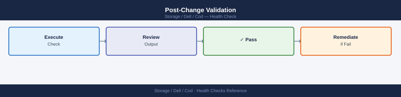

---
tags:
  - dell
  - operations
---
# COD — Health Checks

Health Checks reference covering Daily Checks, Health Check Commands, Change Readiness, Post-Change Validation.

*Applies to: Cloud for Desktop (COD)*

## Before you begin

- **Access:** Storage admin credentials (cluster admin or equivalent)
- **Timing:** safe to run during business hours unless a step is marked ⚠ (causes interruption)
- **Dependencies:** no active upgrades or migrations on the same infrastructure
- **Logging:** capture command output — paste into the change record on completion

---

## Run This Routine

1. **Service status:** Check COD management portal → service health dashboard
2. **Storage pool capacity:** review capacity percentage per storage class
3. **Replication jobs:** check active replication jobs and verify completion
4. **Access key validity:** review active access keys — flag keys >90 days old
5. **Audit log review:** check audit logs for unauthorized access attempts
6. **Bucket lifecycle policies:** verify lifecycle policies are active and executing
7. **Network connectivity:** test endpoint connectivity from application nodes

## Change Readiness

- [ ] Current utilization has been reviewed and is approaching the threshold requiring COD activation (typically >80% of licensed capacity)
- [ ] A change ticket has been raised and approved before initiating the COD activation request
- [ ] Unisphere has confirmed connectivity to Dell's licensing backend (check Unisphere > Settings > License)
- [ ] The Dell account team or support portal has been engaged if the activation requires a new entitlement rather than an existing COD pool
- [ ] Post-activation capacity headroom has been calculated to confirm the activation resolves the constraint

| Item | Status | Notes |
|---|---|---|
| Current utilization reviewed and at threshold | | |
| Change ticket raised and approved | | |
| Unisphere connectivity to Dell confirmed | | |
| Dell account/support engaged if new entitlement needed | | |
| Post-activation headroom calculated | | |

## Post-Change Validation

- [ ] New capacity is visible in `symcfg -sid <sid> show -capacity -gb` output
- [ ] Licensed capacity now reflects the activated COD amount in `symlmf -sid <sid> list`
- [ ] SRP utilization percentage has dropped to reflect the additional capacity
- [ ] No performance or availability impact to existing workloads (check I/O stats in Unisphere)
- [ ] CloudIQ health score for the array is unchanged or improved
- [ ] Change ticket updated and closed with post-activation capacity figures

---

## Verify

- Confirm the operation completed without errors in the log or management UI
- Verify the expected state change is visible (service running, object created, config applied)
- Document the outcome in the change record

---

## See also

- [Cod — Procedures](procedures/)
- [Cod — CLI Reference](cli-reference/)
- [Cod — Common Issues](../troubleshooting/common-issues/)
