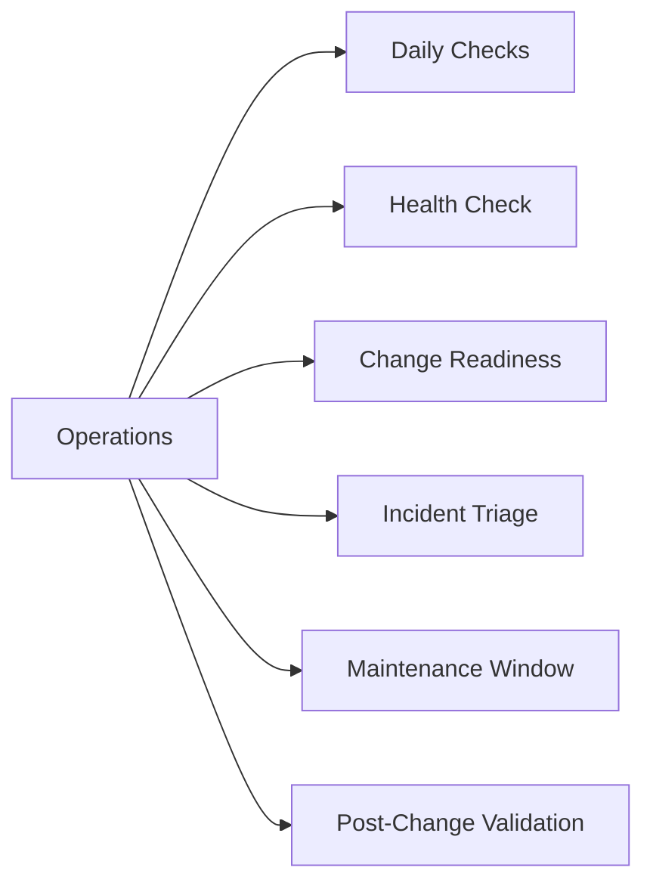

# Operations

> Part of the [Capacity on Demand](../) reference.

---



## Daily Checks


| Check | Command | Notes |
|---|---|---|
| [ ] Review current COD utilization vs licensed capacity using SYMCLI o |  | confirm no unexpected consumption increase |
| [ ] Confirm no new COD activations have occurred without an associated |  |  |
| [ ] Check system capacity headroom |  | flag if utilized capacity exceeds 80% of licensed capacity |
| [ ] Verify Unisphere connectivity to Dell (required for COD activation |  |  |

## Health Check

```bash
# Show current array capacity state including licensed vs consumed
symcfg -sid <sid> show -capacity -gb

# Show COD license entitlement and activation status
symlmf -sid <sid> list

# Show storage resource pool (SRP) utilization — confirms physical capacity consumed
symcfg -sid <sid> list -srp -detail

# Show total raw, subscribed, and usable capacity
symcfg -sid <sid> show -tb

# Check if COD capacity pools are available and their current state
symcfg -sid <sid> list -demand -demand_type cod
```

## Change Readiness

- [ ] Current utilization has been reviewed and is approaching the threshold requiring COD activation (typically >80% of licensed capacity)
- [ ] A change ticket has been raised and approved before initiating the COD activation request
- [ ] Unisphere has confirmed connectivity to Dell's licensing backend (check Unisphere > Settings > License)
- [ ] The Dell account team or support portal has been engaged if the activation requires a new entitlement rather than an existing COD pool
- [ ] Post-activation capacity headroom has been calculated to confirm the activation resolves the constraint

| Item | Status | Notes |
|---|---|---|
| Current utilization reviewed and at threshold | | |
| Change ticket raised and approved | | |
| Unisphere connectivity to Dell confirmed | | |
| Dell account/support engaged if new entitlement needed | | |
| Post-activation headroom calculated | | |

## Incident Triage

**On alert or issue:**
1. Log in to Unisphere or connect via SYMCLI to identify the exact utilization and licensing state
2. Check SYMCLI event log for any licensing-related errors: `symelog -sid <sid> list -type license`
3. Confirm the COD activation request was submitted via the correct channel (Unisphere > Settings > License > Activate Capacity)
4. If activation is rejected, verify the Dell account is current and the COD entitlement has not expired
5. Open a Dell support case if the activation cannot proceed through Unisphere

| Symptom | Likely Cause | Action |
|---|---|---|
| Unexpected capacity consumption spike | Workload growth or new provisioning without capacity planning | Run `symcfg -sid <sid> list -srp -detail`, identify which SRP/SG consumed capacity, review provisioning activity |
| COD activation rejected in Unisphere | Entitlement expired or account issue | Check license entitlement via `symlmf -sid <sid> list`, contact Dell account team |
| Licensing error in SYMCLI | Expired or invalid license file | Run `symlmf -sid <sid> list` to show license state, check expiry, open Dell support case |
| COD capacity not visible after activation | Activation not yet propagated | Wait up to 15 minutes, then re-run `symcfg -sid <sid> show -capacity -gb` |
| Unisphere cannot reach Dell licensing backend | Proxy or firewall blocking outbound HTTPS | Check SCG connectivity, verify proxy settings in Unisphere |

## Maintenance Window

1. Confirm the COD activation is required and the change ticket is approved
2. Log in to Unisphere and navigate to Settings > License > Capacity on Demand
3. Submit the activation request specifying the number of additional TB required
4. Monitor the activation status in Unisphere — expect propagation within 10-15 minutes
5. Validate the new capacity is visible via SYMCLI:
   ```bash
   symcfg -sid <sid> show -capacity -gb
   symlmf -sid <sid> list
   ```
6. Confirm the new capacity is available to the SRP and workloads are not impacted
7. Update the change ticket with the post-activation capacity figures

## Post-Change Validation

- [ ] New capacity is visible in `symcfg -sid <sid> show -capacity -gb` output
- [ ] Licensed capacity now reflects the activated COD amount in `symlmf -sid <sid> list`
- [ ] SRP utilization percentage has dropped to reflect the additional capacity
- [ ] No performance or availability impact to existing workloads (check I/O stats in Unisphere)
- [ ] CloudIQ health score for the array is unchanged or improved
- [ ] Change ticket updated and closed with post-activation capacity figures
