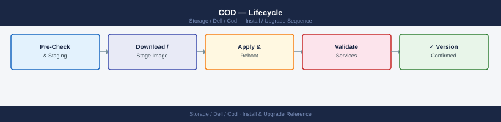

---
tags:
  - dell
  - operations
---
# COD — Lifecycle

Lifecycle reference covering Entitlement Lifecycle, COD Entitlement Review Cadence, Frame Decommission — COD Implications, COD vs. Standard Capacity Purchase.

*Applies to: Cloud for Desktop (COD)*

## Before you begin

- **Access:** Storage admin credentials (cluster admin or equivalent)
- **Timing:** safe to run during business hours unless a step is marked ⚠ (causes interruption)
- **Dependencies:** no active upgrades or migrations on the same infrastructure
- **Logging:** capture command output — paste into the change record on completion

---

## Entitlement Lifecycle

COD entitlements are tracked in the Dell License Management Portal and are tied to a specific PowerMax frame serial number (SID). The lifecycle of a COD entitlement follows this path:

Cross-reference this output against the Dell License Management Portal to confirm the portal record matches what the array reports. Discrepancies must be resolved with Dell before the next capacity review.

## COD Entitlement Review Cadence

| Review | Frequency | Action |
|---|---|---|
| Inventory reconciliation | Every 6 months | Compare symcli license output to Dell portal and CMDB |
| Growth trend review | Monthly | Check CloudIQ capacity forecast against COD headroom |
| COD procurement planning | Annually (or when within 6 months of exhausting COD headroom) | Engage Dell account team for next COD increment |

## Frame Decommission — COD Implications

When decommissioning a PowerMax array:

1. Migrate all data from the array before decommissioning
2. Remove all storage groups and thin pools
3. Contact the Dell account team to discuss COD entitlement disposition:
   - If replacing with a new frame: transfer entitlements to the new SID
   - If reducing capacity: COD licenses expire with the frame (generally not refundable)
4. Remove the array from Unisphere and Solutions Enabler management
5. Deregister from SCG and Dell Support portal
6. Physical decommission or return to Dell (if on a leased/COD subscription)

## COD vs. Standard Capacity Purchase

Understanding when COD makes more sense than buying standard licensed capacity upfront:

| Scenario | Recommended Approach |
|---|---|
| Growth is predictable and sustained | Purchase standard capacity — lower unit cost |
| Growth is uncertain or seasonal | COD — pay only when activated; avoids stranded spend |
| DR site headroom for failover | COD — DR capacity rarely needed at full scale, but must be available instantly |
| Cloud migration (temporary scale-up) | COD — activate for the migration period; headroom not needed after migration completes |
| Service provider burst capacity | COD — provision tenant capacity rapidly without procurement delays |

---

## Verify

- Confirm the operation completed without errors in the log or management UI
- Verify the expected state change is visible (service running, object created, config applied)
- Document the outcome in the change record

---

## See also

- [Cod — Procedures](../procedures/)
- [Cod — Health Checks](../health-checks/)
