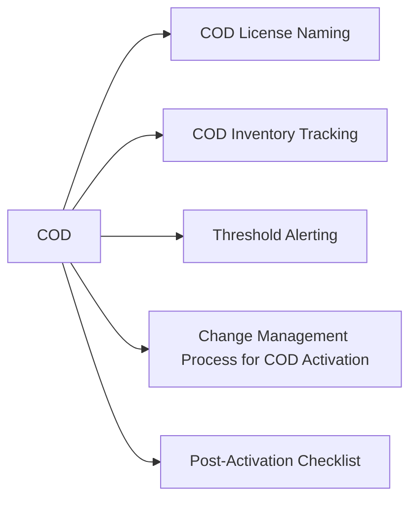

# COD — Standards



## COD License Naming

COD license files downloaded from the Dell License Portal should be stored with a consistent filename that identifies the array and the activation increment.

Pattern: `cod-<array-sid>-<capacity-tib>tib-<date>.xml`

Examples:

```
cod-000123456789-50tib-20260115.xml
cod-000987654321-100tib-20260301.xml
```

Store license files in a secure, backed-up location — a secrets vault or a protected network share accessible only to storage admins. Lost license files require re-issuance from the Dell License Portal, which can cause delays during emergency activations.

## COD Inventory Tracking

Maintain a COD inventory record for each array with COD pre-installed. The record must include:

| Field | Example |
|---|---|
| Array SID | `000123456789` |
| Array hostname | `powermax-prod-01` |
| Total installed capacity (raw TiB) | `500 TiB` |
| Active licensed capacity (raw TiB) | `300 TiB` |
| COD reserved capacity (raw TiB) | `200 TiB` |
| COD license key file location | `vault://storage/cod-licenses/` |
| Last activation date | `2026-01-15` |
| Next review date | `2026-07-15` (6-month cadence) |

Reconcile the inventory record against `symlicense -sid <SID> list` output at least every 6 months.

## Threshold Alerting

Configure a capacity utilisation alert so COD activation is planned ahead of time, not triggered as an emergency.

| Alert Level | Threshold | Action |
|---|---|---|
| Warning | 70% of active licensed capacity used | Review growth trend; plan COD activation within 30 days |
| Critical | 85% of active licensed capacity used | Initiate COD activation change ticket immediately |
| Emergency | 95% of active licensed capacity used | Emergency COD activation; escalate to storage architect |

Set these thresholds in CloudIQ under Capacity Alerts, or configure equivalent SNMP/email alerts via Unisphere.

## Change Management Process for COD Activation

COD activation is a significant change — it increases array capacity and triggers device discovery events. It must go through the standard change management process.

**Change ticket must include:**

- Array SID and hostname
- Current capacity utilisation (symcfg output attached)
- COD increment size (TiB) being activated
- Justification (workload growth, DR preparedness, etc.)
- Risk assessment (low — activation is non-disruptive and reversible at next renewal)
- Rollback plan (COD cannot be deactivated mid-term; document this)
- Post-change validation steps (symcfg output confirming new capacity visible)

**Approval required from:** Storage architect or senior storage engineer.

COD activation must never be performed ad-hoc without a change ticket, even in urgent capacity situations. The change ticket serves as the audit trail required to reconcile license spend.

## Post-Activation Checklist

After applying a COD license:

- [ ] Confirm new capacity visible: `symcfg -sid <SID> list -capacity`
- [ ] Confirm license applied correctly: `symlicense -sid <SID> list`
- [ ] Run `symcfg discover` to enumerate new devices if they do not appear immediately
- [ ] Add new devices to the appropriate thin pool or storage group
- [ ] Verify pool capacity increased in Unisphere
- [ ] Update the COD inventory record with the new activation date and capacity
- [ ] Update the CMDB asset record for the array
- [ ] Close the change ticket with the post-change evidence attached
