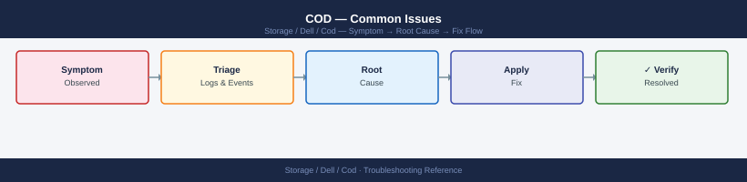
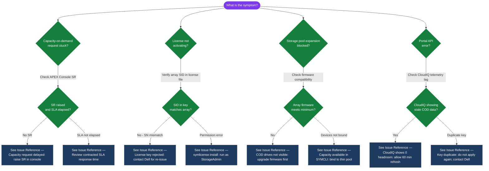

---
tags:
  - dell
  - troubleshooting
search:
  boost: 1.5
---
# COD — Common Issues


<div class="kb-summary">
Common COD issues — capacity activation failures, allocation errors, and licensing troubleshooting.

*Applies to: Cloud for Desktop (COD)*
</div>



> Part of the [COD](../index.md) reference.

---

| Symptom | Likely Cause | First Action |
|---|---|---|
| COD license not activating | Wrong SID in license file; license already consumed; SYMCLI version mismatch | Verify SID: `symcfg -sid <SID> show`; check `symlicense -sid <SID> list` for existing licenses |
| Capacity shows as unavailable after license applied | Array still binding new devices; may take several minutes | Wait 5–10 minutes; run `symcfg discover`; check Unisphere for device enumeration progress |
| `symlicense install` fails with permission error | Solutions Enabler running under user without SYMCLI admin rights | Run as root or with an account holding StorageAdmin role in Unisphere |
| COD drives not visible after activation | Firmware needs to enumerate new devices; requires `symcfg discover` | `symcfg -sid <SID> discover` — triggers device rediscovery; check Unisphere for newly available devices |
| License key rejected (wrong SID) | License file was issued for a different array SID | Contact Dell License Management portal or account team for re-issuance to correct SID |
| Capacity available in SYMCLI but not usable in Unisphere | New devices not yet bound to a thin pool | Add newly discovered devices to the appropriate thin pool via Unisphere or SYMCLI |
| CloudIQ shows COD headroom as 0 but license portal shows available | CloudIQ telemetry not reflecting latest license activation | Allow 30–60 minutes for CloudIQ to refresh; confirm SCG is forwarding telemetry |
| COD activation audit trail missing | Activation performed without a change ticket or outside SYMCLI | Review SYMCLI audit log; correlate with Unisphere session logs; update CMDB retroactively |

```d2
direction: down

symptom: Identify Symptom {shape: diamond}
diagnostic_flow: "Diagnostic Flow" {shape: rectangle}
verify_resolution: "Verify resolution" {shape: rectangle}
resolution: Resolve or Escalate {shape: oval}

symptom -> diagnostic_flow: investigate
symptom -> verify_resolution: investigate
diagnostic_flow -> resolution
verify_resolution -> resolution
```

## Diagnostic Flow



---

## Before you begin

- **Access:** Storage admin credentials (cluster admin or equivalent)
- **Gather first:** recent error message text, event timestamps, and affected object names
- **Scope:** confirm whether the issue affects a single object, host, cluster, or site
- **Escalation:** open a vendor support ticket before running any destructive step
- **Logging:** document each command and output — required if escalation is needed

---

---

## Verify resolution

- Confirm the original symptom no longer occurs
- Check logs for any residual errors related to the issue
- Monitor for 10–15 minutes to confirm the fix is stable

---

## See also

- [Cod — Diagnostics](diagnostics/)
- [Cod — Escalation](escalation/)
- [Cod — Health Checks](../operations/health-checks/)
