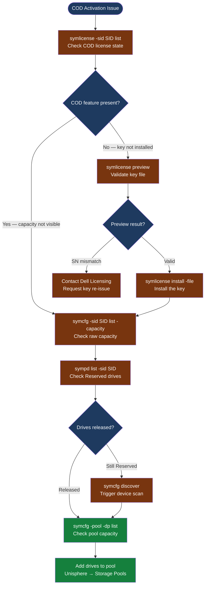

---
tags:
  - dell
  - troubleshooting
search:
  boost: 1.5
---
# Dell COD — Diagnostics

<div class="kb-summary">
Dell Capacity on Demand diagnostic commands: verify COD license state with symlicense, confirm capacity expansion with symcfg, trigger device discovery, and audit COD activation history for Dell TAC cases.

*Applies to: Dell PowerMax Capacity on Demand (COD)*
</div>




## Before you begin

- **Access:** Solutions Enabler access to the PowerMax array (gatekeeper LUNs configured); Unisphere for PowerMax admin access
- **Gather first:** array SID and serial number (from `symcfg list`), the COD license file from Dell, and the current thin pool utilization before activation
- **Verify first:** check whether the COD key has already been installed with `symlicense -sid <SID> list` before attempting another install — applying the same key twice is harmless but not helpful
- **Capacity lag:** after a successful COD activation, capacity may take up to 5 minutes to appear in pool metrics — wait before escalating

---

## Step 1 — Check current license state

```bash
# List all active licenses on the array
symlicense -sid <SID> list
# Output columns: License Name, Feature, Status, Expiry
# Expected for activated COD: COD feature shows Status = Enabled
# If COD not listed: the key has not been installed yet

# Show COD feature detail
symlicense -sid <SID> show -feature COD
# Shows: key ID, installed date, expiry, array SN the key is bound to

# Get the array serial number
symcfg list
# Note the SID and check the "SN" column — this is the serial that must match VENDOR_SN in the key file
```

---

## Step 2 — Inspect the COD key file

```bash
# Check which array serial number the key is bound to
grep -E "VENDOR_SN|SN|SERIAL" /path/to/cod-license.xml
# The VENDOR_SN value must match the SN shown in symcfg list and the chassis label

# Check expiry date
grep -i "expiry\|expire\|date" /path/to/cod-license.xml

# Check what capacity the key unlocks
grep -i "capacity\|drives\|feature" /path/to/cod-license.xml

# DO NOT modify the key file — it has a cryptographic signature; any edit causes rejection
```

---

## Step 3 — Dry-run the key installation

```bash
# Preview install: validates the key without activating (safe, non-disruptive)
symlicense -sid <SID> preview -file /path/to/cod-license.xml
# Expected output (valid key):
#   Feature: COD
#   Capacity: <X> TB additional
#   Status: Will be enabled
#   Ready to install.

# Capture preview output for the Dell SR
symlicense -sid <SID> preview -file /path/to/cod-license.xml 2>&1 | tee /tmp/cod-preview-$(date +%F).txt

# If preview fails with "SYMAPI_C_INVALID_LICENSE: SN mismatch":
# → The key was generated for a different array SN
# → Contact Dell Licensing via support.dell.com with the chassis label SN
```

---

## Step 4 — Install the key and verify capacity

```bash
# Install the COD license key
symlicense -sid <SID> install -file /path/to/cod-license.xml
# Capture the full output regardless of success or failure
symlicense -sid <SID> install -file /path/to/cod-license.xml 2>&1 | tee /tmp/cod-install-$(date +%F).txt
# Expected: no SYMAPI errors; exits with code 0

# Trigger device discovery so the array recognises newly available drives
symcfg -sid <SID> discover
# Wait 3–5 minutes after this command before checking capacity

# Check physical drives — COD drives should no longer show "Reserved"
sympd list -sid <SID>
# COD reserved drives appear with State = Reserved before activation
# After successful COD: they appear as Available or already assigned to a pool

# Confirm capacity has increased in thin pool
symcfg -sid <SID> -pool -dp list
# Output: each pool with Total_Capacity and Used_Capacity columns
# The total should reflect the newly unlocked drives

# Overall array capacity after activation
symcfg -sid <SID> list -capacity
# Shows: installed capacity, usable capacity, allocated
```

---

## Step 5 — Add new drives to a thin pool

After COD activation, the unlocked drives are available but not automatically added to a pool. They must be added manually.

```bash
# Via Solutions Enabler (if scripting is needed)
symconfigure -sid <SID> -cmd "add drives to pool <pool-name> type thin;" commit
# This adds all currently available unassigned drives to the named pool

# Via Unisphere (recommended for manual activation)
# Unisphere for PowerMax → Storage → Storage Pools → select pool → Add Drives
# Select the COD drives from the "Available" list → Apply

# Confirm after adding
symcfg -sid <SID> -pool -dp list
# Pool total capacity should now include the newly added COD drives
```

---

## Step 6 — Audit COD activation history

```bash
# Review SYMCLI audit log for the COD activation event
symaudit -sid <SID> list -action "license"
# Shows: timestamp, operation, user, result

# Date-range query (use YYYY-MM-DD format)
symaudit -sid <SID> list -start_time 2026-06-01 -end_time 2026-06-15

# Review Unisphere audit log via REST API (if activation was done through Unisphere)
curl -sk -u <user>:<pass> \
  "https://<unisphere-host>:8443/univmax/restapi/103/system/audit" \
  -H "Content-Type: application/json" | jq '.auditRecordList[] | select(.message | test("licen";"i"))'

# All-in-one diagnostic snapshot for Dell SR
{
  echo "=== symcfg list ==="
  symcfg list
  echo "=== symlicense list ==="
  symlicense -sid <SID> list
  echo "=== symcfg capacity ==="
  symcfg -sid <SID> list -capacity
  echo "=== sympd list ==="
  sympd list -sid <SID>
  echo "=== pool list ==="
  symcfg -sid <SID> -pool -dp list
} > /tmp/cod-diag-$(date +%F-%H%M).txt
```

---

## See also

- [COD — Common Issues](common-issues/)
- [COD — Escalation](escalation/)
- [COD — Health Checks](../operations/health-checks/)

## Verify resolution

- `symlicense -sid <SID> list` shows COD feature with `Status = Enabled`
- `sympd list -sid <SID>` shows no drives in `Reserved` state (all COD drives released)
- `symcfg -sid <SID> -pool -dp list` shows increased pool total capacity
- A test volume creation using the new capacity succeeds
- Monitor Unisphere dashboard for 15 minutes to confirm no capacity alarms
