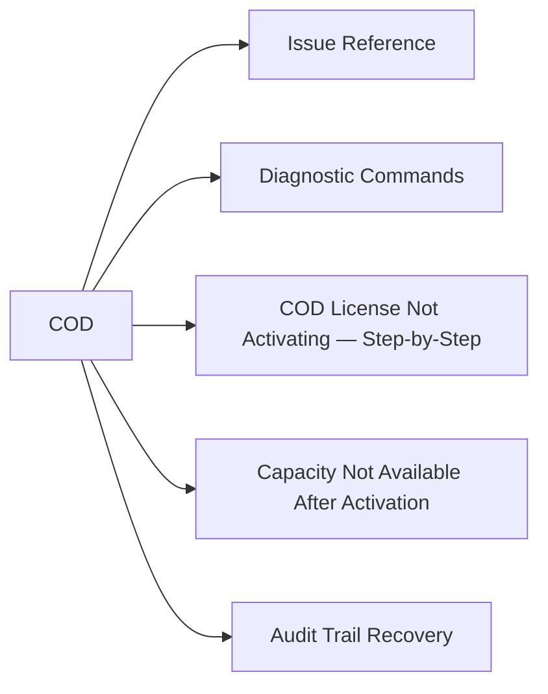

# COD — Troubleshooting



## Issue Reference

| Symptom | Likely Cause | First Action |
|---|---|---|
| COD license not activating | Wrong SID in license file; license already consumed; SYMCLI version mismatch | Verify SID: `symcfg -sid <SID> show`; check `symlicense -sid <SID> list` for existing licenses |
| Capacity shows as unavailable after license applied | Array still binding new devices; may take several minutes | Wait 5–10 minutes; run `symcfg discover`; check Unisphere for device enumeration progress |
| `symlicense install` fails with permission error | Solutions Enabler running under user without SYMCLI admin rights | Run as root or with an account holding StorageAdmin role in Unisphere |
| COD drives not visible after activation | Firmware needs to enumerate new devices; requires `symcfg discover` | `symcfg -sid <SID> discover` — triggers device rediscovery; check Unisphere for newly available devices |
| License key rejected (wrong SID) | License file was issued for a different array SID | Contact Dell License Management portal or account team for re-issuance to correct SID |
| Capacity available in SYMCLI but not usable in Unisphere | New devices not yet bound to a thin pool | Add newly discovered devices to the appropriate thin pool via Unisphere or SYMCLI |
| CloudIQ shows COD headroom as 0 but license portal shows available | CloudIQ telemetry not reflecting latest license activation | Allow 30–60 minutes for CloudIQ to refresh; confirm SCG is forwarding telemetry |
| COD activation audit trail missing | Activation performed without a change ticket or outside SYMCLI (Unisphere session not logged) | Review SYMCLI audit log; correlate with Unisphere session logs; update CMDB retroactively |

## Diagnostic Commands

```bash
# Check current license status for the array
symlicense -sid <SID> list

# Show COD-specific feature license
symlicense -sid <SID> show -feature COD

# Show total installed capacity and active capacity breakdown
symcfg -sid <SID> list -capacity

# Show full array configuration including director and capacity details
symcfg -sid <SID> show -detail

# List all physical drives — identify COD reserved drives
sympd list -sid <SID>

# Show thin pool utilisation (confirms new capacity is usable)
symcfg -sid <SID> -pool -dp list

# Trigger device discovery after COD activation
symcfg -sid <SID> discover

# Review SYMCLI audit log for COD activations
symaudit -sid <SID> list -action "license"
```

## COD License Not Activating — Step-by-Step

1. Confirm the license file SID matches the target array:

```bash
# The license file is XML — open it and check the SID field
grep -i "SID\|serial" cod-license.xml
```

2. Confirm SYMCLI can communicate with the array:

```bash
symcfg -sid <SID> show
```

3. Check current license state:

```bash
symlicense -sid <SID> list
```

4. Attempt license installation:

```bash
symlicense -sid <SID> install -file cod-license.xml
```

5. If installation fails, capture the full error:

```bash
symlicense -sid <SID> install -file cod-license.xml 2>&1 | tee /tmp/cod-install-error.txt
```

6. Open a Dell Support case with the error output and the license file (do not share the license file publicly).

## Capacity Not Available After Activation

After license activation, new drives may take several minutes to be enumerated and available.

```bash
# Step 1 — trigger device discovery
symcfg -sid <SID> discover

# Step 2 — wait 3–5 minutes, then check for new devices
sympd list -sid <SID> | grep -i "ready\|avail"

# Step 3 — confirm pool capacity has increased
symcfg -sid <SID> -pool -dp list

# Step 4 — if devices are visible but not in a pool, add them:
# (Use Unisphere GUI → Storage → Storage Pools → Add Drives)
# Or via SYMCLI:
symconfigure -sid <SID> -cmd "add drives to pool <pool-name> type thin;" commit
```

## Audit Trail Recovery

If a COD activation was performed without a proper change ticket, reconstruct the audit trail from SYMCLI logs before closing the gap.

```bash
# Review SYMCLI operations log for the activation date
symaudit -sid <SID> list -start_time <date> -end_time <date>

# Review Unisphere audit log via REST API (if activation was done through Unisphere GUI)
curl -sk -u <user>:<pass> \
  "https://<unisphere-host>:8443/univmax/restapi/103/system/audit?startTime=<epoch>" \
  -H "Content-Type: application/json" | jq .
```

Document the findings and retroactively create the change record to maintain compliance.
