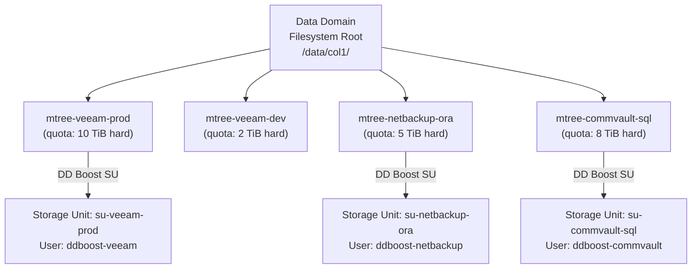

# Data Domain — Standards


<div class="kb-summary">
Standards reference covering Sizing Considerations, MTree Naming Convention, DD Boost Storage Unit Naming, Replication Context Naming, MTree Quota Standards and 4 more sections.
</div>

## Sizing Considerations

| Parameter | Guidance |
|---|---|
| Usable capacity | Size for 2–3 weeks of full backups pre-dedup; dedup ratio determines actual footprint |
| Dedup ratio assumption | Conservative estimate: 10:1 for databases, 20:1 for mixed workloads, 50:1 for long-term retention |
| Ingest throughput | Match DD model throughput to peak backup window requirement (e.g., DD9900: up to 68 TB/hr) |
| Head count for HA | HA pair if RTO < 30 minutes; single node with fast replication recovery for RTO > 2 hours |
| Cloud Tier ratio | Keep 10–15% active tier headroom; age data older than 90 days to cloud tier |
| NVRAM | Built-in; not user-configurable — relevant for understanding write latency characteristics |

## MTree Naming Convention


┌────────────────────────────────── Dell Data Domain Design Standards ──────────────────────────────────┐
│                                                                                                       │
│   ┌───────────────────────────────────────────────────────────────────────────────────────────────┐   │
│   │            Size DD at 2× expected logical retention to account for dedup variation            │   │
│   │            Separate MTrees per backup application or environment for quota control            │   │
│   │           Replication: active site primary → passive site DR; test restore quarterly          │   │
│   └───────────────────────────────────────────────────────────────────────────────────────────────┘   │
│                                                                                                       │
│                          ▼                                                 ▼                          │
│                                                                                                       │
│   ┌──────────────────────────────────────────────┐  ┌─────────────────────────────────────────────┐   │
│   │               Sizing Standards               │  │               Layout Standards              │   │
│   │      ─────────────────────────────────       │  │      ─────────────────────────────────      │   │
│   │         2× logical retention in raw          │  │              MTree per app/env              │   │
│   │         Plan for 10–30x dedup ratio          │  │            MTree quotas enforced            │   │
│   │           Leave 20% free headroom            │  │            NFS exports per MTree            │   │
│   │         DD Boost preferred protocol          │  │            DD Boost users per app           │   │
│   │           NVRAM: do not exceed 80%           │  │            Replication per MTree            │   │
│   └──────────────────────────────────────────────┘  └─────────────────────────────────────────────┘   │
│                                                                                                       │
│   │     Standard     │      Value       │       Reason      │      Owner       │      Review      │   │
│   │ ──────────────── │ ──────────────── │ ───────────────── │ ──────────────── │──────────────────│   │
│   │   Raw headroom   │      > 20%       │   Dedup overhead  │   Backup team    │     Monthly      │   │
│   │   MTree quotas   │ Per environment  │  Prevent runaway  │   Backup team    │    Quarterly     │   │
│   │   Rep schedule   │  4-hour RPO max  │     DR target     │   Backup team    │      Annual      │   │
│   │   Restore test   │    Quarterly     │     Verify DR     │   Backup team    │     Per test     │   │
│                                                                                                       │
│    Key terms:                                                                                         │
│                                                                                                       │
│    Dedup ratio      = Logical data stored ÷ physical space used; 10–30x typical for backup            │
│    20% headroom     = DDOS performance degrades when filesystem > 80% full; always leave buffer       │
│    MTree quota      = Soft/hard limits on MTree logical capacity; prevents one app starving others    │
│    DD Boost protocol= Preferred over NFS for backup; offloads dedup; uses less network bandwidth      │
│                                                                                                       │
└───────────────────────────────────────────────────────────────────────────────────────────────────────┘
```sql

Each storage unit maps to exactly one MTree. Create the MTree first, then create the storage unit pointing at it.

## Replication Context Naming

Pattern: `<src-dd-hostname>-to-<dst-dd-hostname>-<mtree-name>`

Example:

```text
dd9900-prod-to-dd6400-dr-mtree-veeam-prod
```

This makes it immediately clear which source and destination are involved and which MTree is being replicated in each context.

## MTree Quota Standards

Every MTree must have both a soft quota and a hard quota configured at creation.

| Quota Type | Purpose | Recommended Value |
|---|---|---|
| Soft quota | Warning threshold — alerts when this usage is exceeded | 80% of expected max data |
| Hard quota | Hard cap — writes refused above this limit | 100–110% of expected max data |

Never leave MTrees with unlimited quotas. An unconstrained MTree can fill the global filesystem and impact all backup jobs on the array.

## Retention Lock Settings

Configure retention lock per MTree based on compliance requirements:

| Mode | Use Case | Key Behaviour |
|---|---|---|
| Governance | Internal data retention policies | Files locked; can be deleted by authorised admin with correct role |
| Compliance | Regulatory (SEC 17a-4, HIPAA, GDPR, etc.) | Files locked; cannot be deleted by any admin during the retention period |

Retention lock minimum and maximum periods must be set at MTree creation:

```bash
# Enable governance retention lock on an MTree
mtree retention-lock enable mode governance mtree /data/col1/mtree-veeam-prod

# Set retention period limits
mtree retention-lock set min-retention-period 30days mtree /data/col1/mtree-veeam-prod
mtree retention-lock set max-retention-period 7years mtree /data/col1/mtree-veeam-prod
```

## DD Boost User Naming

Pattern: `ddboost-<backup-tool>`

Examples:

```text
ddboost-veeam
ddboost-netbackup
ddboost-commvault
```

Create a separate DD Boost user per backup application. Do not share a single DD Boost user across multiple backup tools — this prevents credential rotation from impacting unrelated backup systems.

## Build Baseline Checklist

Complete this checklist when commissioning a new Data Domain or adding a new MTree/integration:

- [ ] DDOS version confirmed and within supported version range for all connected backup applications
- [ ] Management IP, hostname, and DNS record registered
- [ ] NTP configured and synchronized (`ntp status`)
- [ ] Syslog forwarding configured to the central log collector (`log host add <syslog-host>`)
- [ ] SNMP configured for monitoring platform integration
- [ ] DD Encryption at Rest (D@RE) enabled (verify with `encryption status`)
- [ ] LDAP or local user accounts created; default `sysadmin` password changed
- [ ] MTrees created with soft and hard quotas defined
- [ ] DD Boost storage units created, mapped to MTrees, and DD Boost users configured
- [ ] Replication contexts created and confirmed in `Normal` state (`replication show`)
- [ ] CloudIQ telemetry active via SCG registration (confirm in CloudIQ portal)
- [ ] SupportAssist / AutoSupport configured (`autosupport enable`)
- [ ] Filesystem cleaning scheduled (`filesys clean set-frequency weeks 1`)
- [ ] Monitoring alert thresholds set in CloudIQ or SNMP manager
- [ ] Backup software registered to DD Boost storage units and test backup completed

## Configuration Checklist — Ongoing

- [ ] Replication contexts all in `Normal` state — verify weekly
- [ ] Global dedup ratio above 10:1 — investigate if below
- [ ] Active capacity below 80% — plan expansion if approaching
- [ ] No active hardware alerts (`alerts show current`)
- [ ] DD Boost user credentials rotated per password policy cycle
- [ ] Retention lock periods reviewed against current compliance requirements annually
