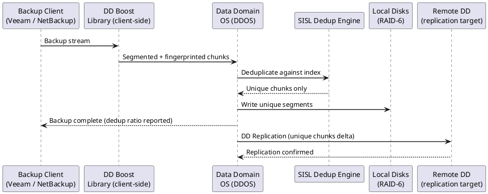
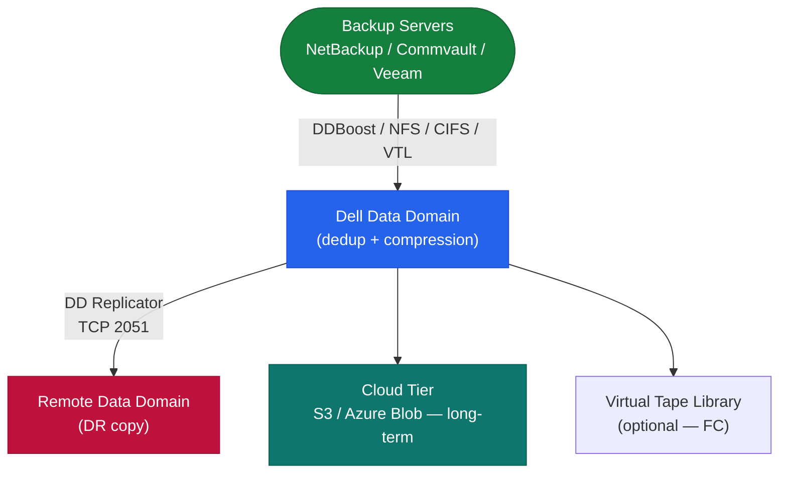

---
tags:
  - architecture
  - dell
---
# Data Domain — How It Works

<div class="kb-summary">
How It Works reference covering Overview, Architecture, Data Path, Components, HA Options and 2 more sections.

*Applies to: Data Domain DD OS 7.x*
</div>




## Overview

Dell PowerProtect DD (Data Domain) is a purpose-built backup appliance built around **inline global deduplication**. All data is deduplicated as it is written using the SISL (Stream-Informed Segment Layout) engine — not in post-processing. Typical deduplication ratios: 20:1 or greater across mixed workloads.

## Architecture



DDBoost reduces network traffic by ~50% via source-side deduplication — only unique segments are sent to the DD appliance.

## Components

| Component | Description |
|---|---|
| DDBoost | Protocol allowing backup software to perform source-side dedup filtering; integrates with NetBackup, Commvault, Veeam |
| SISL Engine | Stream-Informed Segment Layout; fingerprints segments and matches against global index; new unique segments go to NVRAM |
| NVRAM | Power-safe write buffer; writes acknowledged to backup software after NVRAM landing |
| MTree | Logical namespace partition (`/data/col1/<name>`); quotas, retention locks, and replication policies set per MTree |
| DD Replicator | Asynchronous delta replication between DD systems; replicates only new unique segments (TCP 2051) |
| Cloud Tier | Lifecycle policy to offload aged segments to S3-compatible or Azure Blob object storage |
| VTL | Virtual Tape Library interface via FC for tape-based backup software integration |

## HA Options

| Model | HA Type | Description |
|---|---|---|
| DD2200–DD9400 | Single node | No controller failover; HA via MTree replication to remote DD |
| DD9900 | Active-Standby pair | Two DD heads sharing SAS disk shelves; standby monitors active; automatic failover |

## Protocol Access

| Protocol | Port | Use Case |
|---|---|---|
| DDBoost over IP | TCP 2052 (HTTP) / 2053 (HTTPS) | Primary — backup software integration |
| NFS v3 | TCP/UDP 2049 | Unix/Linux backup clients |
| CIFS/SMB | TCP 445 | Windows backup clients |
| VTL | FC | Tape-emulation for legacy backup software |
| DD Replicator | TCP 2051 | DD-to-DD replication |
| Management (CLI/UI) | TCP 22 (SSH) / 443 (HTTPS) | Administration |

## Key CLI Commands

```bash
filesys status                    # filesystem enabled/disabled state
filesys show space                # pre/post-compression capacity
filesys show compression          # global dedup ratio (healthy = 20:1+)
replication show                  # replication context states
ddboost show clients              # connected backup servers
alerts show current               # active hardware/software alerts
system show                       # hardware health (fans, PSUs, disks)
mtree list                        # all MTrees and their quota status
```

---

## See also

- [Data Domain — Design Standards](design-standards/)
- [Data Domain — Integrations](integrations/)
