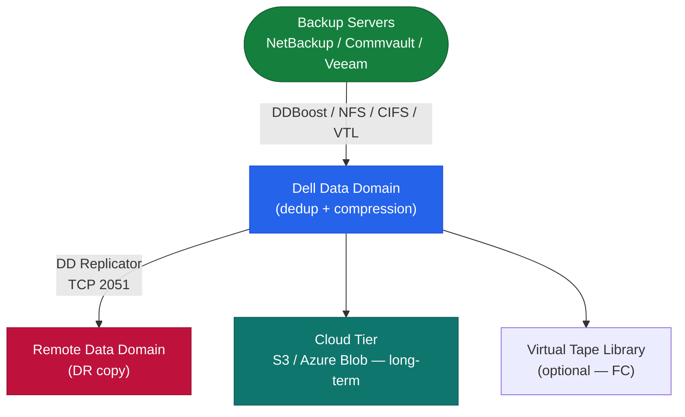
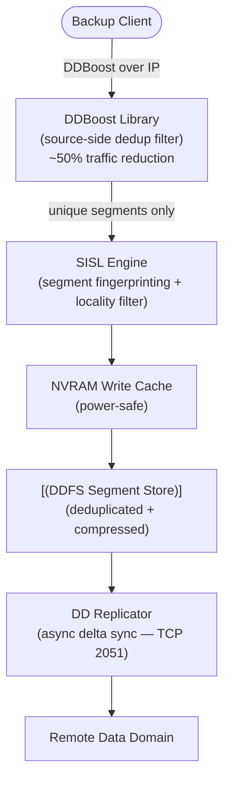

# Data Domain — How It Works

## Overview

Dell PowerProtect DD (Data Domain) is a purpose-built backup appliance built around **inline global deduplication**. All data is deduplicated as it is written using the SISL (Stream-Informed Segment Layout) engine — not in post-processing. Typical deduplication ratios: 20:1 or greater across mixed workloads.

## Architecture


┌─────────────────────────────────── Dell Data Domain — How It Works ───────────────────────────────────┐
│                                                                                                       │
│   ┌───────────────────────────────────────────────────────────────────────────────────────────────┐   │
│   │        Data Domain performs inline dedup: segments incoming data, hashes, checks index        │   │
│   │            Unique segments written to DDOS; duplicates recorded as references only            │   │
│   │           NVRAM buffers writes; segment index (fingerprint DB) held in RAM for speed          │   │
│   └───────────────────────────────────────────────────────────────────────────────────────────────┘   │
│                                                                                                       │
│    Write path: data → segment → hash → index lookup → unique: write / dup: reference only             │
│                                                                                                       │
│                          ▼                                                 ▼                          │
│                                                                                                       │
│   ┌──────────────────────────────────────────────┐  ┌─────────────────────────────────────────────┐   │
│   │                  Write Path                  │  │                  Read Path                  │   │
│   │      ─────────────────────────────────       │  │      ─────────────────────────────────      │   │
│   │       1. Data enters via NFS/Boost/VTL       │  │          1. Restore request arrives         │   │
│   │      2. Chunked into variable segments       │  │        2. DDOS resolves segment refs        │   │
│   │       3. SHA-1 fingerprint per segment       │  │          3. Segments read from disk         │   │
│   │         4. Index lookup in RAM/NVRAM         │  │           4. Reassembled in order           │   │
│   │       5. Unique: write to disk + index       │  │         5. Decompressed + delivered         │   │
│   │       6. Duplicate: metadata ref only        │  │          6. Data returned to client         │   │
│   └──────────────────────────────────────────────┘  └─────────────────────────────────────────────┘   │
│                                                                                                       │
│   ┌───────────────────────────────────────────────────────────────────────────────────────────────┐   │
│   │     DD Boost: client-side library segments data before sending; reduces network by 50–90%     │   │
│   │       Cleaning: DDOS garbage collects orphaned segments during off-hours (cron default)       │   │
│   │           Replication: only sends unique new segments to DR DD; bandwidth-efficient           │   │
│   └───────────────────────────────────────────────────────────────────────────────────────────────┘   │
│                                                                                                       │
│    Key terms:                                                                                         │
│                                                                                                       │
│    Segment       = Variable-length data chunk (avg 8 KB); unit of deduplication                       │
│    Fingerprint   = SHA-1 hash of segment content; used as dedup index key                             │
│    Segment index = In-RAM hash table mapping fingerprints to disk locations                           │
│    NVRAM cache   = Incoming writes staged in NVRAM; protects against power loss mid-stream            │
│    Cleaning      = Scheduled DDOS process removing segments no longer referenced                      │
│    DD Boost lib  = Plugin installed in backup app (NBU, Networker, Veeam); enables client dedup       │
│    Reference     = Duplicate segment stored as pointer to existing segment; saves disk space          │
│                                                                                                       │
└───────────────────────────────────────────────────────────────────────────────────────────────────────┘
```

Each MTree is a logical partition; all data physically shares the same dedup pool. Quotas are enforced per MTree, but deduplication operates globally across all MTrees.

## Data Path



DDBoost reduces network traffic by ~50% via source-side deduplication — only unique segments are sent to the DD appliance.

## Components

| Component | Description |
|---|---|
| DDBoost | Protocol allowing backup software to perform source-side dedup filtering; integrates with NetBackup, Commvault, Veeam |
| SISL Engine | Stream-Informed Segment Layout; fingerprints segments and matches against global index; new unique segments go to NVRAM |
| NVRAM | Power-safe write buffer; writes acknowledged to backup software after NVRAM landing |
| MTree | Logical namespace partition (`/data/col1/<name>`); quotas, retention locks, and replication policies set per MTree |
| DD Replicator | Asynchronous delta replication between DD systems; replicates only new unique segments (TCP 2051) |
| Cloud Tier | Lifecycle policy to offload aged segments to S3-compatible or Azure Blob object storage |
| VTL | Virtual Tape Library interface via FC for tape-based backup software integration |

## HA Options

| Model | HA Type | Description |
|---|---|---|
| DD2200–DD9400 | Single node | No controller failover; HA via MTree replication to remote DD |
| DD9900 | Active-Standby pair | Two DD heads sharing SAS disk shelves; standby monitors active; automatic failover |

## Protocol Access

| Protocol | Port | Use Case |
|---|---|---|
| DDBoost over IP | TCP 2052 (HTTP) / 2053 (HTTPS) | Primary — backup software integration |
| NFS v3 | TCP/UDP 2049 | Unix/Linux backup clients |
| CIFS/SMB | TCP 445 | Windows backup clients |
| VTL | FC | Tape-emulation for legacy backup software |
| DD Replicator | TCP 2051 | DD-to-DD replication |
| Management (CLI/UI) | TCP 22 (SSH) / 443 (HTTPS) | Administration |

## Key CLI Commands

```bash
filesys status                    # filesystem enabled/disabled state
filesys show space                # pre/post-compression capacity
filesys show compression          # global dedup ratio (healthy = 20:1+)
replication show                  # replication context states
ddboost show clients              # connected backup servers
alerts show current               # active hardware/software alerts
system show                       # hardware health (fans, PSUs, disks)
mtree list                        # all MTrees and their quota status
```
