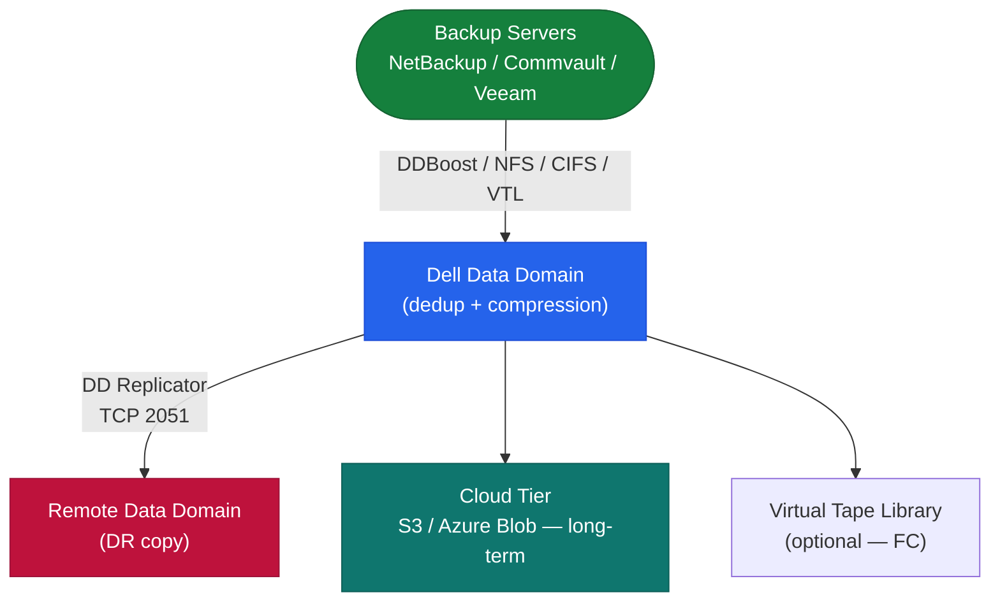

# Data Domain — Architecture

Dell PowerProtect DD (Data Domain) is a purpose-built backup appliance with inline global deduplication via the SISL engine. DDBoost integration with backup software reduces network traffic by ~50% via source-side deduplication. Typical dedup ratios: 20:1 or greater.

  <a class="kb-card" href="how-it-works/">
    
⚙️

    
How It Works

    
SISL dedup engine, DDFS/MTree namespace, DDBoost source-side filtering, DD Replicator, cloud tier, and key CLI commands.

  </a>
  <a class="kb-card" href="integrations/">
    
🔗

    
Integrations

    
NetBackup, Commvault, Veeam DDBoost integration, VTL for legacy backup software, and cloud tier object storage.

  </a>
  <a class="kb-card" href="design-standards/">
    
📐

    
Design Standards

    
MTree layout, replication topology, DDBoost vs NFS protocol selection, and cloud tier lifecycle policy design.

  </a>

## Protocol Access

| Protocol | Port | Use Case |
|---|---|---|
| DDBoost over IP | TCP 2052 / 2053 | Primary — backup software integration |
| NFS v3 | TCP/UDP 2049 | Unix/Linux backup clients |
| CIFS/SMB | TCP 445 | Windows backup clients |
| VTL | FC | Tape-emulation for legacy backup software |
| DD Replicator | TCP 2051 | DD-to-DD replication |
| Management | TCP 22 / 443 | SSH CLI and HTTPS UI |

## Topology

