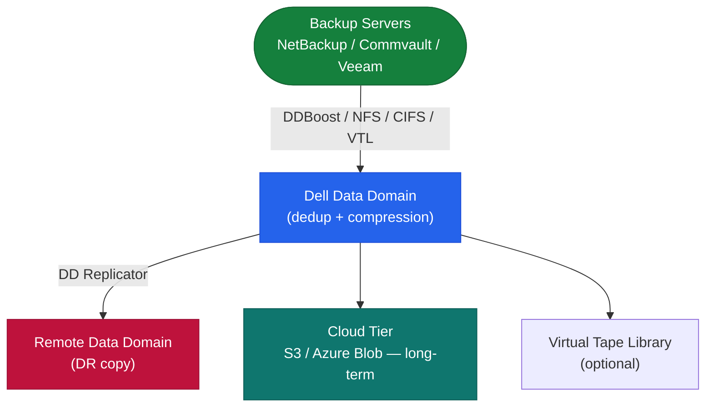
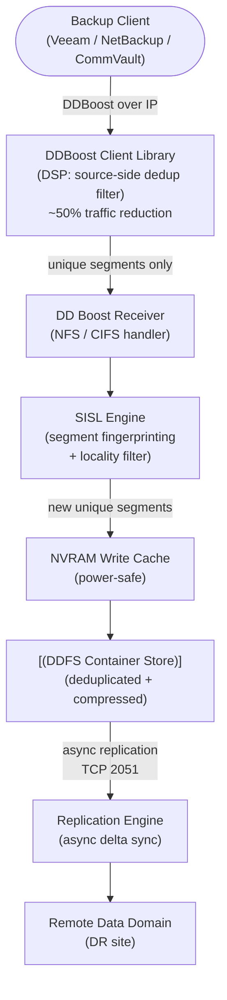

# Data Domain — Overview

## Overview

Dell PowerProtect DD (Data Domain) is a purpose-built backup appliance built around inline global deduplication. All data is deduplicated as it is written — not in post-processing — using the SISL (Stream-Informed Segment Layout) deduplication engine. The result is a highly space-efficient backup target that typically achieves 20:1 or greater reduction ratios across mixed workloads.

## Deduplication Pipeline



## Filesystem Architecture

```
DDFS (Data Domain Filesystem)
├── Namespace layer (MTrees: /data/col1/<name>)
│   ├── MTree A (e.g., mtree-veeam-prod)
│   ├── MTree B (e.g., mtree-netbackup-ora)
│   └── MTree C (e.g., mtree-commvault-dev)
├── Segment store (deduplicated data containers)
├── Index (segment fingerprint lookup table)
└── Cleaning layer (garbage collection of unreferenced segments)
```

Each MTree is a logical view; all data physically shares the same dedup pool. Quotas are enforced per MTree, but deduplication operates globally across all MTrees.

## HA Topology

### Single Node (Standard)

The most common deployment. A single DD appliance with internal or external shelf expansion. No automatic failover — HA is achieved through MTree replication to a secondary DD at a remote site.

```
[Backup Clients]
      |
  [Data Domain]  ←── DDBoost / NFS / CIFS / VTL
      |
  [Disk Shelves]  (internal or external SAS expansion)
      |
  [Replication target DD] (remote site — DR)
```

### HA Active-Standby Pair

Available on high-end DD9000/DD9900 series. Two DD heads share the same disk shelves. The standby monitors the active node and takes over on failure. Failover is automatic and non-disruptive to replication contexts.

```
[Active DD Head] ←──── Heartbeat ────→ [Standby DD Head]
         \                                    /
          └──── Shared SAS Disk Shelves ─────┘
```

## Data Path



---

## In this section

<div class="kb-grid kb-grid-3">
<a class="kb-card" href="components/"><strong>Components</strong><span>Core components, services, and technical specifications.</span></a>
<a class="kb-card" href="integrations/"><strong>Integrations</strong><span>Integration with other platforms and external systems.</span></a>
<a class="kb-card" href="standards/"><strong>Standards</strong><span>Sizing guidelines, design standards, and best practices.</span></a>
</div>
