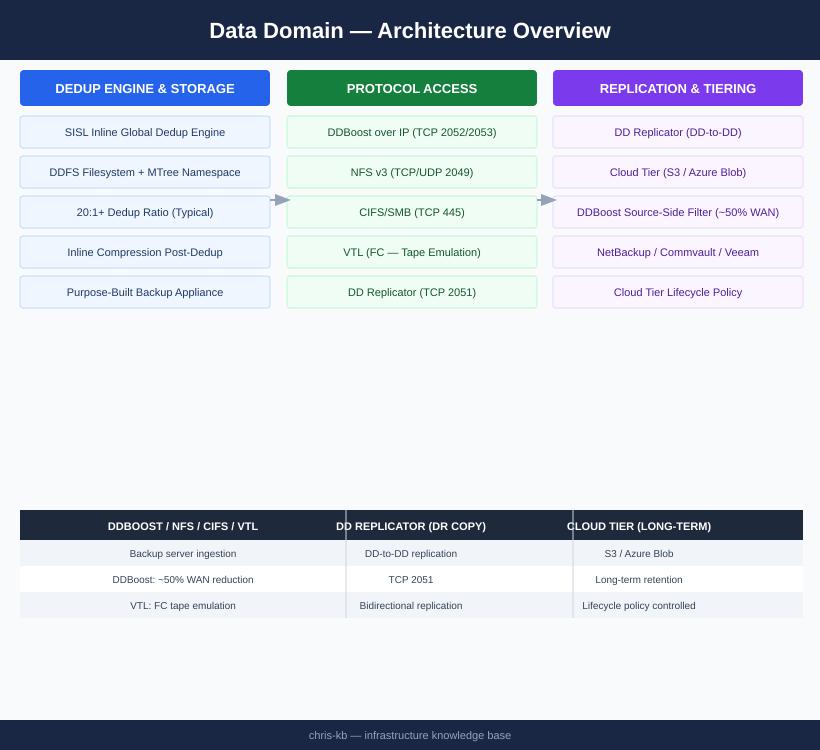

# Data Domain — Architecture

<div class="kb-summary">
Dell PowerProtect DD (Data Domain) is a purpose-built backup appliance with inline global deduplication via the SISL engine. DDBoost integration with backup software reduces network traffic by ~50% via source-side deduplication. Typical dedup ratios: 20:1 or greater.
</div>

```
┌──────────────────────────────────── Dell Data Domain Architecture ────────────────────────────────────┐
│                                                                                                       │
│   ┌───────────────────────────────────────────────────────────────────────────────────────────────┐   │
│   │     Data Domain: purpose-built deduplication backup appliance with DDOS; NAS/VTL front-end    │   │
│   │      Inline deduplication and compression reduce backup storage by 10–55x typical ratios      │   │
│   │          Protocols: NFS, CIFS/SMB, DD Boost (app-side dedup), VTL, OST (OpenStorage)          │   │
│   │           Replication: DD Replicator sends only unique deduplicated data to DR site           │   │
│   └───────────────────────────────────────────────────────────────────────────────────────────────┘   │
│                                                                                                       │
│    Backup app writes to DD via NFS/DD Boost → inline dedup → stored in DDOS filesystem                │
│                                                                                                       │
│                  ▼                                ▼                                ▼                  │
│                                                                                                       │
│   ┌─────────────────────────────┐  ┌─────────────────────────────┐  ┌─────────────────────────────┐   │
│   │     Front-End Protocols     │  │          DDOS Core          │  │         Replication         │   │
│   │      ─────────────────      │  │      ─────────────────      │  │      ─────────────────      │   │
│   │         NFS (POSIX)         │  │         Inline dedup        │  │        DD Replicator        │   │
│   │          CIFS / SMB         │  │         Compression         │  │        Collection rep       │   │
│   │           DD Boost          │  │           DDOS FS           │  │          MTree rep          │   │
│   │        VTL (FC/iSCSI)       │  │            RAID-6           │  │        DD Cloud Tier        │   │
│   │            DD OST           │  │          Encryption         │  │         Cascade rep         │   │
│   └─────────────────────────────┘  └─────────────────────────────┘  └─────────────────────────────┘   │
│                                                                                                       │
│   │    Component     │      Model       │      Capacity     │    Throughput    │     Use case     │   │
│   │ ──────────────── │ ──────────────── │ ───────────────── │ ──────────────── │──────────────────│   │
│   │      Entry       │      DD3300      │    Up to 96 TB    │    5.4 TB/hr     │   Remote/ROBO    │   │
│   │       Mid        │      DD6400      │    Up to 576 TB   │     27 TB/hr     │  Mid datacenter  │   │
│   │       High       │      DD9900      │    Up to 1 PB+    │    68.8 TB/hr    │ Large enterprise │   │
│   │     Virtual      │       DDVE       │    Up to 96 TB    │     Software     │   Cloud/hybrid   │   │
│                                                                                                       │
│    Physical: head unit + expansion shelves; NVRAM write cache for inline dedup throughput             │
│                                                                                                       │
│    Key terms:                                                                                         │
│                                                                                                       │
│    DDOS         = Data Domain Operating System; purpose-built FS optimised for deduplication          │
│    DD Boost     = Client-side library in Networker/Veeam/NBU; offloads dedup to backup client         │
│    Inline dedup = Deduplication performed as data streams in; zero separate dedupe pass needed        │
│    MTree        = Logical partition of DD storage; replication target; quota boundaries               │
│    VTL          = Virtual Tape Library; emulates tape drives over FC or iSCSI                         │
│    DD Replicator= Asynchronous replication of deduplicated data; sends only unique segments           │
│    Collection rep= Replicates entire DD filesystem; used for full system DR                           │
│    NVRAM        = Non-volatile RAM write cache; ensures dedup throughput without losing data          │
│    RAID-6       = DDOS uses RAID-6 for data protection; tolerates 2 simultaneous drive failures       │
│    DD Cloud Tier= Offloads inactive data from DD to object storage (AWS S3, Azure Blob, etc.)         │
│    OST          = OpenStorage Technology; backup app plugin for direct data path to DD                │
│    DDVE         = Data Domain Virtual Edition; software-only DD running on VMware/cloud               │
│                                                                                                       │
└───────────────────────────────────────────────────────────────────────────────────────────────────────┘
```
```text
┌──────────────────────────────────── Dell Data Domain Architecture ────────────────────────────────────┐
│                                                                                                       │
│   ┌───────────────────────────────────────────────────────────────────────────────────────────────┐   │
│   │     Data Domain: purpose-built deduplication backup appliance with DDOS; NAS/VTL front-end    │   │
│   │      Inline deduplication and compression reduce backup storage by 10–55x typical ratios      │   │
│   │          Protocols: NFS, CIFS/SMB, DD Boost (app-side dedup), VTL, OST (OpenStorage)          │   │
│   │           Replication: DD Replicator sends only unique deduplicated data to DR site           │   │
│   └───────────────────────────────────────────────────────────────────────────────────────────────┘   │
│                                                                                                       │
│    Backup app writes to DD via NFS/DD Boost → inline dedup → stored in DDOS filesystem                │
│                                                                                                       │
│                  ▼                                ▼                                ▼                  │
│                                                                                                       │
│   ┌─────────────────────────────┐  ┌─────────────────────────────┐  ┌─────────────────────────────┐   │
│   │     Front-End Protocols     │  │          DDOS Core          │  │         Replication         │   │
│   │      ─────────────────      │  │      ─────────────────      │  │      ─────────────────      │   │
│   │         NFS (POSIX)         │  │         Inline dedup        │  │        DD Replicator        │   │
│   │          CIFS / SMB         │  │         Compression         │  │        Collection rep       │   │
│   │           DD Boost          │  │           DDOS FS           │  │          MTree rep          │   │
│   │        VTL (FC/iSCSI)       │  │            RAID-6           │  │        DD Cloud Tier        │   │
│   │            DD OST           │  │          Encryption         │  │         Cascade rep         │   │
│   └─────────────────────────────┘  └─────────────────────────────┘  └─────────────────────────────┘   │
│                                                                                                       │
│   │    Component     │      Model       │      Capacity     │    Throughput    │     Use case     │   │
│   │ ──────────────── │ ──────────────── │ ───────────────── │ ──────────────── │──────────────────│   │
│   │      Entry       │      DD3300      │    Up to 96 TB    │    5.4 TB/hr     │   Remote/ROBO    │   │
│   │       Mid        │      DD6400      │    Up to 576 TB   │     27 TB/hr     │  Mid datacenter  │   │
│   │       High       │      DD9900      │    Up to 1 PB+    │    68.8 TB/hr    │ Large enterprise │   │
│   │     Virtual      │       DDVE       │    Up to 96 TB    │     Software     │   Cloud/hybrid   │   │
│                                                                                                       │
│    Physical: head unit + expansion shelves; NVRAM write cache for inline dedup throughput             │
│                                                                                                       │
│    Key terms:                                                                                         │
│                                                                                                       │
│    DDOS         = Data Domain Operating System; purpose-built FS optimised for deduplication          │
│    DD Boost     = Client-side library in Networker/Veeam/NBU; offloads dedup to backup client         │
│    Inline dedup = Deduplication performed as data streams in; zero separate dedupe pass needed        │
│    MTree        = Logical partition of DD storage; replication target; quota boundaries               │
│    VTL          = Virtual Tape Library; emulates tape drives over FC or iSCSI                         │
│    DD Replicator= Asynchronous replication of deduplicated data; sends only unique segments           │
│    Collection rep= Replicates entire DD filesystem; used for full system DR                           │
│    NVRAM        = Non-volatile RAM write cache; ensures dedup throughput without losing data          │
│    RAID-6       = DDOS uses RAID-6 for data protection; tolerates 2 simultaneous drive failures       │
│    DD Cloud Tier= Offloads inactive data from DD to object storage (AWS S3, Azure Blob, etc.)         │
│    OST          = OpenStorage Technology; backup app plugin for direct data path to DD                │
│    DDVE         = Data Domain Virtual Edition; software-only DD running on VMware/cloud               │
│                                                                                                       │
└───────────────────────────────────────────────────────────────────────────────────────────────────────┘
```


<div class="kb-grid kb-grid-3">
  <a class="kb-card" href="how-it-works/">
    <div class="kb-card-icon">⚙️</div>
    <div class="kb-card-title">How It Works</div>
    <div class="kb-card-desc">SISL dedup engine, DDFS/MTree namespace, DDBoost source-side filtering, DD Replicator, cloud tier, and key CLI commands.</div>
  </a>
  <a class="kb-card" href="integrations/">
    <div class="kb-card-icon">🔗</div>
    <div class="kb-card-title">Integrations</div>
    <div class="kb-card-desc">NetBackup, Commvault, Veeam DDBoost integration, VTL for legacy backup software, and cloud tier object storage.</div>
  </a>
  <a class="kb-card" href="design-standards/">
    <div class="kb-card-icon">📐</div>
    <div class="kb-card-title">Design Standards</div>
    <div class="kb-card-desc">MTree layout, replication topology, DDBoost vs NFS protocol selection, and cloud tier lifecycle policy design.</div>
  </a>
</div>

## Protocol Access

| Protocol | Port | Use Case |
|---|---|---|
| DDBoost over IP | TCP 2052 / 2053 | Primary — backup software integration |
| NFS v3 | TCP/UDP 2049 | Unix/Linux backup clients |
| CIFS/SMB | TCP 445 | Windows backup clients |
| VTL | FC | Tape-emulation for legacy backup software |
| DD Replicator | TCP 2051 | DD-to-DD replication |
| Management | TCP 22 / 443 | SSH CLI and HTTPS UI |

## Topology


