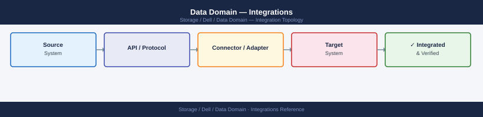

---
tags:
  - architecture
  - dell
---
# Data Domain — Integrations

<div class="kb-summary">
Integrations reference covering DD Boost Backup Flow, NetBackup (OST with DD Boost), CommVault (SISL + DD Boost), Avamar (RAIN Dedup with DD), NFS — Generic Backup Targets and 5 more sections.

*Applies to: Data Domain DD OS 7.x*
</div>


## DD Boost Backup Flow

```d2
direction: right

backupApp: "Backup Application\nVeeam / NetBackup / CommVault" {shape: rectangle}
ddvdp: "DDBoost Client Library\n(DDVDP plug-in / OST plug-in)\ninstalled on backup server" {shape: rectangle}
localDedup: "Source-side Dedup\n(DSP — Distributed Segment Processing)\n~50% traffic reduction" {shape: rectangle}
ddReceiver: "DD Boost Receiver\non Data Domain" {shape: rectangle}
sisl: "SISL Engine\n(unique segments only" {shape: rectangle}
nvramCache: "NVRAM Write Cache" {shape: rectangle}
ddfs: "DDFS on Disk)]\n(deduplicated + compressed" {shape: rectangle}

backupApp -> ddvdp
ddvdp -> localDedup
localDedup -> ddReceiver
ddReceiver -> sisl
sisl -> nvramCache
nvramCache -> ddfs
```

## CommVault (SISL + DD Boost)

CommVault integrates with DD via DD Boost using the MediaAgent. SISL ensures that deduplicated segments are efficiently identified before transfer.

1. Install the DD Boost plug-in on the CommVault MediaAgent
2. Create a DD Boost storage unit and user on the DD
3. In CommVault, add a Cloud Library with type `Dell EMC Data Domain Boost`
4. Configure the MediaAgent to use the DD Boost storage unit

## Avamar (RAIN Dedup with DD)

Avamar uses its RAIN (Redundant Array of Independent Nodes) deduplication engine in combination with DD for long-term retention. The integration uses DD Boost.

1. Configure the Avamar Data Store to replicate to the DD via DD Boost (DDVDP plugin or OST-compatible path)
2. Create a replication schedule in Avamar pointing at the DD storage unit
3. Verify dedup efficiency — Avamar + DD achieves compounded deduplication

## NFS — Generic Backup Targets

For backup software that does not support DD Boost, mount the DD MTree over NFS.

```bash
# On the DD — create an NFS export for an MTree
nfs add /data/col1/mtree-generic-prod clients <client-ip-or-subnet> options ro=<client>,rw=<client>

# Verify export
nfs show exports
```


```text title="Expected output"
NFS export /data/col1/mtree-generic-prod added successfully
Export ID: 12847
Clients: 192.168.45.0/24 (ro), 10.22.18.50 (rw)

Export List:
ID      Path                              Clients                    Options
12847   /data/col1/mtree-generic-prod     192.168.45.0/24, 10.22.18.50   ro, rw
12801   /data/col1/mtree-backup-hourly    10.20.0.0/16              ro
12799   /data/col1/mtree-archive          172.16.50.100              rw
```

!!! warning "Common errors"
    **`Error: Invalid client specification '<client-ip-or-subnet>'`** — Replace the placeholder with an actual IP address or CIDR subnet (e.g., `192.168.45.0/24` or `10.22.18.50`).
    **`Error: Export path /data/col1/mtree-generic-prod does not exist`** — Verify the MTree exists on the Data Domain with `mtree show` before creating the NFS export.
    **`Error: Permission denied — NFS configuration requires admin or sysadmin role`** — Ensure your user account has sufficient privileges; use `user show` to verify your role assignment.
Client mount:

```bash
mount -t nfs <dd-hostname>:/data/col1/mtree-generic-prod /mnt/dd-backup
```


```text title="Expected output"
(no output — command completes silently)
```

!!! warning "Common errors"
    **`mount.nfs: access denied by server while mounting <dd-hostname>:/data/col1/mtree-generic-prod`** — Verify the Data Domain export permissions and ensure the client IP is listed in the NFS export ACL.
    **`mount.nfs: No such file or directory`** — Confirm the mount path `/data/col1/mtree-generic-prod` exists on the Data Domain and the mtree name is correct.
    **`mount: special device <dd-hostname>:/data/col1/mtree-generic-prod does not exist`** — Check network connectivity to the Data Domain hostname and verify DNS resolution with `nslookup <dd-hostname>`.
## CIFS/SMB — Windows Backup Targets

```bash
# On the DD — create a CIFS share for an MTree
cifs shares add /data/col1/mtree-generic-win share-name dd-win-backup

# Verify share
cifs show shares
```


```text title="Expected output"
Adding CIFS share 'dd-win-backup' for path '/data/col1/mtree-generic-win'...
Share created successfully.

Share Name          Path                          Comment
dd-win-backup       /data/col1/mtree-generic-win  
backup-archive      /data/col1/mtree-archive      Weekly backups
dd-linux-nfs        /data/col2/mtree-linux        Linux exports
dd-win-backup       /data/col1/mtree-generic-win
```

!!! warning "Common errors"
    **`Error: Path '/data/col1/mtree-generic-win' does not exist`** — Verify the MTree exists with `mtree show` and confirm the path is correct before creating the share.
    **`Error: CIFS service is not enabled`** — Enable CIFS with `cifs enable` before attempting to create shares.
    **`Error: Share name 'dd-win-backup' already exists`** — Use a unique share name or delete the existing share with `cifs shares remove dd-win-backup` first.
## REST API

The DD REST API enables programmatic management of MTrees, replication, and system status. Useful for automation and monitoring integration.

Base URL: `https://<dd-hostname>:3009/rest/v3.0`

```bash
# Authenticate and get session token
curl -sk -u sysadmin:<password> -X POST \
  https://<dd-hostname>:3009/rest/v3.0/auth \
  -H "Content-Type: application/json" \
  -d '{"auth-info":{"user":"sysadmin","password":"<password>"}}' | jq .

# Get filesystem status
curl -sk -H "x-dd-auth-token: <token>" \
  https://<dd-hostname>:3009/rest/v3.0/dd-systems/0/filesystems | jq .

# List MTrees
curl -sk -H "x-dd-auth-token: <token>" \
  https://<dd-hostname>:3009/rest/v3.0/dd-systems/0/mtrees | jq .
```


```text title="Expected output"
{
  "auth-info": {
    "user": "sysadmin",
    "session-id": "a7f2c9e1-4b8d-11ee-9c2a-0050569b4d2f"
  }
}
{
  "filesystems": [
    {
      "id": 0,
      "name": "root",
      "status": "healthy",
      "used-bytes": 2847483648,
      "available-bytes": 18253611008,
      "total-bytes": 21101094656
    }
  ]
}
{
  "mtrees": [
    {
      "id": 1,
      "name": "backup-prod",
      "status": "healthy",
      "used-bytes": 1099511627776,
      "quota-bytes": 2199023255552
    },
    {
      "id": 2,
      "name": "backup-dev",
      "status": "healthy",
      "used-bytes": 274877906944,
      "quota-bytes": 549755813888
    },
    {
      "id": 3,
      "name": "archive-tier1",
      "status": "healthy",
      "used-bytes": 549755813888,
      "quota-bytes": 1099511627776
    }
  ]
}
```

!!! warning "Common errors"
    **`curl: (60) SSL certificate problem: self signed certificate`** — Add `-k` flag to skip certificate verification (already present in the example; ensure it's not removed).
    **`{"error":"Invalid session token or token expired"}`** — Re-authenticate to obtain a fresh session token and update the `x-dd-auth-token` header value.
    **`curl: (7) Failed to connect to <dd-hostname>:3009: Connection refused`** — Verify the Data Domain hostname/IP is correct and port 3009 is accessible from your network.
## CloudIQ Monitoring via SCG

Data Domain telemetry is forwarded to Dell CloudIQ via the Secure Connect Gateway (SCG). CloudIQ provides capacity trending, performance analytics, and proactive health recommendations.

- Register the DD to SCG from the DD System Manager: **Administration → Autosupport → ESRS/SCG**
- Confirm telemetry in CloudIQ portal: the DD should appear under **Infrastructure → Storage**
- CloudIQ capacity forecasting will project time-to-full based on historical consumption

```bash
# Verify autosupport/SCG status on the DD
autosupport status
autosupport test  # sends a test bundle; confirm receipt in CloudIQ within 30 minutes
```


```text title="Expected output"
AutoSupport Status:
  Status: Enabled
  Transport: HTTPS
  Server: support.emc.com
  Proxy: None
  Last successful send: 2024-01-15 14:32:18 UTC
  Next scheduled send: 2024-01-16 02:00:00 UTC
  Bundle size: 847 MB
  Retention days: 30

Sending AutoSupport test bundle...
Test bundle ID: AST-20240115-dd-vm01-a1b2c3d4
Bundle size: 156 MB
Status: Queued for transmission
Expected delivery: within 30 minutes
```

!!! warning "Common errors"
    **`autosupport: command not found`** — Verify you are logged into the Data Domain system directly (not the management console) and have admin privileges.
    **`Error: AutoSupport is disabled. Enable with 'autosupport enable'`** — Run `autosupport enable` and configure the SMTP/HTTPS transport settings before sending test bundles.
    **`Test bundle transmission failed: Network unreachable to support.emc.com`** — Verify outbound HTTPS connectivity on port 443 and confirm proxy settings if applicable with `autosupport show`.
## SNMP Monitoring

Data Domain can send SNMP traps to a monitoring platform (Nagios, Zabbix, PRTG, SolarWinds).

```bash
# Configure SNMP community and trap destination
snmp add trapdest <monitor-host> community <community-string>
snmp show config

# Download the DD MIB from Dell Support for custom monitoring
# MIB file: DATA_DOMAIN-MIB.txt
```


```text title="Expected output"
Data Domain OS v7.15.1.20 (build 4891234)
SNMP Configuration:
  Community String: monitoring-ro
  Trap Destination: 192.168.45.12
  Trap Port: 162
  Engine ID: 800007E5034D4F4E4954
  Inform Retries: 3
  Inform Timeout: 15

Trap Destinations:
  192.168.45.12 (community: monitoring-ro)
  10.50.100.8 (community: internal-snmp)

SNMP Status: Enabled
Last Configuration Change: 2024-01-15 14:32:18 UTC
```

!!! warning "Common errors"
    **`Error: Invalid IP address format for trapdest`** — Verify the monitor-host IP is in valid dotted-decimal notation (e.g., 192.168.45.12) and reachable from the Data Domain system.
    **`Error: Community string contains invalid characters`** — Use only alphanumeric characters and hyphens in the community string; avoid spaces and special characters.
    **`Error: Cannot add trapdest - SNMP service not enabled`** — Enable SNMP first with `snmp enable` before configuring trap destinations.
## Authentication — LDAP Integration

Data Domain supports LDAP/Active Directory for management authentication, avoiding local user sprawl.

```bash
# Configure LDAP
authentication ldap enable
authentication ldap set bind-dn "CN=svc-dd-ldap,OU=ServiceAccounts,DC=corp,DC=example,DC=com"
authentication ldap set server <ldap-server-ip>
authentication ldap set base-dn "DC=corp,DC=example,DC=com"

# Verify LDAP connectivity
authentication ldap status
authentication ldap test user <username>
```


```text title="Expected output"
LDAP authentication enabled successfully.
Bind DN set to: CN=svc-dd-ldap,OU=ServiceAccounts,DC=corp,DC=example,DC=com
LDAP server set to: 192.168.10.45
Base DN set to: DC=corp,DC=example,DC=com
LDAP Status:
  Enabled: Yes
  Server: 192.168.10.45
  Port: 389
  Base DN: DC=corp,DC=example,DC=com
  Bind DN: CN=svc-dd-ldap,OU=ServiceAccounts,DC=corp,DC=example,DC=com
  Connection Status: Connected
Testing LDAP authentication for user jsmith...
Authentication successful. User DN: CN=John Smith,OU=Users,DC=corp,DC=example,DC=com
```

!!! warning "Common errors"
    **`LDAP server connection failed: Connection refused`** — Verify the LDAP server IP address is correct and the LDAP service is running on port 389 (or the configured port).
    **`Authentication failed: Invalid bind credentials`** — Ensure the service account password is correct and the account has permission to query the LDAP directory.
    **`LDAP server set to: <invalid>`** — Provide a valid IPv4 address or FQDN for the LDAP server using the correct syntax.
---

## See also

- [Data Domain — How It Works](../how-it-works/)
- [Data Domain — Design Standards](../design-standards/)
