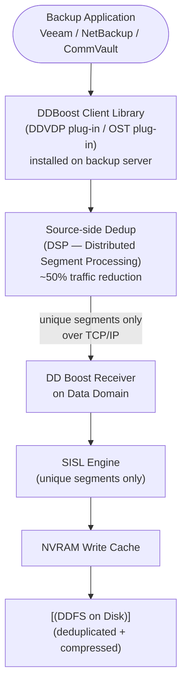

# Data Domain — Integrations

## DD Boost Backup Flow


┌──────────────────────────────────── Dell Data Domain Integrations ────────────────────────────────────┐
│                                                                                                       │
│   ┌───────────────────────────────────────────────────────────────────────────────────────────────┐   │
│   │         Data Domain integrates with major backup applications via DD Boost or NFS/CIFS        │   │
│   │           DDMC (Data Domain Management Center) manages multiple DD systems centrally          │   │
│   └───────────────────────────────────────────────────────────────────────────────────────────────┘   │
│                                                                                                       │
│                  ▼                                ▼                                ▼                  │
│                                                                                                       │
│   ┌─────────────────────────────┐  ┌─────────────────────────────┐  ┌─────────────────────────────┐   │
│   │         Backup Apps         │  │          Management         │  │        Cloud/Archive        │   │
│   │      ─────────────────      │  │      ─────────────────      │  │      ─────────────────      │   │
│   │        Dell Networker       │  │             DDMC            │  │        DD Cloud Tier        │   │
│   │      Veritas NetBackup      │  │           CloudIQ           │  │            AWS S3           │   │
│   │         Veeam Backup        │  │        Secure Connect       │  │          Azure Blob         │   │
│   │         Dell Avamar         │  │         SNMP alerts         │  │        S3-compatible        │   │
│   │          Commvault          │  │         Syslog/SIEM         │  │          ECS object         │   │
│   └─────────────────────────────┘  └─────────────────────────────┘  └─────────────────────────────┘   │
│                                                                                                       │
│   │   Integration    │     Protocol     │      Feature      │      Config      │      Notes       │   │
│   │ ──────────────── │ ──────────────── │ ───────────────── │ ──────────────── │──────────────────│   │
│   │    Networker     │     DD Boost     │   App-side dedup  │   DDBDA plugin   │    Preferred     │   │
│   │      Veeam       │     DD Boost     │   App-side dedup  │   Boost plugin   │      v9.5+       │   │
│   │    NetBackup     │   OST/DD Boost   │   Optimised dup   │    OST plugin    │    Preferred     │   │
│   │       DDMC       │      HTTPS       │    Central mgmt   │  Add DD to DDMC  │     Multi-DD     │   │
│                                                                                                       │
│    Key terms:                                                                                         │
│                                                                                                       │
│    DDBDA  = Dell Data Domain Boost for Backup Application; Networker integration library              │
│    DDMC   = Data Domain Management Center; central web UI managing multiple DD systems                │
│    OST    = OpenStorage Technology; NetBackup plugin enabling direct API integration with DD          │
│    Cloud Tier= DDOS tier moving aged data to object storage; read-back transparent                    │
│                                                                                                       │
└───────────────────────────────────────────────────────────────────────────────────────────────────────┘

## NetBackup (OST with DD Boost)

NetBackup uses the OpenStorage Technology (OST) plug-in to write directly to DD via DD Boost.

1. Install the OST plug-in on each NetBackup media server
2. Create DD Boost user and storage unit on the DD
3. In NetBackup, add a Disk Pool using storage server type `DataDomain` with DD Boost credentials
4. Create a Storage Unit pointing at the Disk Pool
5. Configure backup policies to target the new Storage Unit

**Verify:**

```bash
ddboost show clients  # NetBackup media servers should appear
replication show  # if OST optimised duplication is used, check replication contexts
```

## CommVault (SISL + DD Boost)

CommVault integrates with DD via DD Boost using the MediaAgent. SISL ensures that deduplicated segments are efficiently identified before transfer.

1. Install the DD Boost plug-in on the CommVault MediaAgent
2. Create a DD Boost storage unit and user on the DD
3. In CommVault, add a Cloud Library with type `Dell EMC Data Domain Boost`
4. Configure the MediaAgent to use the DD Boost storage unit

## Avamar (RAIN Dedup with DD)

Avamar uses its RAIN (Redundant Array of Independent Nodes) deduplication engine in combination with DD for long-term retention. The integration uses DD Boost.

1. Configure the Avamar Data Store to replicate to the DD via DD Boost (DDVDP plugin or OST-compatible path)
2. Create a replication schedule in Avamar pointing at the DD storage unit
3. Verify dedup efficiency — Avamar + DD achieves compounded deduplication

## NFS — Generic Backup Targets

For backup software that does not support DD Boost, mount the DD MTree over NFS.

```bash
# On the DD — create an NFS export for an MTree
nfs add /data/col1/mtree-generic-prod clients <client-ip-or-subnet> options ro=<client>,rw=<client>

# Verify export
nfs show exports
```

Client mount:

```bash
mount -t nfs <dd-hostname>:/data/col1/mtree-generic-prod /mnt/dd-backup
```

## CIFS/SMB — Windows Backup Targets

```bash
# On the DD — create a CIFS share for an MTree
cifs shares add /data/col1/mtree-generic-win share-name dd-win-backup

# Verify share
cifs show shares
```

## REST API

The DD REST API enables programmatic management of MTrees, replication, and system status. Useful for automation and monitoring integration.

Base URL: `https://<dd-hostname>:3009/rest/v3.0`

```bash
# Authenticate and get session token
curl -sk -u sysadmin:<password> -X POST \
  https://<dd-hostname>:3009/rest/v3.0/auth \
  -H "Content-Type: application/json" \
  -d '{"auth-info":{"user":"sysadmin","password":"<password>"}}' | jq .

# Get filesystem status
curl -sk -H "x-dd-auth-token: <token>" \
  https://<dd-hostname>:3009/rest/v3.0/dd-systems/0/filesystems | jq .

# List MTrees
curl -sk -H "x-dd-auth-token: <token>" \
  https://<dd-hostname>:3009/rest/v3.0/dd-systems/0/mtrees | jq .
```

## CloudIQ Monitoring via SCG

Data Domain telemetry is forwarded to Dell CloudIQ via the Secure Connect Gateway (SCG). CloudIQ provides capacity trending, performance analytics, and proactive health recommendations.

- Register the DD to SCG from the DD System Manager: **Administration → Autosupport → ESRS/SCG**
- Confirm telemetry in CloudIQ portal: the DD should appear under **Infrastructure → Storage**
- CloudIQ capacity forecasting will project time-to-full based on historical consumption

```bash
# Verify autosupport/SCG status on the DD
autosupport status
autosupport test  # sends a test bundle; confirm receipt in CloudIQ within 30 minutes
```

## SNMP Monitoring

Data Domain can send SNMP traps to a monitoring platform (Nagios, Zabbix, PRTG, SolarWinds).

```bash
# Configure SNMP community and trap destination
snmp add trapdest <monitor-host> community <community-string>
snmp show config

# Download the DD MIB from Dell Support for custom monitoring
# MIB file: DATA_DOMAIN-MIB.txt
```

## Authentication — LDAP Integration

Data Domain supports LDAP/Active Directory for management authentication, avoiding local user sprawl.

```bash
# Configure LDAP
authentication ldap enable
authentication ldap set bind-dn "CN=svc-dd-ldap,OU=ServiceAccounts,DC=corp,DC=example,DC=com"
authentication ldap set server <ldap-server-ip>
authentication ldap set base-dn "DC=corp,DC=example,DC=com"

# Verify LDAP connectivity
authentication ldap status
authentication ldap test user <username>
```
