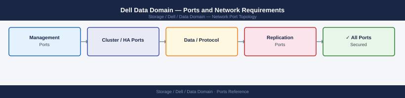

---
tags:
  - data-domain
  - dell
  - networking
  - firewall
  - ports
  - backup
  - deduplication
---
# Dell Data Domain — Ports and Network Requirements

<div class="kb-summary">
Firewall port reference for Dell Data Domain (EMC Data Domain / PowerProtect DD). Covers management UI, DD Boost protocol (primary integration path for Veeam, Commvault, NetBackup), NFS/SMB data paths, DD Replicator (inter-system replication), and NDMP.

*Applies to: DD OS 7.x / 8.x*
</div>


## Before you begin

- DD Boost (port 2052) is the primary backup software integration protocol — used by Veeam, Commvault, NetBackup, and most enterprise backup tools
- DD Replicator uses port 2051 for system-to-system replication — this must be open bidirectionally across any WAN or inter-site firewall
- NDMP (port 10000) is used only if integrating with NDMP-capable backup clients or NAS migration

---

## Inbound — Management Traffic

| Port | Protocol | Source | Purpose |
|---|---|---|---|
| 443 | TCP | Admin workstations | DD System Manager (web UI) and REST API |
| 22 | TCP | Jump hosts | SSH — DD OS CLI |
| 80 | TCP | Clients | HTTP — redirects to 443 |
| 161 | UDP | Monitoring systems | SNMP polling |

---

## Outbound — Array to External

| Port | Protocol | Destination | Purpose |
|---|---|---|---|
| 162 | UDP | SNMP trap receiver | SNMP traps |
| 514 | UDP/TCP | Syslog server | Syslog forwarding |
| 123 | UDP | NTP servers | Time synchronisation |
| 25 | TCP | SMTP relay | Email alert delivery |
| 443 | TCP | esrs.dell.com | ConnectEMC/ESRS support phone-home |

---

## DD Boost (Backup Software Integration)

DD Boost is the preferred data path for all major backup software clients.

| Port | Protocol | Source | Purpose |
|---|---|---|---|
| 2052 | TCP | Backup servers (Veeam, Commvault, NetBackup, AVAMAR) | DD Boost protocol — deduplicated data ingest |
| 2051 | TCP | DD Boost clients (WAN Boost) | DD Boost WAN optimisation (same port as Replicator — context-dependent) |

---

## NFS (Backup Clients via NFS Share)

| Port | Protocol | Source | Purpose |
|---|---|---|---|
| 2049 | TCP/UDP | NFS backup clients | NFS v3 data access |
| 111 | TCP/UDP | NFS backup clients | rpcbind |

---

## SMB / CIFS (Backup Clients via SMB Share)

| Port | Protocol | Source | Purpose |
|---|---|---|---|
| 445 | TCP | SMB backup clients | SMB data access |
| 139 | TCP | Legacy SMB clients | NetBIOS over TCP |

---

## NDMP (Tape or NAS Integration)

| Port | Protocol | Source | Purpose |
|---|---|---|---|
| 10000 | TCP | NDMP-capable backup server | NDMP agent — tape library emulation / NAS data migration |

---

## DD Replicator (Inter-System Replication)

DD Replicator replicates backup data between two Data Domain systems for offsite protection.

| Port | Protocol | Between | Purpose |
|---|---|---|---|
| 2051 | TCP | DD System A mgmt/data IP ↔ DD System B mgmt/data IP | DD Replicator — data replication and managed file replication |

Open bidirectionally — the secondary site's DD must also initiate to the primary.

---

## iSCSI (DD VTL — Virtual Tape Library)

When DD VTL (Virtual Tape Library) is enabled:

| Port | Protocol | Source | Purpose |
|---|---|---|---|
| 3260 | TCP | Backup server / media server | DD VTL iSCSI target (VTL disk device) |

---

## Active Directory Integration

| Port | Protocol | Destination | Purpose |
|---|---|---|---|
| 389 | TCP | Active Directory DCs | LDAP — admin authentication |
| 636 | TCP | Active Directory DCs | LDAPS (recommended) |
| 88 | TCP/UDP | Active Directory DCs | Kerberos |
| 445 | TCP | Active Directory DCs | SMB (domain join for CIFS access) |

---

## Firewall Zone Summary

| From | To | Ports | Notes |
|---|---|---|---|
| Admin clients | DD management IP | 443, 22 | Web UI and CLI |
| Monitoring | DD management IP | 161 UDP | SNMP |
| Backup servers | DD data IP | 2052 | DD Boost — primary integration port |
| NFS backup clients | DD NFS export IP | 2049, 111 | NFS share backup |
| SMB backup clients | DD SMB export IP | 445 | CIFS share backup |
| NDMP clients | DD management IP | 10000 | NDMP tape/NAS |
| DD1 mgmt/data | DD2 mgmt/data | 2051 | DD Replicator — bidirectional |
| Backup servers | DD VTL IP | 3260 | DD VTL iSCSI (if VTL enabled) |

---

## Verify

```bash
# From admin workstation — test DD web UI
curl -sk -o /dev/null -w "%{http_code}" https://<dd-mgmt-ip>/ddsmc/rest

# From backup server — test DD Boost port
nc -zv <dd-data-ip> 2052

# From backup server — test NFS mount
showmount -e <dd-nfs-ip>

# From second DD system — test Replicator port
nc -zv <remote-dd-ip> 2051

# From DD CLI SSH — check replication status
replication status
replication show config all
```

---

## See also

- [Dell Data Domain — Architecture](how-it-works/)
- [Dell Data Domain — Operations](../operations/)
