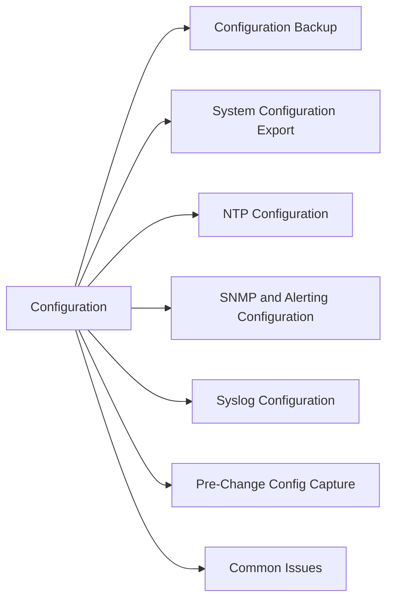

# Backup & Configuration

> Part of the Dell Data Domain CLI Reference.



## Configuration Backup

```bash
# Create a config backup
config backup create

# List available backups
config backup list

# Show backup details
config backup show

# Restore from a named backup
config backup restore <backup_name>
```

## System Configuration Export

```bash
# Show current system config summary
config show

# Show network configuration
net show config

# Show all interface settings
net show hostname
net show dns
```

## NTP Configuration

```bash
# Show current NTP settings
ntp status
ntp show

# Add NTP server
ntp add timesever <ntp_server_ip>

# Enable/disable NTP
ntp enable
ntp disable
```

## SNMP & Alerting Configuration

```bash
# Show SNMP configuration
snmp show config

# Show alert notification config
alerts notify-list show
```

## Syslog Configuration

```bash
# Show syslog configuration
log show config

# Forward logs to syslog server (via GUI or config file)
# Admintools → Maintenance → Syslog
```

## Pre-Change Config Capture

Before any change, capture current state:

```bash
config backup create
system show version
net show config
filesys show compression
replication show all
```

## Common Issues

| Issue | Check | Action |
|---|---|---|
| Config backup fails | Disk space | Check `filesys show space` |
| Restore fails | Backup name typo | Run `config backup list` first |
| NTP drift | NTP server unreachable | Check network and NTP config |
