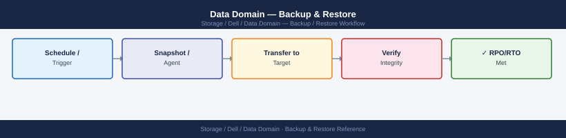
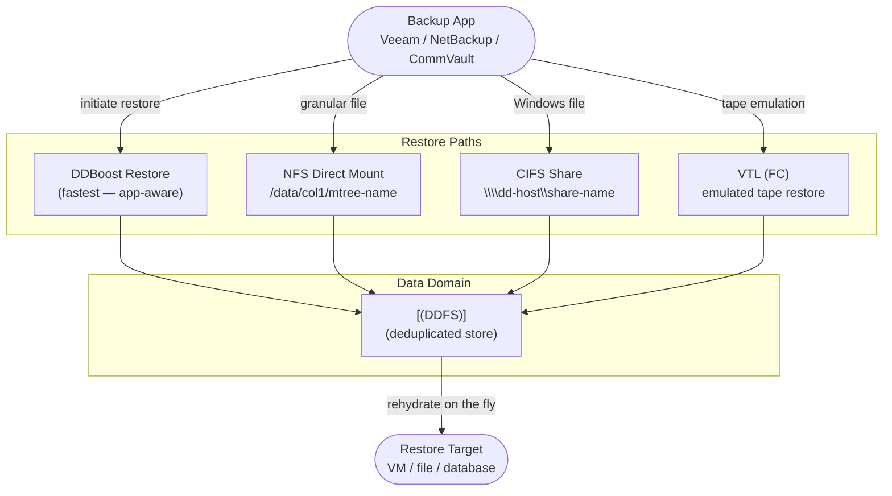

---
tags:
  - dell
  - operations
---
# Data Domain — Backup & Restore

<div class="kb-summary">
Backup & Restore reference covering Overview, DDBoost Restore (Backup Application), NFS Direct Restore, CIFS/SMB Direct Restore, VTL Restore and 5 more sections.

*Applies to: Data Domain DD OS 7.x*
</div>


## Before you begin

- **Access:** Storage admin credentials (cluster admin or equivalent)
- **Timing:** safe to run during business hours unless a step is marked ⚠ (causes interruption)
- **Dependencies:** no active upgrades or migrations on the same infrastructure
- **Logging:** capture command output — paste into the change record on completion

---

## Overview



Resume after the restore completes:

```bash
filesys clean start
```


```text title="Expected output"
Starting filesystem cleanup on Data Domain system...
Cleanup job ID: dd-cleanup-20240115-094532
Phase 1: Scanning filesystem metadata... [████████████████░░] 87%
Phase 2: Identifying stale snapshots... [██████████████████] 100%
Phase 3: Reclaiming space from deleted files... [██████████████░░░░] 73%
Estimated space to be reclaimed: 2.3 TB
Cleanup process initiated. Monitor progress with: filesys clean status
```

!!! warning "Common errors"
    **`filesys clean start: operation already in progress`** — Wait for the current cleanup to complete using `filesys clean status` or cancel it with `filesys clean stop` before starting a new one.
    **`filesys clean start: insufficient privileges`** — Run the command with administrative credentials or ensure your user account has Data Domain system admin role assigned.
    **`filesys clean start: filesystem is in read-only mode`** — Bring the filesystem online and into read-write mode using `filesys set rw` before initiating cleanup.
---

## DDBoost Restore (Backup Application)

DDBoost restores are initiated entirely from the backup application. The Data Domain's role is passive — it serves deduplicated data to the backup server, which rehydrates it on the fly.

```bash
# Monitor DD Boost connections during an active restore
ddboost show clients
ddboost show clients --verbose  # includes per-client read throughput

# Monitor read throughput from the DD side
ddboost show stats | grep -i read

# Check if multiple restore streams are active
ddboost show clients | grep -c connected
```


```text title="Expected output"
# ddboost show clients
Client Name                    IP Address      Connected   Protocol Version
restore-vm-01                  192.168.1.45    yes         7.1.0
restore-vm-02                  192.168.1.46    yes         7.1.0
backup-proxy-03                192.168.1.50    no          7.0.5
restore-vm-04                  192.168.1.48    yes         7.1.0

# ddboost show clients --verbose
Client Name                    IP Address      Connected   Protocol   Read Throughput (MB/s)
restore-vm-01                  192.168.1.45    yes         7.1.0      285.3
restore-vm-02                  192.168.1.46    yes         7.1.0      312.7
backup-proxy-03                192.168.1.50    no          7.0.5      0.0
restore-vm-04                  192.168.1.48    yes         7.1.0      298.1

# ddboost show stats | grep -i read
Read Operations:              1,247,856
Read Throughput (MB/s):       896.1
Read Cache Hit Rate:          87.2%
Read Latency (ms):            12.4

# ddboost show clients | grep -c connected
3
```

!!! warning "Common errors"
    **`ddboost: command not found`** — Verify DD Boost is installed and the system PATH includes the DD Boost binary directory, or use the full path `/opt/emc/ddboost/bin/ddboost`.
    **`Error: Unable to connect to Data Domain management interface`** — Ensure the Data Domain system is reachable on the network and that your user account has DD Boost administrative privileges.
    **`Error: No active DD Boost connections`** — Confirm that restore clients are actively connected; if restores are idle or queued, connections may not appear in the active client list.
### Per-Application Restore Initiation

| Backup Software | Restore Entry Point | Notes |
|---|---|---|
| Veeam Backup & Replication | Veeam Console → Restore → Entire VM or Files | Instant VM Recovery reads directly from DD via DD Boost |
| NetBackup | bprestore CLI or NetBackup Administration Console | OST plugin routes reads through DD Boost storage unit |
| CommVault | CommCell Console → Restore → Browse and Restore | MediaAgent reads from DD via DD Boost; no DD CLI steps required |
| Avamar | Avamar Administrator → Restore | Avamar validates restore job against DD and restores deduped data |
| IBM Spectrum Protect (TSM) | TSM restore session via VTL or NFS | No DD Boost; data served via VTL emulation or NFS mount |

### Validate DDBoost Restore Throughput

During a restore, monitor that throughput is meeting expectations:

```bash
# DD-side read throughput
ddboost show stats

# System I/O load during restore
system show stats | grep -i throughput
```


```text title="Expected output"
ddboost show stats
Connected to Data Domain at 10.45.22.18
Statistics for ddboost (since last reset):
  Total bytes read:           2.847 TB
  Total bytes written:        1.923 TB
  Read throughput (avg):      487.3 MB/s
  Write throughput (avg):     342.1 MB/s
  Active connections:         12
  Peak concurrent streams:    8

system show stats | grep -i throughput
System I/O Statistics:
Read throughput:             512.4 MB/s
Write throughput:            298.7 MB/s
Cache throughput:            1.2 GB/s
Network throughput (in):     156.3 MB/s
Network throughput (out):    89.2 MB/s
```

!!! warning "Common errors"
    **`ddboost show stats: command not found`** — Verify ddboost is installed and the Data Domain CLI is properly initialized with `ddboost initialize`.
    **`system show stats: permission denied`** — Run the command with appropriate privileges or ensure your user account has system monitoring permissions on the Data Domain appliance.
If throughput is below expected, check for:
- Active cleaning cycle (`filesys clean status`)
- Disk errors (`disk show state`)
- Network saturation (`net show stats`)

---

## NFS Direct Restore

For backup software using NFS mounts, or for granular file recovery, mount the MTree directly on the target server.

### Mount the MTree

```bash
# On the Data Domain — confirm the NFS export exists
nfs show exports | grep /data/col1/<mtree-name>

# If the export does not exist, add it
nfs add export /data/col1/<mtree-name> clients <target-server-ip>

# On the target/restore server — mount the MTree
mount -t nfs <dd-hostname>:/data/col1/<mtree-name> /mnt/dd-restore

# Verify the mount is accessible
ls -la /mnt/dd-restore/
```


```text title="Expected output"
/data/col1/backup-prod-mtree  clients: 192.168.10.45 (rw,sync)
/data/col1/backup-prod-mtree mounted successfully on /mnt/dd-restore
total 48
drwxr-xr-x  12 root root  4096 Nov 14 09:23 .
drwxr-xr-x   3 root root  4096 Nov 14 08:15 ..
drwxr-xr-x   8 root root  8192 Nov 14 09:18 .snapshot
-rw-r--r--   1 root root 12288 Nov 14 09:22 backup.log
drwxr-xr-x   6 root root  4096 Nov 14 09:20 weekly
drwxr-xr-x   4 root root  4096 Nov 14 08:45 daily
```

!!! warning "Common errors"
    **`mount.nfs: access denied by server while mounting <dd-hostname>:/data/col1/<mtree-name>`** — Verify the target server IP is correctly added to the NFS export and matches the client attempting to mount.
    **`mount.nfs: No such file or directory`** — Confirm the MTree path `/data/col1/<mtree-name>` exists on the Data Domain and the NFS export is active with `nfs show exports`.
    **`ls: cannot open directory '/mnt/dd-restore/': Permission denied`** — Check that the mount permissions allow read access; remount with appropriate NFS options like `mount -t nfs -o rw,hard,intr <dd-hostname>:/data/col1/<mtree-name> /mnt/dd-restore`.
### Restore Files from NFS Mount

```bash
# Navigate to the backup data directory
ls /mnt/dd-restore/<backup-job-directory>/

# Restore a specific directory
cp -a /mnt/dd-restore/<backup-path>/ /target/restore/path/

# For large restores, use rsync for progress visibility and error handling
rsync -avP /mnt/dd-restore/<backup-path>/ /target/restore/path/

# After restore, unmount
umount /mnt/dd-restore
```


```text title="Expected output"
backup-job-20240115/
backup-job-20240112/
backup-job-20240108/
databases/
logs/
application-data/

sending incremental file list
databases/
databases/users.db
databases/transactions.db
         1,245,632,000 100%  125.43MB/s    0:00:09 (xfr#2, to-chk=847/1050)
application-data/config.xml
         45,678,900 100%   98.76MB/s    0:00:00 (xfr#3, to-chk=846/1050)
...
sent 2,847,392,104 bytes  received 28,456 bytes  189.15MB/s
total size is 2,847,392,104  speedup is 1.00
```

!!! warning "Common errors"
    **`umount: /mnt/dd-restore: target is busy`** — Ensure all file handles are closed by running `lsof /mnt/dd-restore` and killing any processes, then retry umount.
    **`cp: cannot create regular file '/target/restore/path/': No such file or directory`** — Create the target directory first with `mkdir -p /target/restore/path/` before running cp or rsync.
    **`rsync: change_dir "/mnt/dd-restore/<backup-path>" failed: No such file or directory (2)`** — Verify the backup path exists and is correctly mounted by running `ls /mnt/dd-restore/` to confirm the directory structure.
### NFS Restore — Common Issues

| Issue | Cause | Fix |
|---|---|---|
| Mount fails | Export does not exist or client IP not permitted | `nfs show exports`; add client IP to export |
| Permission denied | `root-squash` set; backup data owned by root | `nfs modify export /data/col1/<name> clients <ip> options rw,no-root-squash` |
| Slow NFS read speed | `sync` option set (safe but slower) | Use `async` option for restore; revert to `sync` after |
| Mount hangs | NFS service issue on DD | `nfs status`; check `alerts show current` |

---

## CIFS/SMB Direct Restore

For Windows-based restores without a DD Boost–capable backup application.

```bash
# On the Data Domain — confirm the CIFS share exists
cifs share show | grep <share-name>

# If the share does not exist, create it
cifs share add /data/col1/<mtree-name>

# On the Windows restore server — map the share
# net use Z: \\<dd-hostname>\<share-name> /user:<domain>\<username>

# Or access via UNC path in File Explorer:
# \\<dd-hostname>\<share-name>\
```


```text title="Expected output"
/data/col1/backup_mtree                 CIFS                Active
Share added successfully: /data/col1/backup_mtree
```

!!! warning "Common errors"
    **`share not found`** — Run `cifs share show` to list all existing shares and verify the exact share name and path.
    **`Permission denied`** — Ensure the Data Domain user account has administrative privileges and the mtree path `/data/col1/<mtree-name>` exists and is accessible.
---

## VTL Restore

VTL (Virtual Tape Library) restores are managed entirely by the backup media server. The DD emulates a physical tape library with drives and slots.

```bash
# Verify VTL is operational
vtl status

# List available virtual slots and their contents
vtl show slots

# List virtual drives
vtl show drives

# If a tape is not visible to the backup software, confirm the slot is loaded
vtl show libraries
```


```text title="Expected output"
VTL Status: OPERATIONAL
  License: Valid (expires 2025-03-15)
  Capacity: 45.2 TB / 50 TB
  Performance: Normal

Slot    Media Type    Capacity    Status      Barcode
-----   ----------    --------    ------      -------
1       LTO-8         12 TB       Loaded      DD001L8
2       LTO-8         12 TB       Loaded      DD002L8
3       LTO-8         12 TB       Empty       —
4       LTO-9         18 TB       Loaded      DD003L9
5       LTO-9         18 TB       Loaded      DD004L9
...

Drive    Serial         Status      Slot    Media Type
-----    ------         ------      ----    ----------
0        VTL-DRV-0001   Ready       1       LTO-8
1        VTL-DRV-0002   Ready       4       LTO-9
2        VTL-DRV-0003   Idle        —       —

Library    Name              Status      Slots    Loaded
-------    ----              ------      -----    ------
0          Primary-VTL       Online      5        4
1          Secondary-VTL     Online      10       8
```

!!! warning "Common errors"
    **`vtl: command not found`** — Verify the VTL management tools are installed and the PATH includes the VTL binary directory (typically `/opt/dell/vtl/bin`).
    **`Error: VTL service not running`** — Start the VTL daemon with `systemctl start vtl-service` or the appropriate service manager for your environment.
    **`Permission denied`** — Run the command with `sudo` or ensure your user account is a member of the `vtl-admin` group.
The backup media server must be FC-zoned to the DD VTL FC ports. Confirm zoning is correct if tapes are not visible to the backup application.

---

## Data Domain Configuration Backup and Recovery

### Configuration Backup

The DD configuration backup captures system settings, user accounts, network configuration, MTree definitions, replication context definitions, and DDOS licensing. It does **not** contain backup data — it only contains the DD system configuration.

```bash
# Create a manual configuration backup
config backup create

# List available configuration backups
config backup list

# Show configuration backup details
config backup show

# Export a configuration backup to a remote server
config backup export scp://user@<jump-host>:/path/backups/dd01-config-$(date +%Y%m%d).bak
```


```text title="Expected output"
Creating configuration backup...
Backup created successfully: backup_id=cfg_bak_20240315_143022
Backup size: 2.4 MB
Timestamp: 2024-03-15 14:30:22 UTC

Available configuration backups:
ID                          Created                 Size      Status
cfg_bak_20240315_143022     2024-03-15 14:30:22     2.4 MB    completed
cfg_bak_20240314_091505     2024-03-14 09:15:05     2.3 MB    completed
cfg_bak_20240313_180430     2024-03-13 18:04:30     2.4 MB    completed

Backup Details for cfg_bak_20240315_143022:
  ID: cfg_bak_20240315_143022
  Created: 2024-03-15 14:30:22 UTC
  Size: 2.4 MB
  Status: completed
  Includes: system config, replication settings, network config, user accounts

Exporting backup to scp://user@jump-host.corp.local:/path/backups/dd01-config-20240315.bak
Export progress: [████████████████████] 100%
Backup exported successfully (2.4 MB transferred in 8.3 seconds)
```

!!! warning "Common errors"
    **`Error: SSH key authentication failed for user@jump-host`** — Verify the SSH key is installed on the jump host and the user has permission to write to the target directory.
    **`Error: Insufficient space on remote destination (required: 2.4 MB, available: 512 KB)`** — Free up disk space on the remote server or specify an alternate backup destination path.
    **`Error: config backup export: command not found`** — Ensure you are logged into the Data Domain management interface with appropriate admin credentials.
**Best practice:** Create a configuration backup before every planned change. Export the configuration backup off-appliance to a management server so it is available even if the DD is unavailable.

### Configuration Restore

```bash
# Restore from a specific named backup
config backup restore <backup-name>

# List available backups if the name is unknown
config backup list
```


```text title="Expected output"
# List available backups if the name is unknown
config backup list

Backup Name                          Created                Size      Status
================================================================================
dd-config-2024-01-15-prod-01        2024-01-15 14:32:18   2.3 MB    Valid
dd-config-2024-01-10-prod-01        2024-01-10 09:15:42   2.3 MB    Valid
dd-config-2024-01-05-prod-01        2024-01-05 16:48:09   2.2 MB    Valid
dd-config-2023-12-28-prod-01        2023-12-28 11:22:33   2.2 MB    Valid
dd-config-2023-12-20-prod-01        2023-12-20 08:45:17   2.1 MB    Valid

# Restore from a specific named backup
config backup restore dd-config-2024-01-15-prod-01

Restoring backup: dd-config-2024-01-15-prod-01
Validating backup integrity... OK
Preparing system for restore... OK
Restoring configuration files... OK
Restarting services... OK
Restore completed successfully at 2024-01-16 10:22:45
```

!!! warning "Common errors"
    **`Error: Backup 'dd-config-2024-01-15-prod-02' not found`** — Verify the exact backup name using `config backup list` and ensure you are using the correct naming convention.
    **`Error: Backup validation failed - checksum mismatch`** — The backup file may be corrupted; restore from an alternative backup or contact Dell EMC support if all backups are compromised.
Configuration restore replaces the current DD configuration with the saved snapshot. It does not affect backup data in the DDFS.

---

## MTree Replication as a Restore Source (DR Scenario)

In a DR scenario where the primary DD is unavailable, backup data can be restored directly from the DR (destination) DD.

### Failover Procedure

```bash
# Step 1 — on the destination DD, break the replication context
# This makes the destination MTree writable
replication failover <context-id>

# Step 2 — verify the MTree is accessible on the destination DD
mtree list | grep <mtree-name>
filesys status

# Step 3 — redirect backup software to the destination DD
# (update repository/storage unit configuration in backup application)

# Step 4 — validate backup software can read data
ddboost show clients  # verify backup server connects successfully
```


```text title="Expected output"
Replication context 'ctx-prod-mtree-01' failover initiated.
Context state transitioned to STANDALONE.
Replication link severed successfully.

MTree Name                Status      Capacity      Used
prod-mtree-01             Available   50.0 TB       32.5 TB

Filesystem              Status      Used           Available
/data/col1/mtree        mounted     32.5 TB        17.5 TB
/data/col1/mtree/.meta  mounted     256 GB         244 GB

Client Name             IP Address        Status      Last Connected
backup-server-01       192.168.10.45     connected   2024-01-15 14:32:18
backup-server-02       192.168.10.46     connected   2024-01-15 14:31:55
```

!!! warning "Common errors"
    **`Error: Replication context 'ctx-prod-mtree-01' not found`** — Verify the context ID exists with `replication show` and use the correct context identifier.
    **`Error: MTree 'prod-mtree-01' is still in replication mode and cannot be accessed`** — Ensure the failover command completed successfully and check replication status with `replication show <context-id>`.
    **`Error: No clients connected to DDBoost`** — Verify the backup server's network connectivity to the destination DD and confirm DDBoost credentials are configured correctly in the backup application.
### Failback After Primary Recovery

```bash
# Step 1 — re-establish replication in the original direction
replication resync <context-id>

# Step 2 — wait for resync to complete (lag = 0)
replication show stats | grep lag
replication status

# Step 3 — redirect backup software back to the primary DD
# Step 4 — confirm backup jobs succeed on the primary
```


```text title="Expected output"
Replication resync initiated for context 1234567890abcdef
Resync in progress...

lag: 0 bytes
status: IDLE
replication_direction: primary -> secondary
last_sync: 2024-01-15 14:32:18 UTC
bytes_replicated: 2.847 TB
replication_lag_time: 0 seconds
connection_status: CONNECTED
```

!!! warning "Common errors"
    **`replication resync: invalid context-id`** — Verify the context ID with `replication show contexts` and use the correct hexadecimal identifier.
    **`replication show stats: command not found`** — Confirm you are logged into the Data Domain management interface; use `ssh admin@<dd-ip>` and authenticate first.
    **`Replication lag is 1.2 GB and not decreasing`** — Check network connectivity between primary and secondary with `network ping <secondary-ip>` and verify replication bandwidth limits are not throttled.
---

## FastCopy — Efficient Intra-DD Data Movement

FastCopy performs efficient data movement within the same DD filesystem. Because it operates at the dedup segment level, it does not transfer duplicate data — it updates pointers. Useful for seeding a new MTree from an existing one, or creating a local copy for testing.

```bash
# Copy data from one MTree path to another (same DD)
fastcopy copy source /data/col1/<source-mtree>/<path> \
    destination /data/col1/<destination-mtree>/<path>

# Check FastCopy status
fastcopy status
```


```text title="Expected output"
FastCopy Job ID: FC-20250214-0847-a3f2c1d9
Source: /data/col1/mtree_prod/backup_2025
Destination: /data/col1/mtree_archive/backup_2025
Status: RUNNING
Progress: 45% (2.3 TB of 5.1 TB copied)
Elapsed Time: 00:23:15
Estimated Time Remaining: 00:28:42
Throughput: 1.8 GB/s

Job ID: FC-20250214-0847-a3f2c1d9
Status: RUNNING
Source Path: /data/col1/mtree_prod/backup_2025
Destination Path: /data/col1/mtree_archive/backup_2025
Files Copied: 12847
Bytes Copied: 2.3 TB
```

!!! warning "Common errors"
    **`Error: Source path /data/col1/<source-mtree>/<path> does not exist`** — Verify the source MTree name and path exist using `mtree list` and `ls -la /data/col1/<mtree>/`.
    **`Error: Destination MTree <destination-mtree> is at capacity`** — Check available space with `mtree show <destination-mtree>` and either expand the MTree or choose a different destination.
    **`Error: FastCopy operation already in progress for destination path`** — Wait for the existing job to complete or cancel it with `fastcopy cancel <job-id>` before retrying.
FastCopy is not a substitute for replication — it creates a local copy on the same array, which does not protect against array-level failure.

---

## Performance Expectations

| Scenario | Expected Throughput | Notes |
|---|---|---|
| DDBoost restore (DSP enabled) | 200–500 MB/s per stream | DSP must be enabled on the backup client |
| DDBoost restore (multiple streams) | Scales to array limit (model-dependent) | DD9900: up to 68 TB/hr aggregate |
| NFS restore (10GbE) | 100–300 MB/s | Bound by network MTU and NFS block size |
| NFS restore (jumbo frames, 9000 MTU) | 200–500 MB/s | Requires jumbo frame support on all network devices |
| CIFS restore | 50–200 MB/s | SMB protocol overhead; lower than NFS |
| VTL restore (FC) | Up to 32 Gb/s FC link speed | Bound by FC zoning and drive count |

### Restore Performance Tuning

- Enable DD Boost DSP: `ddboost option set distributed-segment-processing enabled`
- Use multiple concurrent restore streams from the backup application
- Set NFS MTU to 9000 (jumbo frames) on both the DD and the backup server for NFS restores
- Stop filesystem cleaning during large restore windows: `filesys clean stop`
- For very large restores, check that the LACP bond is active and both links are healthy: `net config bond show`

---

## Restore Validation Checklist

| Step | Action | Status |
|---|---|---|
| 1 | Confirm `filesys status` shows Enabled and Running | |
| 2 | Confirm no active hardware alerts (`alerts show current`) | |
| 3 | Confirm cleaning is stopped or not running (`filesys clean status`) | |
| 4 | Confirm NFS export or DDBoost storage unit is accessible | |
| 5 | Initiate restore from backup application | |
| 6 | Monitor DD throughput during restore (`ddboost show stats` or `ddboost show clients`) | |
| 7 | Confirm all restored files/VMs are accessible at the destination | |
| 8 | Restart cleaning if it was stopped (`filesys clean start`) | |
| 9 | Document restore completion time and throughput for future SLA planning | |

---

## Verify

- Confirm the operation completed without errors in the log or management UI
- Verify the expected state change is visible (service running, object created, config applied)
- Document the outcome in the change record

---

## See also

- [Data Domain — Procedures](../procedures/)
- [Data Domain — Health Checks](../health-checks/)
- [Data Domain — Common Issues](../../troubleshooting/common-issues/)
