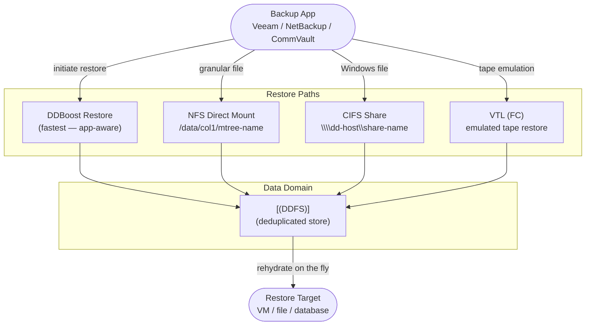

---
tags:
  - dell
  - operations
---
# Data Domain — Backup & Restore


<div class="kb-summary">
Backup & Restore reference covering Overview, DDBoost Restore (Backup Application), NFS Direct Restore, CIFS/SMB Direct Restore, VTL Restore and 5 more sections.
</div>

## Before you begin

- **Access:** Storage admin credentials (cluster admin or equivalent)
- **Timing:** safe to run during business hours unless a step is marked ⚠ (causes interruption)
- **Dependencies:** no active upgrades or migrations on the same infrastructure
- **Logging:** capture command output — paste into the change record on completion

---

## Overview


```text
┌───────────────────────────────── Dell Data Domain Backup and Restore ─────────────────────────────────┐
│                                                                                                       │
│   ┌───────────────────────────────────────────────────────────────────────────────────────────────┐   │
│   │         DD stores backups from backup applications; restore = backup app reads from DD        │   │
│   │       DR restore: backup app points to replicated DD at DR site; same restore procedure       │   │
│   │        DD Boost allows backup apps to read directly; NFS mount for filesystem restores        │   │
│   └───────────────────────────────────────────────────────────────────────────────────────────────┘   │
│                                                                                                       │
│                          ▼                                                 ▼                          │
│                                                                                                       │
│   ┌──────────────────────────────────────────────┐  ┌─────────────────────────────────────────────┐   │
│   │             Primary Site Restore             │  │               DR Site Restore               │   │
│   │      ─────────────────────────────────       │  │      ─────────────────────────────────      │   │
│   │         Backup app initiates restore         │  │          Point backup app to DR DD          │   │
│   │         DD serves segments via Boost         │  │         DR DD is read-write replica         │   │
│   │         Reassembles to original data         │  │           Same Boost/NFS procedure          │   │
│   │           Verify restore integrity           │  │         Replication paused during DR        │   │
│   │            Document recovery time            │  │          Resume rep after recovery          │   │
│   └──────────────────────────────────────────────┘  └─────────────────────────────────────────────┘   │
│                                                                                                       │
│   ┌───────────────────────────────────────────────────────────────────────────────────────────────┐   │
│   │                       # Verify MTree replication state before DR restore                      │   │
│   │                  replication show all     — show replication contexts and lag                 │   │
│   │               filesys show space       — confirm DR DD has sufficient free space              │   │
│   └───────────────────────────────────────────────────────────────────────────────────────────────┘   │
│                                                                                                       │
│    Key terms:                                                                                         │
│                                                                                                       │
│    DR DD            = Replicated Data Domain at DR site; exact copy of primary MTree data             │
│    Read-write replica= After failover, DR DD MTree becomes writable for new backups                   │
│    Replication pause = Stop replication before DR restore to prevent overwriting recovery data        │
│    Resume rep       = After DR recovery, resume replication and resync from primary                   │
│                                                                                                       │
└───────────────────────────────────────────────────────────────────────────────────────────────────────┘
```

Resume after the restore completes:

```bash
filesys clean start
```

---

## DDBoost Restore (Backup Application)

DDBoost restores are initiated entirely from the backup application. The Data Domain's role is passive — it serves deduplicated data to the backup server, which rehydrates it on the fly.

```bash
# Monitor DD Boost connections during an active restore
ddboost show clients
ddboost show clients --verbose  # includes per-client read throughput

# Monitor read throughput from the DD side
ddboost show stats | grep -i read

# Check if multiple restore streams are active
ddboost show clients | grep -c connected
```

### Per-Application Restore Initiation

| Backup Software | Restore Entry Point | Notes |
|---|---|---|
| Veeam Backup & Replication | Veeam Console → Restore → Entire VM or Files | Instant VM Recovery reads directly from DD via DD Boost |
| NetBackup | bprestore CLI or NetBackup Administration Console | OST plugin routes reads through DD Boost storage unit |
| CommVault | CommCell Console → Restore → Browse and Restore | MediaAgent reads from DD via DD Boost; no DD CLI steps required |
| Avamar | Avamar Administrator → Restore | Avamar validates restore job against DD and restores deduped data |
| IBM Spectrum Protect (TSM) | TSM restore session via VTL or NFS | No DD Boost; data served via VTL emulation or NFS mount |

### Validate DDBoost Restore Throughput

During a restore, monitor that throughput is meeting expectations:

```bash
# DD-side read throughput
ddboost show stats

# System I/O load during restore
system show stats | grep -i throughput
```

If throughput is below expected, check for:
- Active cleaning cycle (`filesys clean status`)
- Disk errors (`disk show state`)
- Network saturation (`net show stats`)

---

## NFS Direct Restore

For backup software using NFS mounts, or for granular file recovery, mount the MTree directly on the target server.

### Mount the MTree

```bash
# On the Data Domain — confirm the NFS export exists
nfs show exports | grep /data/col1/<mtree-name>

# If the export does not exist, add it
nfs add export /data/col1/<mtree-name> clients <target-server-ip>

# On the target/restore server — mount the MTree
mount -t nfs <dd-hostname>:/data/col1/<mtree-name> /mnt/dd-restore

# Verify the mount is accessible
ls -la /mnt/dd-restore/
```

### Restore Files from NFS Mount

```bash
# Navigate to the backup data directory
ls /mnt/dd-restore/<backup-job-directory>/

# Restore a specific directory
cp -a /mnt/dd-restore/<backup-path>/ /target/restore/path/

# For large restores, use rsync for progress visibility and error handling
rsync -avP /mnt/dd-restore/<backup-path>/ /target/restore/path/

# After restore, unmount
umount /mnt/dd-restore
```

### NFS Restore — Common Issues

| Issue | Cause | Fix |
|---|---|---|
| Mount fails | Export does not exist or client IP not permitted | `nfs show exports`; add client IP to export |
| Permission denied | `root-squash` set; backup data owned by root | `nfs modify export /data/col1/<name> clients <ip> options rw,no-root-squash` |
| Slow NFS read speed | `sync` option set (safe but slower) | Use `async` option for restore; revert to `sync` after |
| Mount hangs | NFS service issue on DD | `nfs status`; check `alerts show current` |

---

## CIFS/SMB Direct Restore

For Windows-based restores without a DD Boost–capable backup application.

```bash
# On the Data Domain — confirm the CIFS share exists
cifs share show | grep <share-name>

# If the share does not exist, create it
cifs share add /data/col1/<mtree-name>

# On the Windows restore server — map the share
# net use Z: \\<dd-hostname>\<share-name> /user:<domain>\<username>

# Or access via UNC path in File Explorer:
# \\<dd-hostname>\<share-name>\
```

---

## VTL Restore

VTL (Virtual Tape Library) restores are managed entirely by the backup media server. The DD emulates a physical tape library with drives and slots.

```bash
# Verify VTL is operational
vtl status

# List available virtual slots and their contents
vtl show slots

# List virtual drives
vtl show drives

# If a tape is not visible to the backup software, confirm the slot is loaded
vtl show libraries
```

The backup media server must be FC-zoned to the DD VTL FC ports. Confirm zoning is correct if tapes are not visible to the backup application.

---

## Data Domain Configuration Backup and Recovery

### Configuration Backup

The DD configuration backup captures system settings, user accounts, network configuration, MTree definitions, replication context definitions, and DDOS licensing. It does **not** contain backup data — it only contains the DD system configuration.

```bash
# Create a manual configuration backup
config backup create

# List available configuration backups
config backup list

# Show configuration backup details
config backup show

# Export a configuration backup to a remote server
config backup export scp://user@<jump-host>:/path/backups/dd01-config-$(date +%Y%m%d).bak
```

**Best practice:** Create a configuration backup before every planned change. Export the configuration backup off-appliance to a management server so it is available even if the DD is unavailable.

### Configuration Restore

```bash
# Restore from a specific named backup
config backup restore <backup-name>

# List available backups if the name is unknown
config backup list
```

Configuration restore replaces the current DD configuration with the saved snapshot. It does not affect backup data in the DDFS.

---

## MTree Replication as a Restore Source (DR Scenario)

In a DR scenario where the primary DD is unavailable, backup data can be restored directly from the DR (destination) DD.

### Failover Procedure

```bash
# Step 1 — on the destination DD, break the replication context
# This makes the destination MTree writable
replication failover <context-id>

# Step 2 — verify the MTree is accessible on the destination DD
mtree list | grep <mtree-name>
filesys status

# Step 3 — redirect backup software to the destination DD
# (update repository/storage unit configuration in backup application)

# Step 4 — validate backup software can read data
ddboost show clients  # verify backup server connects successfully
```

### Failback After Primary Recovery

```bash
# Step 1 — re-establish replication in the original direction
replication resync <context-id>

# Step 2 — wait for resync to complete (lag = 0)
replication show stats | grep lag
replication status

# Step 3 — redirect backup software back to the primary DD
# Step 4 — confirm backup jobs succeed on the primary
```

---

## FastCopy — Efficient Intra-DD Data Movement

FastCopy performs efficient data movement within the same DD filesystem. Because it operates at the dedup segment level, it does not transfer duplicate data — it updates pointers. Useful for seeding a new MTree from an existing one, or creating a local copy for testing.

```bash
# Copy data from one MTree path to another (same DD)
fastcopy copy source /data/col1/<source-mtree>/<path> \
    destination /data/col1/<destination-mtree>/<path>

# Check FastCopy status
fastcopy status
```

FastCopy is not a substitute for replication — it creates a local copy on the same array, which does not protect against array-level failure.

---

## Performance Expectations

| Scenario | Expected Throughput | Notes |
|---|---|---|
| DDBoost restore (DSP enabled) | 200–500 MB/s per stream | DSP must be enabled on the backup client |
| DDBoost restore (multiple streams) | Scales to array limit (model-dependent) | DD9900: up to 68 TB/hr aggregate |
| NFS restore (10GbE) | 100–300 MB/s | Bound by network MTU and NFS block size |
| NFS restore (jumbo frames, 9000 MTU) | 200–500 MB/s | Requires jumbo frame support on all network devices |
| CIFS restore | 50–200 MB/s | SMB protocol overhead; lower than NFS |
| VTL restore (FC) | Up to 32 Gb/s FC link speed | Bound by FC zoning and drive count |

### Restore Performance Tuning

- Enable DD Boost DSP: `ddboost option set distributed-segment-processing enabled`
- Use multiple concurrent restore streams from the backup application
- Set NFS MTU to 9000 (jumbo frames) on both the DD and the backup server for NFS restores
- Stop filesystem cleaning during large restore windows: `filesys clean stop`
- For very large restores, check that the LACP bond is active and both links are healthy: `net config bond show`

---

## Restore Validation Checklist

| Step | Action | Status |
|---|---|---|
| 1 | Confirm `filesys status` shows Enabled and Running | |
| 2 | Confirm no active hardware alerts (`alerts show current`) | |
| 3 | Confirm cleaning is stopped or not running (`filesys clean status`) | |
| 4 | Confirm NFS export or DDBoost storage unit is accessible | |
| 5 | Initiate restore from backup application | |
| 6 | Monitor DD throughput during restore (`ddboost show stats` or `ddboost show clients`) | |
| 7 | Confirm all restored files/VMs are accessible at the destination | |
| 8 | Restart cleaning if it was stopped (`filesys clean start`) | |
| 9 | Document restore completion time and throughput for future SLA planning | |
