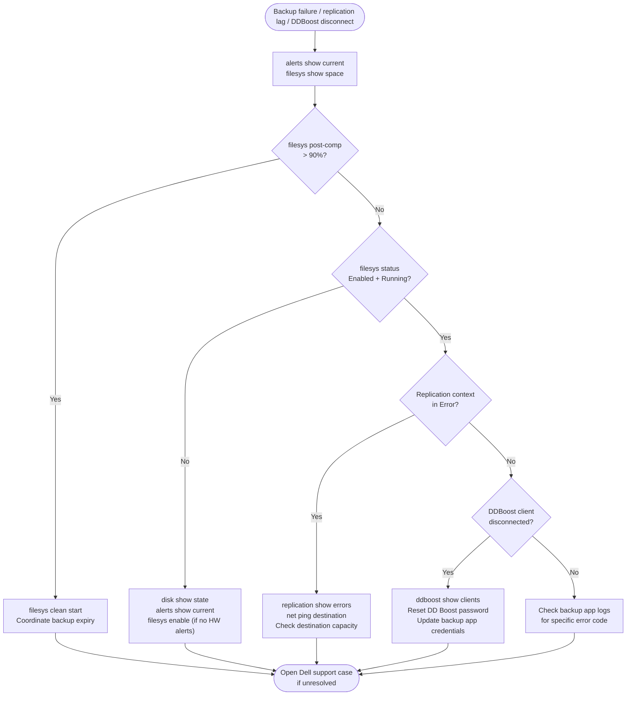

# Data Domain — Common Issues (Operations)

## Overview

This page covers the most frequent operational issues encountered on Dell Data Domain appliances during day-to-day backup operations. For deeper diagnostic procedures see the [Diagnostics](../../troubleshooting/diagnostics/) page. For a structured symptom table see [Troubleshooting Common Issues](../../troubleshooting/common-issues/).

## Incident Triage — First Response



When backup jobs fail, replication falls behind, or DDBoost clients disconnect, work through this sequence first before diving into specific issues.

- [ ] Run `alerts show current` — identify any active hardware or software alerts that correspond to the start of the incident
- [ ] Run `filesys show space` — a filesystem at capacity (post-compression usage approaching 100%) will cause backup writes to fail; this is the most common cause of sudden backup failures
- [ ] Run `replication show` — check whether any replication context has entered `Error` state or is accumulating lag; replication errors can signal network issues or a full filesystem on the destination
- [ ] Run `ddboost show clients` — identify which DDBoost-connected backup servers are disconnected or reporting authentication errors
- [ ] Check `filesys status` — if the filesystem is not `Running`, backup writes will fail regardless of capacity
- [ ] Check disk health: `disk show state` — a faulted or absent disk reduces usable capacity and triggers alerts; do not replace a disk without a Dell support case
- [ ] Review backup application logs for the specific error code reported by the backup job — DDBoost error codes map to specific DD conditions

| Question | Answer |
|---|---|
| What is the current post-compression usage percentage? | |
| Which replication contexts are in Error or lagging? | |
| Which DDBoost clients are disconnected or erroring? | |
| Is the filesystem status Enabled and Running? | |
| Are there any faulted or absent disks? | |

---

## Issue: Filesystem Full or Near-Full

**Symptoms:** Backup jobs fail with "no space" errors; DDBoost writes rejected; `filesys show space` shows post-comp usage above 90–95%.

**Causes:** Cleaning not running after backup expiry; faster-than-expected data growth; expired data not yet deleted by backup software; Cloud Tier not configured despite aged data accumulating.

### Emergency Steps

```bash
# 1. Check current space
filesys show space

# 2. Is cleaning already running?
filesys clean status

# 3. If not running, start it
filesys clean start

# 4. Identify the largest MTrees (pre-comp column)
mtree list

# 5. Monitor clean progress (check every 30 minutes during a crisis)
filesys clean status
filesys show space
```

If cleaning does not recover sufficient space:

- Coordinate with backup teams to expire and delete old backup data in the backup application
- After the backup software marks data deleted, run `filesys clean start` again
- If still insufficient: plan an emergency capacity expansion (disk shelf addition)

**Prevention:**
- Schedule weekly automatic cleaning: `filesys clean schedule set day tue start-time 02:00`
- Set MTree hard quotas to prevent a single application from consuming all capacity
- Monitor capacity weekly and project time-to-full using CloudIQ trending

---

## Issue: Replication Context in Error State

**Symptoms:** `replication show` displays a context in `Error`, `Idle-Error`, or `In-Error` state; replication lag growing continuously; DR copy not being updated.

**Causes:** Network path failure between source and destination DD; destination filesystem full; authentication credential mismatch; DDOS version incompatibility after an upgrade on one side; SSL/TLS certificate mismatch.

### Investigation Steps

```bash
# 1. Check context state
replication show

# 2. Get detailed error information for the specific context
replication show errors

# 3. Check destination filesystem space
# (run on the destination DD)
filesys show space

# 4. Verify network connectivity to the destination
net ping <destination-dd-hostname>
net traceroute <destination-dd-hostname>

# 5. Check network interface errors
net show stats | grep -iE "error|drop"

# 6. Check certificate status on both sides
adminaccess certificate show
```

### Recovery Steps

```bash
# Step 1 — attempt soft recovery (disable then re-enable)
replication disable <context_id>
replication enable <context_id>
replication show  # wait for status to update

# Step 2 — if still in error, check authentication
# On both source and destination:
replication show all | grep -i auth

# Step 3 — if certificates are mismatched, re-establish trust
adminaccess certify <remote-dd-hostname>

# Step 4 — if the context is stuck and unfixable, resync
replication resync <context_id>
# Note: resync re-initialises — it will retransmit any changes since last sync
```

---

## Issue: Replication Lag Growing

**Symptoms:** `replication status` shows increasing `Pre-Comp Remaining` or lag in hours; DR copy is falling behind the production backup window.

**Causes:** WAN bandwidth saturation; high ingest rate on source during backup window exceeding replication throughput; replication throttle set too conservatively; network packet loss causing TCP retransmission.

### Investigation

```bash
# 1. Current lag and throughput
replication status  # note Throughput (MB/s) and Estimated Completion

# 2. Check network interface statistics on both ends
net show stats

# 3. Check replication throttle settings
replication throttle show

# 4. Review source ingest rate
filesys show compression  # note the recent write rate
```

### Actions

```bash
# Increase replication bandwidth (if throttle is too conservative)
replication throttle set schedule <schedule-name> bandwidth 0  # 0 = unlimited

# Or set a specific bandwidth in kbps (e.g., 500 MB/s = 4,000,000 kbps)
replication throttle set schedule <schedule-name> bandwidth 4000000

# Trigger an immediate sync after bandwidth adjustment
replication sync <context_id>
```

If the lag is caused by a backup window overlap, work with backup teams to stagger backup windows to create a replication catchup window.

---

## Issue: DDBoost Client Authentication Failure

**Symptoms:** Backup jobs fail with authentication error; DDBoost client appears as `Disconnected` in `ddboost show clients`; backup application reports "storage server authentication failed".

**Causes:** DD Boost user password changed on the DD but not updated in the backup application; DD Boost user deleted and recreated; backup software version incompatibility with the installed DDVDP or OST plug-in version.

### Investigation and Resolution

```bash
# 1. List all DD Boost users and their storage unit assignments
ddboost user list
ddboost storage-unit list

# 2. Verify the specific client appears and its state
ddboost show clients | grep <backup-server-name>

# 3. Check if the DDBoost service itself is running
ddboost status

# 4. Test connectivity from backup server to DD port 2049 (DD Boost port)
# (run on the backup server)
# nc -zv <dd-hostname> 2049

# 5. Reset the DD Boost user password if credential drift is suspected
ddboost user change password <ddboost-username>
```

After resetting the password, update the credentials in the backup application:
- **Veeam:** Edit the backup repository → update credentials
- **NetBackup:** Update the disk pool storage server credentials via `nbdevconfig`
- **CommVault:** Update the Cloud Library credentials in the MediaAgent configuration

---

## Issue: Low Deduplication Ratio

**Symptoms:** `filesys show compression` shows a global ratio below 10:1 or a significant drop from the previous week; capacity growing faster than expected.

**Causes:** New data type being backed up that does not deduplicate well (encrypted databases, already-compressed files, virtual machine images with rapid change rate); DD Boost source-side dedup (DSP) disabled in backup software; first-pass full backup (no prior data for dedup against).

### Investigation

```bash
# 1. Global dedup ratio and trend
filesys show compression

# 2. Per-MTree dedup ratio — identify which MTree is low
# (run for each MTree)
mtree show compression mtree /data/col1/<mtree-name>

# 3. Check DD Boost DSP status
ddboost option show | grep -i dist-seg

# 4. Enable DSP if disabled
ddboost option set distributed-segment-processing enabled
```

**Data types with inherently low dedup ratios (expected behaviour):**

| Data Type | Typical Ratio | Notes |
|---|---|---|
| Already-compressed files (ZIP, 7z, PNG, MP4) | 1.0x–1.5x | No dedup possible; expected |
| Encrypted databases (TDE enabled) | 1.0x–2.0x | Encryption destroys dedup |
| VM images with active, rapidly changing data | 5x–15x | Still benefits from block-level dedup |
| Standard file data (Office, source code, email) | 20x–50x | Optimal for DD dedup |
| SQL/Oracle databases (no TDE) | 10x–25x | Good dedup from consistent data blocks |
| Long-term static data | 50x+ | Maximises dedup over multiple backup generations |

---

## Issue: Filesystem Disabled After Reboot

**Symptoms:** `filesys status` shows `Disabled` after a DD reboot or power cycle; backup jobs cannot connect; DDBoost clients unable to authenticate.

**Causes:** Hardware fault prevented the filesystem from mounting (check for disk alerts); NVRAM issue; DDOS did not complete clean shutdown before power loss.

### Resolution

```bash
# 1. Check filesystem status
filesys status

# 2. Check for hardware alerts
alerts show current

# 3. Check disk health
disk show state

# 4. Review the system log for errors at/around the reboot time
log view | head -100

# 5. If no hardware alerts and disks are healthy, manually enable
filesys enable

# 6. Confirm filesystem is running
filesys status
filesys show space
```

If the filesystem fails to enable after `filesys enable` and `alerts show current` shows disk or NVRAM errors, do not proceed with manual recovery — open a Dell support case immediately. Forcing a filesystem enable in a degraded state risks data corruption.

---

## Issue: VTL Tape Import Failure

**Symptoms:** Backup software cannot import or use VTL tapes; VTL drive shows offline in backup application; FC-attached tape library not visible.

**Causes:** VTL slot configuration mismatch with backup software cartridge count; FC zoning not configured between backup media server HBA and DD VTL FC ports; VTL not enabled or VTL licence not active.

### Investigation

```bash
# 1. Check VTL status
vtl status

# 2. List VTL slots and drives
vtl show slots
vtl show drives

# 3. List VTL libraries
vtl show libraries

# 4. Confirm VTL is enabled
vtl enable

# 5. Check that the VTL FC ports are visible in the SAN fabric
# (run on the backup media server)
# systool -c fc_host -v | grep port_name
```

Verify FC zoning: the backup media server HBA ports must be zoned to the DD VTL FC target ports. Consult the SAN team to confirm zoning and that the LUN is presented correctly.

---

## Issue: Disk in Failed or Absent State

**Symptoms:** `disk show state` shows a disk in `Failed`, `Absent`, or `Reconstructing` state; alert is active in `alerts show current`; RAID rebuild may be in progress.

### Immediate Actions

```bash
# 1. Identify the failed disk
disk show state | grep -iE "failed|absent|unknown|reconstructing"

# 2. Get full detail
disk show hardware | grep -B5 -A10 <slot-number>

# 3. Check RAID rebuild status
raid show all | grep -iE "rebuilding|reconstruct|percent"

# 4. Monitor rebuild progress
raid show detail
```

**Do not remove or reseat a disk without a Dell support case open.** On some DD models, removing an additional disk during a RAID rebuild will cause data loss. Always wait for Dell support guidance before physically replacing a disk.

```bash
# Check if a hot spare has been allocated and rebuild has started automatically
disk show state | grep spare
raid show detail | grep -i rebuild
```

---

## Issue: CloudIQ Showing Array Offline / No Telemetry

**Symptoms:** Data Domain is not visible in CloudIQ; capacity forecasting not updating; no health recommendations being generated.

**Causes:** SCG (Secure Connect Gateway) appliance offline or unreachable from the DD management network; AutoSupport disabled on the DD; firewall blocking outbound HTTPS from SCG to Dell support endpoints.

### Resolution

```bash
# 1. Check AutoSupport status on the DD
autosupport status

# 2. Attempt a test send
autosupport test

# 3. Verify SCG registration
# System Manager → Administration → Autosupport → ESRS/SCG

# 4. Check network path from DD to SCG
net ping <scg-appliance-ip>

# 5. Re-enable AutoSupport if disabled
autosupport enable
```

If `autosupport test` fails with a network error, work with the network team to confirm that outbound HTTPS (port 443) is permitted from the SCG appliance to `esrs3.dell.com` and related Dell support FQDNs.

---

## Issue: Slow Backup Throughput

**Symptoms:** Backup jobs taking longer than expected; DD Boost throughput below expected for the DD model; backup window is not being met.

**Causes:** DD Boost DSP (Distributed Segment Processing) disabled; network MTU mismatch causing fragmentation; LACP bonding not configured; filesystem cleaning running during backup window; insufficient CPU on backup server proxy.

### Investigation

```bash
# 1. Current DD throughput during backup window
ddboost show stats

# 2. Check DSP status
ddboost option show | grep -i dist-seg

# 3. Network interface statistics during backup
net show stats | grep -iE "error|drop|collision"

# 4. Check MTU
net show config | grep -i mtu

# 5. Is cleaning running during the backup window?
filesys clean status

# 6. Check system resource usage
system show stats
```

**Recommended configuration for maximum throughput:**
- Enable DSP: `ddboost option set distributed-segment-processing enabled`
- Use 10GbE or 25GbE interfaces with LACP bonding for backup traffic
- Set MTU to 9000 (jumbo frames) on both the DD and the backup server NICs for NFS traffic
- Schedule filesystem cleaning outside the backup window (overnight Monday or Tuesday)

---

## Quick Reference — Operations Command Summary

| Symptom | First Command | Follow-up |
|---|---|---|
| Backup job failing | `filesys show space` | `alerts show current` |
| Replication falling behind | `replication status` | `net show stats` |
| DDBoost client disconnected | `ddboost show clients` | `ddboost status` |
| Low dedup ratio | `filesys show compression` | `mtree show compression mtree /data/col1/<name>` |
| Filesystem not available | `filesys status` | `alerts show current`, `disk show state` |
| Disk failure alert | `disk show state` | `raid show all` |
| Slow restore | `filesys clean status` | `ddboost show stats` |
| CloudIQ offline | `autosupport status` | `autosupport test` |
| VTL tape errors | `vtl status` | `vtl show slots` |
