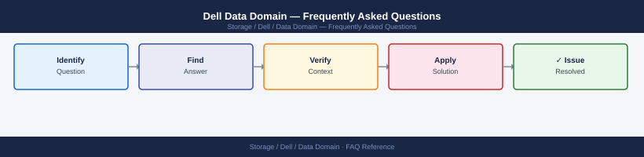

---
tags:
  - dell-data-domain
  - faq
  - operations
---
# Dell Data Domain — Frequently Asked Questions

Common questions about Dell Data Domain operations, configuration, and troubleshooting. For step-by-step procedures, see the <a href="index.md">Operations</a> section.

## General

**Q: What DD OS version is recommended for new Data Domain deployments?**
A: DD OS 7.13.x is the current recommendation. Check with `system show version` on the CLI. Always review the Dell Data Domain Compatibility Guide before upgrading.

**Q: How do I check the current Dell Data Domain version?**
A: `system show version`

## Configuration

**Q: What is the default deduplication scope and when should it change?**
A: Global deduplication across all MTrees is the default and recommended setting. Do not disable deduplication — it is the core value of Data Domain and cannot be meaningfully turned off for individual MTrees in production.

**Q: How do I enable DD Replicator for off-site disaster recovery?**
A: Configure replication context: `replication add source mtree://<local-mtree> destination ddboost://<remote-dd>/mtree`. Verify connectivity and credentials. Monitor with `replication show all`. Ensure bandwidth throttle is configured for WAN links.

## Operations

**Q: How do I upgrade DD OS without disrupting backup jobs?**
A: Download the upgrade package from Dell Support. Use `system upgrade` command. Non-disruptive upgrade (NDU) is supported on DD6xxx and above — backup jobs continue during most of the upgrade. Schedule during low-activity window for the reboot phase.

**Q: What is the correct procedure to add a new MTree for a new backup application?**
A: Create MTree: `mtree create /data/col1/newapp`. Set quota if needed: `mtree modify /data/col1/newapp quota-hard 10 TiB`. Configure DDBoost user or NFS/CIFS access for the backup application.

## Troubleshooting

**Q: Data Domain shows 'ALERT: file system usage > 80%'. What does it mean?**
A: Usable space after deduplication is above 80%. Dedup ratio may be declining (more unique data arriving). Review backup retention policies. Clean up expired data: `filesys clean start`. Consider capacity expansion or tiering to DD Cloud Tier.

**Q: Backup throughput to Data Domain is lower than expected — where do I start?**
A: Check `performance show` for per-interface throughput. Verify DDBoost is enabled (provides 50%+ throughput improvement over NFS). Check network bandwidth. Review `disk show performance` for backend disk I/O.

## Backup and Recovery

**Q: How often should I back up the Data Domain configuration?**
A: Weekly: `config backup <remote-path>`. Includes system configuration, network settings, and MTree configuration. Store off-appliance. Data Domain does not back up its own deduplicated data — that is your backup application's responsibility.

**Q: Can I recover individual files from a Data Domain MTree?**
A: Data Domain is a backup target, not a source for file-level restore. Restore files through the backup application (Veeam, NetBackup, Commvault) that wrote to the MTree. Data Domain does not provide file-level access to backup data directly.

## See Also

- [Dell Data Domain Operations](index.md)
- [Dell Data Domain Troubleshooting](../../../troubleshooting/index.md)
