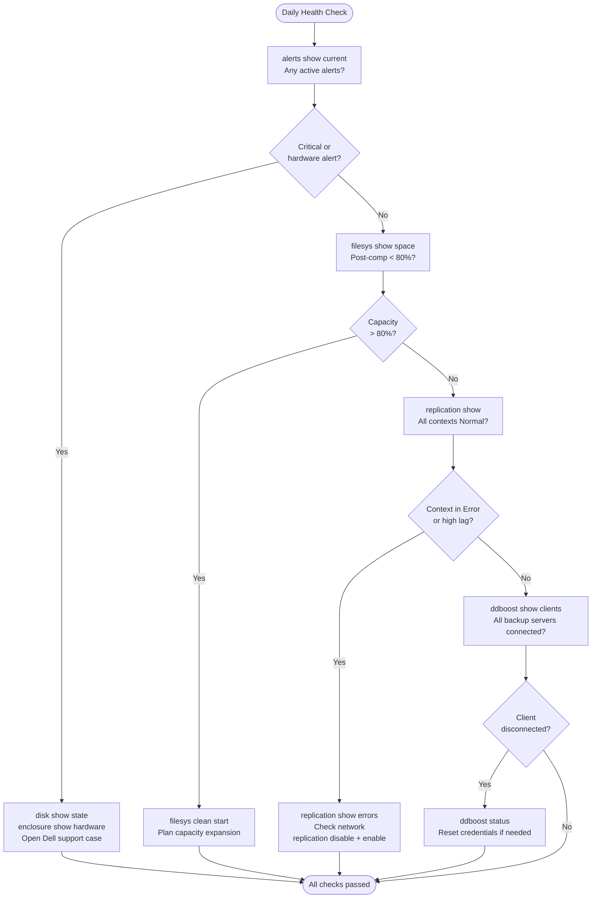

# Data Domain — Health Checks

## Daily Checks



| Check | Command | Notes |
|---|---|---|
| [ ] Run `filesys show space` | `filesys show space` | check pre- and post-compression capacity; alert if post-compression used exceeds 80% of usable capacity |
| [ ] Run `filesys show compression` | `filesys show compression` | confirm the global dedup ratio is above 10:1 (healthy target is 20:1+); a significant drop compared to the previous day warrants investigation |
| [ ] Run `alerts show current` | `alerts show current` | review all active hardware and software alerts; triage by severity |
| [ ] Run `replication show` | `replication show` | confirm all replication contexts are in `Normal` or `Replicating` state; investigate any context in `Error` or `Warning` state |
| [ ] Run `ddboost show clients` | `ddboost show clients` | confirm all expected backup servers are connected and authenticated |
| [ ] Confirm backup software jobs (Avamar, NetWorker, Veeam, Commvault) | | check backup application logs if DDBoost clients show unexpected disconnects |
| [ ] Run `filesys status` to confirm the filesystem is `Enabled` and `Running` | `filesys status` | |
| [ ] Review ESRS / CloudIQ / Smart Connect for any proactive support alerts | | |

## Daily Health Check Script

```bash
# 1. System alerts — any unacknowledged issues?
alert show current

# 2. Filesystem status
filesys status
filesys show space

# 3. Disk state — all normal?
disk show state

# 4. Replication lag
replication status
replication show stats | grep lag

# 5. Cleaning status
filesys clean status
```

## Weekly Health Check

```bash
# Compression and deduplication ratio
filesys show compression summary

# DDBoost active clients
ddboost show clients

# NFS and CIFS connections
nfs show clients
cifs show clients

# Alert history (look for recurring alerts)
alert show history brief

# System uptime and performance stats
system show uptime
system show stats
```

## Health Check — Pre-Change

Run these checks before any planned change or as first-response steps when investigating backup failures or capacity alerts.

- [ ] `filesys status` — filesystem is `Enabled` and `Running`
- [ ] `filesys show space` — post-compression usage below 80%; at least 10–15% raw capacity free for cleaner operation
- [ ] `filesys show compression` — global dedup ratio above 10:1; note if it has dropped since the last check
- [ ] `alerts show current` — no active hardware alerts (disk, fan, PSU, NIC)
- [ ] `replication show` — all contexts in `Normal` or `Replicating` with no lag growing unboundedly
- [ ] `ddboost status` — DDBoost service is active and all storage units are accessible
- [ ] `system show` — system hardware health is clean; note firmware version
- [ ] `mtree list` — all MTrees are accessible; per-MTree quotas are not exhausted

```bash
# Check filesystem operational status
filesys status

# Show pre- and post-compression space usage
filesys show space

# Show global deduplication and compression ratio
filesys show compression

# Show all replication contexts, their state, and lag
replication show

# Show per-context replication throughput and detailed status
replication status

# List all MTrees and their individual space usage
mtree list

# Show per-MTree dedup ratio for a specific MTree
mtree show compression mtree /data/col1/<mtree-name>

# List DDBoost-connected clients and storage unit status
ddboost show clients

# Show DDBoost service status
ddboost status

# Show all currently active system alerts
alerts show current

# Show system hardware health and DDOS version
system show
```

## Capacity Monitoring

| Metric | Threshold | Action |
|---|---|---|
| Post-comp used | > 80% | Plan expansion or cleaning cycle |
| MTree quota used | > 85% | Increase quota or expire old data |
| Cleaning last run | > 7 days | Trigger `filesys clean start` |
| Replication lag | > 4 hours | Investigate network or source load |

## Replication Health

```bash
# All replication contexts
replication show all

# Contexts not in replicating or idle state
replication status | grep -v "replicating\|idle"

# Lag detail per context
replication show stats
```

## Hardware Health

```bash
# Disk states (no failed or reconstructing disks)
disk show state | grep -v normal

# Enclosure health (power, fans, temperature)
enclosure show hardware | grep -iE "fault|failed|warning"

# RAID group status
raid show all | grep -v "normal\|OK"
```

## Pre-Change Checklist

- [ ] No critical or error alerts active
- [ ] Filesystem enabled and healthy
- [ ] All disks in normal state
- [ ] No RAID rebuild in progress
- [ ] Replication lag within acceptable range
- [ ] Cleaning not in progress (or aware it may run)
- [ ] Support bundle taken for baseline

## Health Summary Table

| Check | Expected | Command |
|---|---|---|
| Active alerts | None critical | `alert show current` |
| Filesystem state | Enabled | `filesys status` |
| Disk state | All normal | `disk show state` |
| RAID state | Normal | `raid show all` |
| Replication lag | < 4 hours | `replication show stats` |
| Capacity used | < 80% | `filesys show space` |
| Last cleaning | < 7 days | `filesys clean status` |
