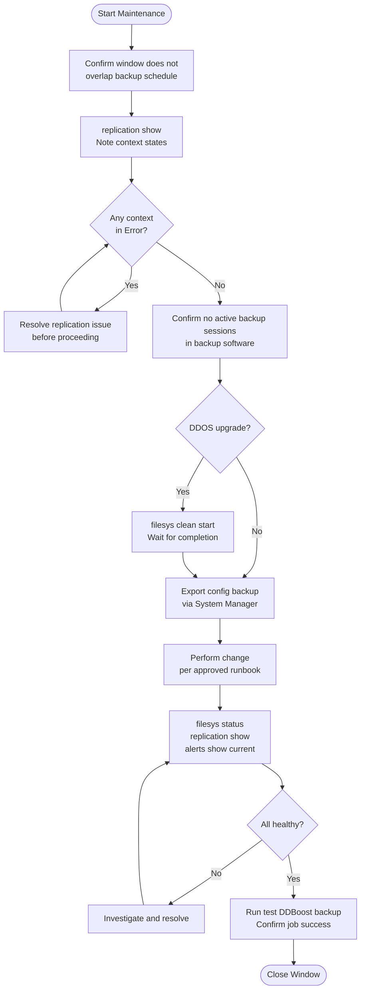

# Data Domain — Procedures


<div class="kb-summary">
Procedures reference covering Change Readiness, Maintenance Window, Filesystem Cleaning.
</div>

## Change Readiness

Verify these items before performing any change on the Data Domain — DDOS upgrades, MTree reconfigurations, replication changes, or hardware expansions.

- [ ] `replication show` — all contexts in `Normal` state; do not proceed with a DDOS upgrade while any context is in `Error` or actively lagging
- [ ] No active backup sessions at the time of the change — confirm with backup software that no jobs are running or scheduled during the window
- [ ] `filesys cleaning` is not running: run `filesys clean status` — a cleaning run during a backup window or major change can cause I/O contention
- [ ] `alerts show current` returns no active alerts that indicate pre-existing hardware faults
- [ ] `filesys show space` confirms at least 15% raw capacity free — sufficient headroom for the cleaner to operate post-change
- [ ] Confirm a valid backup of the DD configuration: `system show` — note the current DDOS version; export the configuration backup via System Manager
- [ ] Inform backup application teams of the maintenance window; confirm they will not schedule test restores or new backup jobs during the change
- [ ] Verify ESRS / Smart Connect support connectivity before starting, so Dell support can be reached if needed

| Item | Status | Notes |
|---|---|---|
| Replication contexts in Normal state | | |
| No active backup sessions | | |
| filesys cleaning not running | | |
| No active hardware alerts | | |
| ≥15% raw capacity free | | |
| DD config backup exported | | |

## Maintenance Window


```text
┌───────────────────────────────────── Dell Data Domain Procedures ─────────────────────────────────────┐
│                                                                                                       │
│   ┌───────────────────────────────────────────────────────────────────────────────────────────────┐   │
│   │       Standard procedures: create MTree, configure replication, set quota, run cleaning       │   │
│   └───────────────────────────────────────────────────────────────────────────────────────────────┘   │
│                                                                                                       │
│   ┌───────────────────────────────────────────────────────────────────────────────────────────────┐   │
│   │                                      # Create a new MTree                                     │   │
│   │                                mtree create /data/col1/mybackup                               │   │
│   │            mtree modify /data/col1/mybackup quota soft-limit 10 TB hard-limit 12 TB           │   │
│   │                                                                                               │   │
│   │                                 # Create NFS export from MTree                                │   │
│   │                        nfs add /data/col1/mybackup clients 10.0.0.0/24                        │   │
│   │                                                                                               │   │
│   │                                   # Configure DD Boost user                                   │   │
│   │                           ddboost user assign myboostuser role admin                          │   │
│   │                        ddboost storage-unit create /data/col1/mybackup                        │   │
│   │                                                                                               │   │
│   │                      # Configure replication context (MTree replication)                      │   │
│   │                 replication add source mtree://dd-primary/data/col1/mybackup \                │   │
│   │                           destination mtree://dd-dr/data/col1/mybackup                        │   │
│   │                  replication initialize mtree://dd-primary/data/col1/mybackup                 │   │
│   │                                                                                               │   │
│   │                                     # Run manual cleaning                                     │   │
│   │                                      filesys clean start                                      │   │
│   │                             filesys clean show  # monitor progress                            │   │
│   └───────────────────────────────────────────────────────────────────────────────────────────────┘   │
│                                                                                                       │
│    Key terms:                                                                                         │
│                                                                                                       │
│    mtree create      = Creates logical partition in DDOS; quota enforced per MTree                    │
│    ddboost storage-unit= Registers MTree as DD Boost storage unit; backup app connects here           │
│    replication initialize= Seeds initial MTree copy to DR DD; only sends unique segments              │
│    filesys clean     = Manually triggers cleaning cycle; normally automated off-peak                  │
│                                                                                                       │
└───────────────────────────────────────────────────────────────────────────────────────────────────────┘
```

### Replication State

```bash
# Check which MTrees are replicating and their state
replication show all | grep <mtree_name>

# Show replication lag for a specific MTree
replication show stats | grep <mtree_name>
```

### Retention Lock Review

```bash
# Check if retention lock is enabled on an MTree
mtree retention-lock status /data/col1/<mtree_name>

# List MTrees with retention lock enabled
mtree list --verbose | grep -E "mtree|retention"
```

### Creating MTrees for New Backup Applications

```bash
# Step 1 — create the MTree
mtree create /data/col1/<application>_backup

# Step 2 — set a quota (prevent runaway growth)
mtree quota set hard-limit 5 TiB /data/col1/<application>_backup
mtree quota set soft-limit 4 TiB /data/col1/<application>_backup

# Step 3 — create an NFS export or DDBoost storage unit
nfs add export /data/col1/<application>_backup clients <backup_server_ip>
# OR
ddboost storage-unit create <application>_backup

# Step 4 — verify
mtree show /data/col1/<application>_backup
mtree quota show
```

### Decommissioning an MTree

```bash
# Step 1 — confirm backup data has been expired in the backup application
# Step 2 — remove the NFS export or DDBoost storage unit
nfs del export /data/col1/<mtree_name>
# OR
ddboost storage-unit delete <storage_unit_name>

# Step 3 — delete the MTree
mtree delete /data/col1/<mtree_name>

# Step 4 — run cleaning to reclaim space
filesys clean start
filesys clean status
```

### MTree Health Summary

| Metric | Target | Check |
|---|---|---|
| MTree quota used | < 85% | `mtree quota show` |
| Replication lag | < 4 hours | `replication show stats` |
| Retention lock as expected | Per policy | `mtree retention-lock status` |
| DDBoost storage unit exists | Configured | `ddboost storage-unit list` |

## Filesystem Cleaning

Cleaning (garbage collection) reclaims disk space after backup data is expired or deleted by the backup application. Without regular cleaning, space is not returned to the usable pool even after backups are removed.

### How Cleaning Works

1. Backup application marks expired data for deletion.
2. Data Domain marks the associated dedup segments as unreferenced.
3. Cleaning scans all segments, identifies unreferenced ones, and reclaims their space.
4. Post-clean, `filesys show space` shows reduced post-comp usage.

### Running Cleaning

```bash
# Start an immediate cleaning cycle
filesys clean start

# Check cleaning status
filesys clean status

# Stop cleaning in progress
filesys clean stop
```

### Automatic Cleaning Schedule

```bash
# View scheduled cleaning windows
filesys clean schedule show

# Set a cleaning schedule (run Tuesdays at 02:00)
filesys clean schedule set day tue start-time 02:00

# Enable automatic cleaning
filesys clean schedule enable

# Disable automatic cleaning (manual-only mode)
filesys clean schedule disable
```

### Monitoring Cleaning Progress

```bash
# Active cleaning progress
filesys clean status

# Space before and after (run filesys show space before and after)
filesys show space

# Cleaning history
filesys clean show history
```

### Space Reclaim Expectations

| Dataset Size | Estimated Cleaning Duration |
|---|---|
| < 10 TB | 1–2 hours |
| 10–50 TB | 4–12 hours |
| > 50 TB | 12–24+ hours |

Cleaning can run concurrently with backup operations but will impact throughput. Schedule during off-peak windows when possible.

### When to Trigger Cleaning

- After expiring a large backup policy
- After deleting old data manually
- When capacity is above 75% and not recovering naturally
- Before a capacity upgrade (to accurately assess current usage)

### Cleaning Troubleshooting

```bash
# Cleaning not reclaiming space — confirm data is actually expired
# Check in backup application: are expired jobs marked as deleted?

# Cleaning status shows errors
log view | grep -i clean

# Cleaning taking too long
system show stats   # check if high I/O is causing slowdown
```
