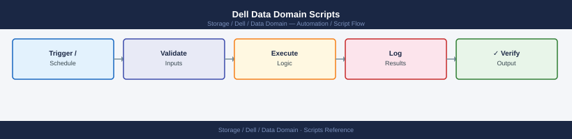

---
tags:
  - dell
  - operations
---
# Dell Data Domain Scripts


```bash
#!/bin/bash
# dd_health_check.sh — Daily health check for a Dell Data Domain appliance
# Usage: DD_HOST=dd01.example.com DD_USER=sysadmin ./dd_health_check.sh

set -euo pipefail

DD_HOST="${DD_HOST:-}"
DD_USER="${DD_USER:-sysadmin}"
ALERT_COUNT=0

if [[ -z "$DD_HOST" ]]; then
  echo "ERROR: DD_HOST is not set." >&2
  exit 1
fi

run_cmd() {
  local label="$1"
  local cmd="$2"
  echo "========================================"
  echo "  $label"
  echo "========================================"
  ssh -o StrictHostKeyChecking=no -o BatchMode=yes "${DD_USER}@${DD_HOST}" "$cmd"
  echo ""
}

echo ""
echo "########################################"
echo "  Data Domain Health Check"
echo "  Host : $DD_HOST"
echo "  Date : $(date '+%Y-%m-%d %H:%M:%S')"
echo "########################################"
echo ""

run_cmd "FILESYSTEM SPACE"         "filesys show space"
run_cmd "COMPRESSION RATIO"        "filesys show compression"
run_cmd "SYSTEM UPTIME"            "system show uptime"
run_cmd "REPLICATION STATE"        "replication show"

echo "========================================"
echo "  ACTIVE ALERTS"
echo "========================================"
ALERTS=$(ssh -o StrictHostKeyChecking=no -o BatchMode=yes \
  "${DD_USER}@${DD_HOST}" "alerts show current")
echo "$ALERTS"
echo ""

# Count non-header, non-empty alert lines
ALERT_COUNT=$(echo "$ALERTS" | grep -cE '^\s+[0-9]+' || true)

echo "========================================"
echo "  SUMMARY"
echo "========================================"
if [[ "$ALERT_COUNT" -gt 0 ]]; then
  echo "STATUS: DEGRADED — $ALERT_COUNT active alert(s) found."
  exit 1
else
  echo "STATUS: OK — No active alerts."
  exit 0
fi
```

```bash
#!/bin/bash
# dd_ddboost_check.sh — Check DDBoost client connectivity on a Data Domain appliance
# Usage: DD_HOST=dd01.example.com DD_USER=sysadmin ./dd_ddboost_check.sh

set -euo pipefail

DD_HOST="${DD_HOST:-}"
DD_USER="${DD_USER:-sysadmin}"

if [[ -z "$DD_HOST" ]]; then
  echo "ERROR: DD_HOST is not set." >&2
  exit 1
fi

echo "========================================"
echo "  DDBoost Client Check — $DD_HOST"
echo "  $(date '+%Y-%m-%d %H:%M:%S')"
echo "========================================"
echo ""

# Fetch DDBoost clients list
CLIENTS=$(ssh -o StrictHostKeyChecking=no -o BatchMode=yes \
  "${DD_USER}@${DD_HOST}" "ddboost show clients")

# Fetch DDBoost overall status
STATUS=$(ssh -o StrictHostKeyChecking=no -o BatchMode=yes \
  "${DD_USER}@${DD_HOST}" "ddboost status")

echo "--- DDBoost Status ---"
echo "$STATUS"
echo ""
echo "--- Client Table ---"
printf "%-30s  %-15s  %-10s\n" "CLIENT" "IP/HOSTNAME" "STATE"
printf "%s\n" "--------------------------------------------------------------"

DISCONNECTED=0
# Parse client lines — format: <name>  <ip>  <state>  ...
while IFS= read -r line; do
  # Skip header and blank lines
  [[ "$line" =~ ^(Client|---|$) ]] && continue
  [[ -z "$line" ]] && continue

  client=$(echo "$line" | awk '{print $1}')
  ip=$(echo "$line"     | awk '{print $2}')
  state=$(echo "$line"  | awk '{print $3}')

  [[ -z "$client" ]] && continue

  if [[ "${state,,}" != "connected" ]]; then
    DISCONNECTED=$((DISCONNECTED + 1))
    printf "%-30s  %-15s  %-10s  <<< DISCONNECTED\n" "$client" "$ip" "$state"
  else
    printf "%-30s  %-15s  %-10s\n" "$client" "$ip" "$state"
  fi
done <<< "$CLIENTS"

echo ""
echo "========================================"
if [[ "$DISCONNECTED" -gt 0 ]]; then
  echo "STATUS: DEGRADED — $DISCONNECTED disconnected DDBoost client(s)."
  exit 1
else
  echo "STATUS: OK — All DDBoost clients connected."
  exit 0
fi
```
```bash
cd ~/Desktop
chmod +x dd_ddboost_check.sh
DD_HOST=192.168.10.50 DD_USER=sysadmin ./dd_ddboost_check.sh
```
```batch
@echo off
REM dd_health_check.bat — Data Domain health check from Windows CMD
REM Uses plink.exe (PuTTY) to SSH into the Data Domain appliance.
REM Download PuTTY (includes plink.exe) from: https://www.putty.org
REM
REM FIRST TIME SETUP: Run this once to accept the host key:
REM   plink -ssh admin@192.168.1.100
REM   Type 'y' when asked to trust the fingerprint, then Ctrl+C.

set DD_HOST=192.168.1.100
set SSH_USER=sysadmin
set PLINK=plink.exe

echo ========================================
echo   Data Domain Health Check
echo   Host: %DD_HOST%
echo ========================================
echo.

echo --- System Stats ---
%PLINK% -ssh -l %SSH_USER% -batch %DD_HOST% "ddsh -c ""system show stats"""
if %ERRORLEVEL% neq 0 (
    echo ERROR: Could not connect to %DD_HOST%. Check hostname and credentials.
    exit /b 1
)

echo.
echo --- Active Alerts ---
%PLINK% -ssh -l %SSH_USER% -batch %DD_HOST% "ddsh -c ""alerts show current"""

echo.
echo --- Filesystem Space ---
%PLINK% -ssh -l %SSH_USER% -batch %DD_HOST% "ddsh -c ""filesys show space"""

echo.
echo ========================================
echo   Health check complete.
echo ========================================
```
```text
plink -ssh sysadmin@192.168.10.50
```
```bash
cd C:\Users\YourName\Desktop
dd_health_check.bat
```
```powershell
# dd_health_rest.ps1 — Data Domain health check via REST API (Windows PowerShell)
# Requires: PowerShell 5.1+ (built into Windows 10/11)
# Run: .\dd_health_rest.ps1

$DdHost = "192.168.1.100"   # Your Data Domain IP or hostname
$DdUser = "sysadmin"         # API username
$DdPass = "yourpassword"     # API password

# Trust self-signed certificates (Data Domain uses self-signed certs by default)
if (-not ([System.Management.Automation.PSTypeName]'TrustAll').Type) {
    Add-Type @"
    using System.Net; using System.Security.Cryptography.X509Certificates;
    public class TrustAll : ICertificatePolicy {
        public bool CheckValidationResult(ServicePoint s, X509Certificate c, WebRequest r, int p) { return true; }
    }
"@
    [System.Net.ServicePointManager]::CertificatePolicy = New-Object TrustAll
}
[Net.ServicePointManager]::SecurityProtocol = [Net.SecurityProtocolType]::Tls12

$BaseUrl = "https://${DdHost}:3009/rest/v1.0"

# Step 1: Authenticate and get auth token
Write-Host "Authenticating to $DdHost ..."
$AuthBody = @{ username = $DdUser; password = $DdPass } | ConvertTo-Json
try {
    $AuthResp = Invoke-RestMethod -Uri "$BaseUrl/auth" `
        -Method POST `
        -Body $AuthBody `
        -ContentType "application/json"
} catch {
    Write-Host "ERROR: Authentication failed - $($_.Exception.Message)"
    exit 1
}

$Token = $AuthResp.token
if (-not $Token) {
    Write-Host "ERROR: No token returned. Check credentials."
    exit 1
}
Write-Host "Authentication successful."
$Headers = @{ "X-DD-AUTH-TOKEN" = $Token; "Accept" = "application/json" }

# Step 2: Get system information
Write-Host ""
Write-Host "========================================"
Write-Host "  System Information"
Write-Host "========================================"
try {
    $SysInfo = Invoke-RestMethod -Uri "$BaseUrl/system" -Headers $Headers
    Write-Host "  Hostname   : $($SysInfo.hostname)"
    Write-Host "  Model      : $($SysInfo.model)"
    Write-Host "  Serial     : $($SysInfo.serial_no)"
    Write-Host "  SW Version : $($SysInfo.version)"
    Write-Host "  Uptime     : $($SysInfo.uptime)"
} catch {
    Write-Host "  WARNING: Could not retrieve system info - $($_.Exception.Message)"
}

# Step 3: Get active alerts
Write-Host ""
Write-Host "========================================"
Write-Host "  Active Alerts"
Write-Host "========================================"
try {
    $AlertsResp = Invoke-RestMethod -Uri "$BaseUrl/system/alerts" -Headers $Headers
    $Alerts = $AlertsResp.alerts
    if (-not $Alerts -or $Alerts.Count -eq 0) {
        Write-Host "  No active alerts."
    } else {
        foreach ($Alert in $Alerts) {
            Write-Host "  [$($Alert.severity)] $($Alert.description)"
        }
        Write-Host ""
        Write-Host "  Total active alerts: $($Alerts.Count)"
    }
} catch {
    Write-Host "  WARNING: Could not retrieve alerts - $($_.Exception.Message)"
}

Write-Host ""
Write-Host "========================================"
Write-Host "  Health check complete."
Write-Host "========================================"
```
```powershell
Set-ExecutionPolicy -Scope Process -ExecutionPolicy Bypass
```
```bash
cd C:\Users\YourName\Desktop
.\dd_health_rest.ps1
```
```bash
#!/bin/bash
# dd_daily_check.sh — Daily operations check for Dell Data Domain
# Usage: SSH_USER=sysadmin DD_HOST=dd01.example.com ./dd_daily_check.sh

set -uo pipefail

SSH_USER="${SSH_USER:-sysadmin}"
DD_HOST="${DD_HOST:-}"

if [[ -z "$DD_HOST" ]]; then
  echo "ERROR: DD_HOST is not set." >&2
  exit 1
fi

PASS=0
FAIL=0
SPACE_WARN_PCT=80

ddcmd() {
  ssh -o BatchMode=yes -o ConnectTimeout=10 "$SSH_USER@$DD_HOST" "ddsh -c \"$1\""
}

check() {
  local label="$1"
  local rc="$2"
  if [[ "$rc" -eq 0 ]]; then
    printf "  %-50s  PASS\n" "$label"
    PASS=$((PASS + 1))
  else
    printf "  %-50s  FAIL\n" "$label"
    FAIL=$((FAIL + 1))
  fi
}

echo "========================================"
echo "  Data Domain Daily Check — $DD_HOST"
echo "  $(date '+%Y-%m-%d %H:%M:%S')"
echo "========================================"

# 1. Alerts — no current alerts
ALERTS=$(ddcmd "alerts show current" 2>&1)
echo "$ALERTS"
echo "$ALERTS" | grep -qiE "emergency|alert|critical|error" \
  && check "alerts (none expected)" 1 || check "alerts (clean)" 0

# 2. Disk health
DISKS=$(ddcmd "disk show state" 2>&1)
echo "$DISKS"
echo "$DISKS" | grep -qi "failed\|absent\|reconstructing\|unknown" \
  && check "disk health" 1 || check "disk health (all OK)" 0

# 3. Filesystem space (<80%)
SPACE=$(ddcmd "filesys show space" 2>&1)
echo "$SPACE"
HIGH=$(echo "$SPACE" | grep -oE '[0-9]+(\.[0-9]+)?%' | tr -d '%' | awk -v t="$SPACE_WARN_PCT" '$1 > t' | wc -l | tr -d ' ')
[[ "$HIGH" -gt 0 ]] \
  && check "filesystem space (<${SPACE_WARN_PCT}%)" 1 \
  || check "filesystem space (<${SPACE_WARN_PCT}%)" 0

# 4. Replication state
REPL=$(ddcmd "replication show all" 2>&1)
echo "$REPL"
echo "$REPL" | grep -qi "error\|disabled\|idle-error\|in-error" \
  && check "replication state" 1 || check "replication state (OK)" 0

# 5. Compression ratio — report only
COMP=$(ddcmd "filesys show compression" 2>&1)
echo "$COMP"
echo "  [INFO] compression output above"
check "compression stats retrieved" $?

echo "========================================"
echo "  PASS: $PASS   FAIL: $FAIL"
[[ "$FAIL" -eq 0 ]] && echo "  STATUS: OK" && exit 0 || echo "  STATUS: DEGRADED" && exit 1
```
```bash
#!/bin/bash
# dd_triage.sh — Incident triage data capture for Dell Data Domain
# Usage: SSH_USER=sysadmin DD_HOST=dd01.example.com ./dd_triage.sh

SSH_USER="${SSH_USER:-sysadmin}"
DD_HOST="${DD_HOST:-}"

if [[ -z "$DD_HOST" ]]; then
  echo "ERROR: DD_HOST is not set." >&2
  exit 1
fi

OUTFILE="dd_triage_$(date '+%Y%m%d_%H%M%S').txt"

ddcmd() {
  ssh -o BatchMode=yes -o ConnectTimeout=10 "$SSH_USER@$DD_HOST" "ddsh -c \"$1\""
}

section() {
  echo "" >> "$OUTFILE"
  echo "========================================" >> "$OUTFILE"
  echo "  $1" >> "$OUTFILE"
  echo "========================================" >> "$OUTFILE"
}

{
  echo "Data Domain Triage Capture"
  echo "Host : $DD_HOST"
  echo "Date : $(date '+%Y-%m-%d %H:%M:%S')"
} > "$OUTFILE"

section "VERSION";          ddcmd "system show version"      >> "$OUTFILE" 2>&1
section "HOSTNAME";         ddcmd "net show hostname"         >> "$OUTFILE" 2>&1
section "SYSTEM STATS";     ddcmd "system show stats"         >> "$OUTFILE" 2>&1
section "ALERTS";           ddcmd "alerts show current"       >> "$OUTFILE" 2>&1
section "DISK STATE";       ddcmd "disk show state"           >> "$OUTFILE" 2>&1
section "FILESYSTEM SPACE"; ddcmd "filesys show space"        >> "$OUTFILE" 2>&1
section "COMPRESSION";      ddcmd "filesys show compression"  >> "$OUTFILE" 2>&1
section "REPLICATION";      ddcmd "replication show all"      >> "$OUTFILE" 2>&1

echo "Triage data written to: $OUTFILE"
```
```bash
#!/bin/bash
# dd_precheck.sh — Pre-change validation for Dell Data Domain
# Usage: SSH_USER=sysadmin DD_HOST=dd01.example.com ./dd_precheck.sh

set -uo pipefail

SSH_USER="${SSH_USER:-sysadmin}"
DD_HOST="${DD_HOST:-}"
SPACE_LIMIT=85

if [[ -z "$DD_HOST" ]]; then
  echo "ERROR: DD_HOST is not set." >&2
  exit 1
fi

ISSUES=0

ddcmd() {
  ssh -o BatchMode=yes -o ConnectTimeout=10 "$SSH_USER@$DD_HOST" "ddsh -c \"$1\""
}

fail() { echo "  FAIL: $1"; ISSUES=$((ISSUES + 1)); }
pass() { echo "  PASS: $1"; }

echo "========================================"
echo "  Data Domain Pre-Change Check — $DD_HOST"
echo "  $(date '+%Y-%m-%d %H:%M:%S')"
echo "========================================"

# 1. No critical alerts
ALERTS=$(ddcmd "alerts show current" 2>&1)
echo "$ALERTS" | grep -qiE "emergency|alert|critical|error" \
  && fail "critical alert(s) present" || pass "no critical alerts"

# 2. All disks healthy
DISKS=$(ddcmd "disk show state" 2>&1)
echo "$DISKS" | grep -qi "failed\|absent\|reconstructing\|unknown" \
  && fail "unhealthy disk(s) found" || pass "all disks healthy"

# 3. Filesystem below 85%
SPACE=$(ddcmd "filesys show space" 2>&1)
HIGH=$(echo "$SPACE" | grep -oE '[0-9]+(\.[0-9]+)?%' | tr -d '%' | awk -v t="$SPACE_LIMIT" '$1 >= t' | wc -l | tr -d ' ')
[[ "$HIGH" -gt 0 ]] \
  && fail "filesystem at or above ${SPACE_LIMIT}% full" \
  || pass "filesystem below ${SPACE_LIMIT}%"

# 4. Replication sessions active
REPL=$(ddcmd "replication show all" 2>&1)
echo "$REPL" | grep -qi "error\|disabled\|idle-error\|in-error" \
  && fail "replication session(s) not active" || pass "replication sessions active"

echo "========================================"
if [[ "$ISSUES" -gt 0 ]]; then
  echo "  PRE-CHECK FAILED — $ISSUES issue(s). Do not proceed."
  exit 2
fi
echo "  PRE-CHECK PASSED — Safe to proceed."
exit 0
```
```bash
#!/bin/bash
# dd_postcheck.sh — Post-change validation for Dell Data Domain
# Usage: SSH_USER=sysadmin DD_HOST=dd01.example.com \
#        EXPECTED_VERSION="7.13.0.0" ./dd_postcheck.sh

set -uo pipefail

SSH_USER="${SSH_USER:-sysadmin}"
DD_HOST="${DD_HOST:-}"
EXPECTED_VERSION="${EXPECTED_VERSION:-}"
SPACE_LIMIT=85

if [[ -z "$DD_HOST" ]]; then
  echo "ERROR: DD_HOST is not set." >&2
  exit 1
fi

ISSUES=0

ddcmd() {
  ssh -o BatchMode=yes -o ConnectTimeout=10 "$SSH_USER@$DD_HOST" "ddsh -c \"$1\""
}

fail() { echo "  FAIL: $1"; ISSUES=$((ISSUES + 1)); }
pass() { echo "  PASS: $1"; }

echo "========================================"
echo "  Data Domain Post-Change Validation — $DD_HOST"
echo "  $(date '+%Y-%m-%d %H:%M:%S')"
echo "========================================"

# 1. No critical alerts
ALERTS=$(ddcmd "alerts show current" 2>&1)
echo "$ALERTS" | grep -qiE "emergency|alert|critical|error" \
  && fail "critical alert(s) present" || pass "no critical alerts"

# 2. All disks healthy
DISKS=$(ddcmd "disk show state" 2>&1)
echo "$DISKS" | grep -qi "failed\|absent\|reconstructing\|unknown" \
  && fail "unhealthy disk(s) found" || pass "all disks healthy"

# 3. Filesystem below 85%
SPACE=$(ddcmd "filesys show space" 2>&1)
HIGH=$(echo "$SPACE" | grep -oE '[0-9]+(\.[0-9]+)?%' | tr -d '%' | awk -v t="$SPACE_LIMIT" '$1 >= t' | wc -l | tr -d ' ')
[[ "$HIGH" -gt 0 ]] \
  && fail "filesystem at or above ${SPACE_LIMIT}%" \
  || pass "filesystem below ${SPACE_LIMIT}%"

# 4. Replication resumed
REPL=$(ddcmd "replication show all" 2>&1)
echo "$REPL" | grep -qi "error\|disabled\|idle-error\|in-error" \
  && fail "replication not active after change" || pass "replication active"

# 5. DD OS version check (if EXPECTED_VERSION set)
if [[ -n "$EXPECTED_VERSION" ]]; then
  VER=$(ddcmd "system show version" 2>&1)
  echo "$VER" | grep -q "$EXPECTED_VERSION" \
    && pass "DD OS version matches $EXPECTED_VERSION" \
    || fail "DD OS version does not match expected $EXPECTED_VERSION"
else
  echo "  INFO: EXPECTED_VERSION not set — skipping version check"
fi

echo "========================================"
if [[ "$ISSUES" -gt 0 ]]; then
  echo "  POST-CHECK FAILED — $ISSUES issue(s). Investigate before closing change."
  exit 2
fi
echo "  POST-CHECK PASSED — All checks healthy."
exit 0
```
```bash
#!/bin/bash
# dd_health.sh — Cron-safe health check for Dell Data Domain
# Usage: SSH_USER=sysadmin DD_HOST=dd01.example.com ./dd_health.sh
# Exit codes: 0=OK  1=WARN  2=CRIT

SSH_USER="${SSH_USER:-sysadmin}"
DD_HOST="${DD_HOST:-}"

if [[ -z "$DD_HOST" ]]; then
  echo "CRIT: DD_HOST not set" >&2
  exit 2
fi

ddcmd() {
  ssh -o BatchMode=yes -o ConnectTimeout=10 "$SSH_USER@$DD_HOST" "ddsh -c \"$1\""
}

STATE=0

flag() {
  local level="$1"; shift
  echo "  [$level] $*"
  case "$level" in
    CRIT) [[ "$STATE" -lt 2 ]] && STATE=2 ;;
    WARN) [[ "$STATE" -lt 1 ]] && STATE=1 ;;
  esac
}

echo "Data Domain Health — $DD_HOST — $(date '+%Y-%m-%d %H:%M:%S')"

# Uptime
UPTIME=$(ddcmd "system show stats" 2>&1 | grep -i "uptime" | head -1)
echo "  [INFO] ${UPTIME:-uptime not parsed}"

# Disk health
DISKS=$(ddcmd "disk show state" 2>&1)
echo "$DISKS" | grep -qi "failed\|absent\|reconstructing\|unknown" \
  && flag CRIT "unhealthy disk(s) detected" \
  || echo "  [OK] all disks healthy"

# Filesystem space
SPACE=$(ddcmd "filesys show space" 2>&1)
HIGH=$(echo "$SPACE" | grep -oE '[0-9]+(\.[0-9]+)?%' | tr -d '%' | awk '$1 >= 85' | wc -l | tr -d ' ')
WARN_HIGH=$(echo "$SPACE" | grep -oE '[0-9]+(\.[0-9]+)?%' | tr -d '%' | awk '$1 >= 80 && $1 < 85' | wc -l | tr -d ' ')
[[ "$HIGH" -gt 0 ]]      && flag CRIT "filesystem >= 85% full"
[[ "$WARN_HIGH" -gt 0 ]] && flag WARN "filesystem >= 80% full"
[[ "$HIGH" -eq 0 && "$WARN_HIGH" -eq 0 ]] && echo "  [OK] filesystem space OK"

# Dedup ratio
COMP=$(ddcmd "filesys show compression" 2>&1)
RATIO=$(echo "$COMP" | grep -i "cumulative compression factor\|total compression" | grep -oE '[0-9]+\.[0-9]+x' | head -1)
echo "  [INFO] dedup/compression ratio: ${RATIO:-not parsed}"

# Replication
REPL=$(ddcmd "replication show all" 2>&1)
echo "$REPL" | grep -qi "error\|disabled\|idle-error\|in-error" \
  && flag CRIT "replication session error" \
  || echo "  [OK] replication active"

LABELS=( OK WARN CRIT )
echo "OVERALL: ${LABELS[$STATE]}"
exit "$STATE"
```

## Before you begin

- **Access:** Storage admin credentials (cluster admin or equivalent)
- **Timing:** safe to run during business hours unless a step is marked ⚠ (causes interruption)
- **Dependencies:** no active upgrades or migrations on the same infrastructure
- **Logging:** capture command output — paste into the change record on completion

---

---

## Verify

- Confirm the operation completed without errors in the log or management UI
- Verify the expected state change is visible (service running, object created, config applied)
- Document the outcome in the change record

---

## See also

- [Data Domain — Procedures](../procedures/)
- [Data Domain — CLI Reference](../cli-reference/)
- [Data Domain — Health Checks](../health-checks/)
