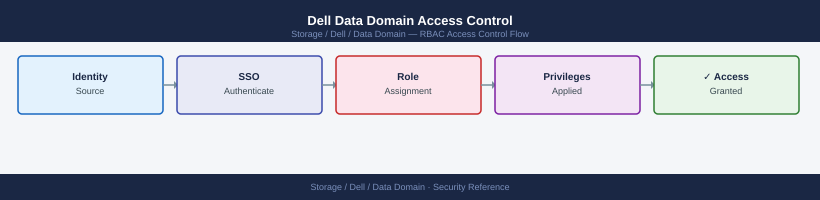

---
tags:
  - dell
  - security
---
# Dell Data Domain Access Control


```bash
# Create a user and assign a role
user add <username> role backup-operator

# Assign LDAP group to a role
authentication roles assign role backup-operator group <ldap-group-name>

# List current users and roles
user show
```

## Before you begin

- **Access:** Storage admin credentials (cluster admin or equivalent)
- **Change management:** security changes require CAB approval in most environments
- **Rollback plan:** document current state before any security control change
- **Testing:** validate in a non-production environment first where possible

---

---

## See also

- [Data Domain — Authentication](authentication/)
- [Data Domain — Hardening](hardening/)
- [Data Domain — Encryption](encryption/)
