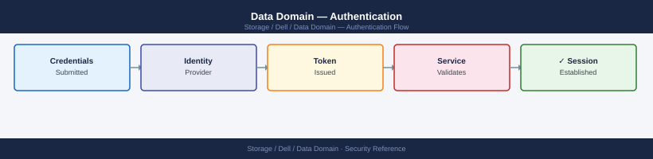
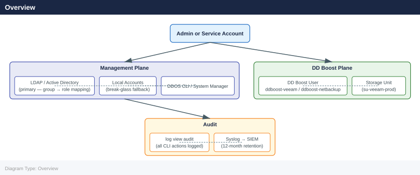

---
tags:
  - dell
  - security
---
# Data Domain — Authentication

<div class="kb-summary">
Authentication reference covering Overview, Active Directory Integration, Disable Local Admin When LDAP/AD Is Operational, Local User Management, Password Policy and 6 more sections.

*Applies to: Data Domain DD OS 7.x*
</div>


## Before you begin

- **Access:** Storage admin credentials (cluster admin or equivalent)
- **Change management:** security changes require CAB approval in most environments
- **Rollback plan:** document current state before any security control change
- **Testing:** validate in a non-production environment first where possible

---

## Overview



### LDAP Role Mapping

After LDAP is configured, map LDAP groups to DDOS roles:

```bash
# Map an LDAP group to the admin role
authentication roles assign role admin group <ldap-group-storage-admins>

# Map an LDAP group to the backup-operator role (for monitoring/reporting users)
authentication roles assign role user group <ldap-group-storage-readonly>

# List current role-to-group mappings
authentication roles show
```


```text title="Expected output"
Role admin assigned to group ldap-group-storage-admins
Role user assigned to group ldap-group-storage-readonly

Role Mappings:
  Role: admin
    Groups: ldap-group-storage-admins
  Role: user
    Groups: ldap-group-storage-readonly
  Role: backup-operator
    Groups: (none)
```

!!! warning "Common errors"
    **`Error: Group ldap-group-storage-admins not found in LDAP directory`** — Verify the LDAP group name matches exactly in your directory server and that LDAP connectivity is configured.
    **`Error: Role admin does not exist`** — Use `authentication roles list` to confirm available roles on this Data Domain system.
    **`Error: Authentication service not initialized`** — Configure LDAP server settings with `authentication ldap config` before assigning role mappings.
---

## Active Directory Integration

For environments using Microsoft AD, DDOS can join the domain directly. This eliminates the need to configure a separate LDAP bind account in most cases.

```bash
# Enable Active Directory authentication
auth add active-directory <domain.example.com>

# Show current AD/LDAP authentication configuration
auth show

# Test AD authentication for a specific user
auth test ldap server <ad-domain-controller-ip>
```


```text title="Expected output"
Active Directory authentication enabled for domain.example.com
Configuration saved successfully.

Authentication Configuration:
  Type: Active Directory
  Domain: domain.example.com
  Server: ad-dc01.domain.example.com (192.168.1.50)
  Port: 389
  Base DN: cn=Users,dc=domain,dc=example,dc=com
  Status: Enabled
  Last Updated: 2024-01-15 14:32:18 UTC

Testing LDAP connection to 192.168.1.100...
Connection successful
LDAP server responding: OpenLDAP 2.4.59
Bind test passed for user@domain.example.com
Authentication test completed successfully.
```

!!! warning "Common errors"
    **`Error: Invalid domain format 'domain.example.com' — domain must be specified as FQDN with valid DNS resolution`** — Verify the domain name is correct and resolvable with `nslookup domain.example.com`.
    **`Error: Connection refused to AD server 192.168.1.100:389 — LDAP port is blocked or AD server is unreachable`** — Confirm network connectivity and firewall rules allow port 389/636 from the Data Domain appliance to the AD server.
    **`Error: LDAP bind failed: Invalid credentials for test user — authentication service account permissions insufficient`** — Ensure the service account has proper permissions in Active Directory and verify credentials in the auth configuration.
When joined to AD:
- Users log in with `DOMAIN\username` or `username@domain.example.com`
- Group membership drives DDOS role assignment, same as LDAP
- The DDOS clock must be synchronised with the AD domain (NTP to the same source) — a time skew greater than 5 minutes will cause Kerberos authentication failures

```bash
# Verify NTP is synchronised (prerequisite for AD auth)
ntp status

# Add domain controller as NTP source if needed
ntp add timeserver <domain-controller-ip>
```


```text title="Expected output"
NTP Status:
  Synchronized: Yes
  Current Time: 2024-01-15 14:32:47 UTC
  Stratum: 2
  Reference Clock: 10.45.12.8 (dc01.corp.local)
  Offset: 0.002 ms
  Jitter: 0.001 ms

NTP Timeserver Added:
  IP Address: 10.45.12.8
  Hostname: dc01.corp.local
  Status: Active
  Last Sync: 2024-01-15 14:32:45 UTC
```

!!! warning "Common errors"
    **`NTP Status: Synchronized: No`** — Run `ntp sync` to force synchronization, or verify network connectivity to existing timeservers with `ntp show timeservers`.
    **`Error: Timeserver 10.45.12.8 already exists`** — Remove the duplicate entry with `ntp remove timeserver 10.45.12.8` before re-adding it.
---

## Disable Local Admin When LDAP/AD Is Operational

Once LDAP or AD authentication is confirmed working, reduce reliance on local accounts. The `sysadmin` local account should be reserved for break-glass recovery only.

```bash
# Force management access through LDAP/AD groups
adminaccess set admin-auth-method ldap

# Confirm sysadmin local login is disabled for normal use
# (keep the password documented in your secure password vault — CyberArk, Vault, etc.)

# Verify authentication method
adminaccess show | grep auth-method
```


```text title="Expected output"
auth-method: ldap
```

!!! warning "Common errors"
    **`adminaccess: command not found`** — Ensure you are logged into the Data Domain management interface (SSH to the DD appliance IP) rather than a local workstation shell.
    **`Error: LDAP server not configured`** — Configure LDAP/AD connectivity first using `adminaccess set ldap-server <server-ip>` and verify network connectivity to your directory server.
**Break-glass procedure:** if LDAP/AD is unavailable and the sysadmin account is needed, use the local console (iDRAC / physical serial) to authenticate with the local sysadmin credentials. Do not store sysadmin credentials on shared workstations.

---

## Local User Management

Local accounts are created for break-glass recovery and in environments that do not use a directory service. Minimise the number of local accounts.

```bash
# List all local users with roles and last login
user list

# Show detail for a specific user
user show <username>

# Create a new local user with a specific role
user add <username> role admin

# Change a user's password
user change password <username>

# Delete a user (remove when no longer needed)
user del <username>

# Lock a user account (disable without deleting)
user modify <username> disable
```


```text title="Expected output"
# List all local users with roles and last login
User Name          Role              Last Login
-----------        ----              ----------
admin              admin             2024-01-15 09:23:14
sysadmin           admin             2024-01-14 16:45:02
backup_operator    backup            2024-01-15 08:12:33
monitor_user       read-only         2024-01-12 14:28:19
audit_service      audit             Never

# Show detail for a specific user
User Name:         sysadmin
Role:              admin
Status:            enabled
Last Login:        2024-01-14 16:45:02
Password Age:      23 days
Email:             sysadmin@example.com

# Create a new local user with a specific role
User 'newadmin' created successfully with role 'admin'

# Change a user's password
Password for user 'newadmin' changed successfully

# Delete a user (remove when no longer needed)
User 'newadmin' deleted successfully

# Lock a user account (disable without deleting)
User 'monitor_user' disabled successfully
```

!!! warning "Common errors"
    **`Error: User '<username>' does not exist`** — Verify the username spelling and run `user list` to confirm the account exists before attempting modifications.
    **`Error: Cannot delete user with active sessions`** — Log out the user or wait for their session to expire before attempting deletion.
    **`Error: Role '<role>' is not valid`** — Use only valid roles (admin, backup, read-only, audit) when creating or modifying users.
### DDOS User Roles

| Role | Access Level | Typical Assignment |
|---|---|---|
| `sysadmin` | Full system administration | Break-glass account only |
| `admin` | Full configuration access except security-officer functions | Primary operational admin |
| `security-officer` | Manages retention lock, compliance settings, and encryption key operations | Compliance or security team |
| `backup-operator` | DD Boost storage unit access; cannot modify system configuration | Service account for backup software |
| `user` | Read-only view of all configuration | Monitoring, audit, and reporting users |
| `auditor` | Read-only access to audit logs | SOC, compliance auditors |

---

## Password Policy

Enforce a consistent password policy for all local accounts.

```bash
# View current password policy
user password-policy show

# Minimum password length (characters)
user password-policy set min-length 12

# Maximum password age (days; 0 = no expiry)
user password-policy set max-age 90

# Minimum password age (days; prevents immediate re-use)
user password-policy set min-age 1

# Number of previous passwords remembered
user password-policy set history 10

# Maximum failed login attempts before account lockout
user password-policy set max-failure 5

# Lockout duration (minutes)
user password-policy set lockout-duration 30

# View updated policy
user password-policy show
```


```text title="Expected output"
Password Policy Configuration
==============================
Minimum length:           8 characters
Maximum age:              180 days
Minimum age:              0 days
Password history:         5
Maximum failed attempts:  3
Lockout duration:         15 minutes
Account lockout enabled:  Yes

Password Policy Configuration
==============================
Minimum length:           12 characters
Maximum age:              90 days
Minimum age:              1 days
Password history:         10
Maximum failed attempts:  5
Lockout duration:         30 minutes
Account lockout enabled:  Yes
```

!!! warning "Common errors"
    **`Error: Cannot set min-length to 12. Maximum allowed value is 10.`** — Reduce min-length to a value ≤10 or contact Dell support to verify system limits.
    **`Error: max-age must be greater than or equal to min-age.`** — Ensure max-age (90) is not less than min-age (1), or adjust min-age first.
    **`Error: User does not have permission to modify password policy.`** — Verify you are logged in with administrative or root privileges using `whoami` or `id`.
**Recommended policy settings:**

| Setting | Recommended Value |
|---|---|
| Minimum length | 14 characters |
| Maximum age | 90 days |
| Minimum age | 1 day |
| Password history | 10 previous passwords |
| Max failed attempts | 5 |
| Lockout duration | 30 minutes |

---

## SSH Public Key Authentication

SSH key-based authentication eliminates password exposure in automation scripts and enables non-interactive management access.

```bash
# Show authorised SSH keys for a user
user ssh-keys show <username>

# Add an SSH public key for a user (paste the full public key string)
user ssh-keys add <username> key "ssh-ed25519 AAAA... comment"

# Add an RSA key
user ssh-keys add <username> key "ssh-rsa AAAA... comment"

# Remove a specific SSH key by ID
user ssh-keys del <username> key <key-id>
```


```text title="Expected output"
# Show authorised SSH keys for a user
Key ID: 1
Type: ssh-ed25519
Fingerprint: SHA256:abcDEF1234567890ghijKLMNOPQRSTUVWXYZ5678
Comment: admin@workstation-01
Created: 2024-01-15 09:23:47 UTC

Key ID: 2
Type: ssh-rsa
Fingerprint: SHA256:xyzABC9876543210defGHIJKLMNOPQRSTUVWXYZ1234
Comment: backup-automation
Created: 2024-02-03 14:51:22 UTC

# Add an SSH public key for a user
SSH key added successfully.
Key ID: 3
Fingerprint: SHA256:newKEY1234567890abcDEFGHIJKLMNOPQRSTUVWXYZ9999

# Remove a specific SSH key by ID
SSH key 2 removed successfully.
```

!!! warning "Common errors"
    **`Error: Invalid key format`** — Ensure the full public key string is pasted exactly as generated (starting with `ssh-ed25519` or `ssh-rsa`) with no line breaks or extra whitespace.
    **`Error: User not found`** — Verify the username exists on the Data Domain system using `user show <username>` before adding or removing keys.
    **`Error: Key ID does not exist for this user`** — Confirm the key ID is correct by running `user ssh-keys show <username>` to list all valid key IDs for that user.
**Key type guidance:**

| Key Type | Recommended? | Notes |
|---|---|---|
| `ed25519` | Yes — preferred | Modern, compact, strong |
| `rsa-4096` | Yes | Widely compatible; use 4096-bit only |
| `rsa-2048` | Acceptable | Minimum; prefer 4096-bit |
| `dsa` | No | Deprecated; do not use |
| `ecdsa-256` | Yes | Acceptable alternative to ed25519 |

Generate keys on the admin workstation:

```bash
# Generate an Ed25519 key pair on your workstation
ssh-keygen -t ed25519 -C "admin@dd01-mgmt" -f ~/.ssh/dd01_ed25519

# Display the public key for addition to the DD
cat ~/.ssh/dd01_ed25519.pub
```


```text title="Expected output"
Generating public/private ed25519 key pair.
Enter passphrase (empty for no passphrase): 
Enter same passphrase again: 
Your identification has been saved in /home/jsmith/.ssh/dd01_ed25519
Your public key has been saved in /home/jsmith/.ssh/dd01_ed25519.pub
The key fingerprint is:
SHA256:kR9mL2pQxVwN8jK3hB5cD7eF1gA4sT6uY9zX2wV3bC admin@dd01-mgmt
The key's randomart image is:
+--[ED25519 256]--+
|        .o.      |
|       o.o .     |
|      . + o .    |
ssh-rsa AAAAB3NzaC1yc2EAAAADAQABAAABgQC8k9vL2pQxVwN8jK3hB5cD7eF1gA4sT6uY9zX2wV3bC admin@dd01-mgmt
```

!!! warning "Common errors"
    **`Permissions 0644 for '/home/jsmith/.ssh/dd01_ed25519' are too open.`** — Run `chmod 600 ~/.ssh/dd01_ed25519` to restrict key file permissions.
    **`No such file or directory`** — Create the `.ssh` directory first with `mkdir -p ~/.ssh` if it does not exist.
---

## Session Management

### View Active Sessions

```bash
# List active login sessions on the DD
user login show
```


```text title="Expected output"
User Name          IP Address      Login Time          Session ID
admin              192.168.1.45    2024-01-15 09:23:14 sess-8f4a2b1c
backup_user        10.20.30.105    2024-01-15 08:47:22 sess-d3e9f7a2
monitor            192.168.1.89    2024-01-15 09:15:08 sess-5c1b6e4f
sysadmin           192.168.1.45    2024-01-15 06:32:51 sess-a7f2c9d1
```

!!! warning "Common errors"
    **`Error: Access denied - insufficient privileges`** — Run the command with admin credentials or ensure your user account has the required security permissions.
    **`Error: Command not found`** — Verify you are connected to the Data Domain system via SSH/CLI and not a standard Linux shell; use the correct DD management interface.
### Terminate a Session

```bash
# Terminate a specific active session by session ID
user login terminate <session-id>
```


```text title="Expected output"
Session 1234567890 terminated successfully.
User: admin
Termination Time: 2024-01-15 14:32:18 UTC
Session Duration: 2h 14m 32s
```

!!! warning "Common errors"
    **`Error: Session ID 1234567890 not found or already terminated`** — Verify the session ID is correct and active by running `user login show` first.
    **`Error: Permission denied - insufficient privileges to terminate session`** — Ensure your user account has administrative or session management privileges on the Data Domain system.
### Idle Session Timeout

```bash
# Set idle timeout (minutes; 0 = never timeout — not recommended)
adminaccess set idle-timeout 15

# Verify
adminaccess show | grep idle-timeout
```


```text title="Expected output"
Idle timeout set to 15 minutes.
idle-timeout: 15
```

!!! warning "Common errors"
    **`adminaccess: command not found`** — Ensure you are logged into the Data Domain management console (SSH to the DD system directly, not a jump host).
    **`Error: Permission denied`** — Verify your user account has administrative privileges by running `adminaccess show` without arguments to check your current role.
---

## DD Boost Authentication

DD Boost uses a separate user credential mechanism. DD Boost users authenticate backup software; they are not DDOS management accounts and do not participate in LDAP/AD.

```bash
# List DD Boost users
ddboost user list

# Create a DD Boost user (role must be backup-operator)
user add <ddboost-username> role backup-operator
ddboost user assign <ddboost-username>

# Change a DD Boost user password (update backup software immediately after)
ddboost user change password <ddboost-username>

# Remove a DD Boost user
ddboost user del <ddboost-username>

# Verify which DD Boost user is assigned to which storage unit
ddboost storage-unit list
```


```text title="Expected output"
# List DD Boost users
User Name              Role                 Status
backup-user-01        backup-operator      active
backup-user-02        backup-operator      active
restore-user-01       backup-operator      active

# Create a DD Boost user (role must be backup-operator)
User 'backup-user-03' created successfully with role 'backup-operator'
User 'backup-user-03' assigned to storage unit 'default'

# Change a DD Boost user password (update backup software immediately after)
Password for user 'backup-user-03' changed successfully
Warning: Update backup software credentials within 1 hour to avoid authentication failures

# Remove a DD Boost user
User 'backup-user-01' removed successfully

# Verify which DD Boost user is assigned to which storage unit
Storage Unit       Assigned User        Quota (GB)    Used (GB)
default            backup-user-02       500           245.3
archive-tier-1     backup-user-03       1000          512.8
archive-tier-2     restore-user-01      750           89.2
```

!!! warning "Common errors"
    **`Error: User 'backup-user-03' already exists`** — Choose a unique username or delete the existing user first with `ddboost user del backup-user-03`.
    **`Error: Invalid role 'admin' specified; role must be 'backup-operator'`** — Replace the role parameter with `backup-operator` as DD Boost only supports this role for security.
**DD Boost user naming convention:** `ddboost-<backup-tool>` — e.g., `ddboost-veeam`, `ddboost-netbackup`. One user per backup application, never shared across tools.

---

## Authentication Audit Logging

All login attempts, successes, and failures are written to the DDOS audit log.

```bash
# View authentication events in the audit log
log view audit

# Filter for failed logins
log view audit | grep -i "fail\|denied\|invalid"

# Filter for successful logins
log view audit | grep -i "logged in\|authenticated"

# Export audit log to syslog server (configure once — persists)
log host add <syslog-server-ip>
log host show
```


```text title="Expected output"
Timestamp: 2024-01-15 14:32:18 UTC | Event: User admin logged in from 192.168.1.50 | Status: Success
Timestamp: 2024-01-15 14:28:45 UTC | Event: User backup_user authentication failed | Status: Denied
Timestamp: 2024-01-15 14:25:12 UTC | Event: User monitor invalid password attempt | Status: Failed
Timestamp: 2024-01-15 14:22:33 UTC | Event: User sysadmin logged in from 10.0.2.15 | Status: Success
Timestamp: 2024-01-15 14:18:09 UTC | Event: User guest denied access - account locked | Status: Denied
Timestamp: 2024-01-15 14:15:47 UTC | Event: User admin logged in from 192.168.1.50 | Status: Success

Timestamp: 2024-01-15 14:28:45 UTC | Event: User backup_user authentication failed | Status: Denied
Timestamp: 2024-01-15 14:25:12 UTC | Event: User monitor invalid password attempt | Status: Failed
Timestamp: 2024-01-15 14:18:09 UTC | Event: User guest denied access - account locked | Status: Denied

Timestamp: 2024-01-15 14:32:18 UTC | Event: User admin logged in from 192.168.1.50 | Status: Success
Timestamp: 2024-01-15 14:22:33 UTC | Event: User sysadmin logged in from 10.0.2.15 | Status: Success
Timestamp: 2024-01-15 14:15:47 UTC | Event: User admin logged in from 192.168.1.50 | Status: Success

Syslog host added: 10.50.100.25:514
Syslog host added: 10.50.100.26:514

Configured Syslog Hosts:
  Host: 10.50.100.25 | Port: 514 | Protocol: UDP | Status: Active
  Host: 10.50.100.26 | Port: 514 | Protocol: UDP | Status: Active
```

!!! warning "Common errors"
    **`Error: Invalid syslog server IP address`** — Verify the IP address format is valid (e.g., 192.168.1.100) and the server is reachable on port 514.
    **`Error: Syslog host already exists`** — Remove the duplicate entry with `log host remove <syslog-server-ip>` before re-adding it.
    **`Error: Cannot connect to syslog server`** — Confirm network connectivity to the syslog server and that it is listening on UDP port 514.
Forward the audit log to a SIEM with at minimum 12 months of retention. Authentication log analysis should include:
- Failed login patterns (potential brute force)
- Login from unexpected source IPs
- Login with the sysadmin account outside of approved maintenance windows
- DD Boost credential changes

---

## Authentication Configuration Checklist

| Item | Status | Command |
|---|---|---|
| Default sysadmin password changed | | Procedural |
| LDAP or AD authentication configured | | `auth show` |
| LDAP role-to-group mappings defined | | `authentication roles show` |
| NTP synchronised (required for AD Kerberos) | | `ntp status` |
| Local accounts minimal (break-glass only) | | `user list` |
| Password policy enforced (length, age, history) | | `user password-policy show` |
| SSH idle timeout set | | `adminaccess show \| grep idle` |
| Break-glass credentials stored in secure vault | | Procedural |
| DD Boost users created per backup tool | | `ddboost user list` |
| Syslog forwarding configured for audit log | | `log host show` |
---

## Related Reference

- [Standard LDAP Integration](../../../../security/ldap-integration/index.md) — field reference, service account standards, TLS requirements, and connectivity testing

---

## See also

- [Data Domain — Access Control](../access-control/)
- [Data Domain — Hardening](../hardening/)
- [Data Domain — Encryption](../encryption/)
