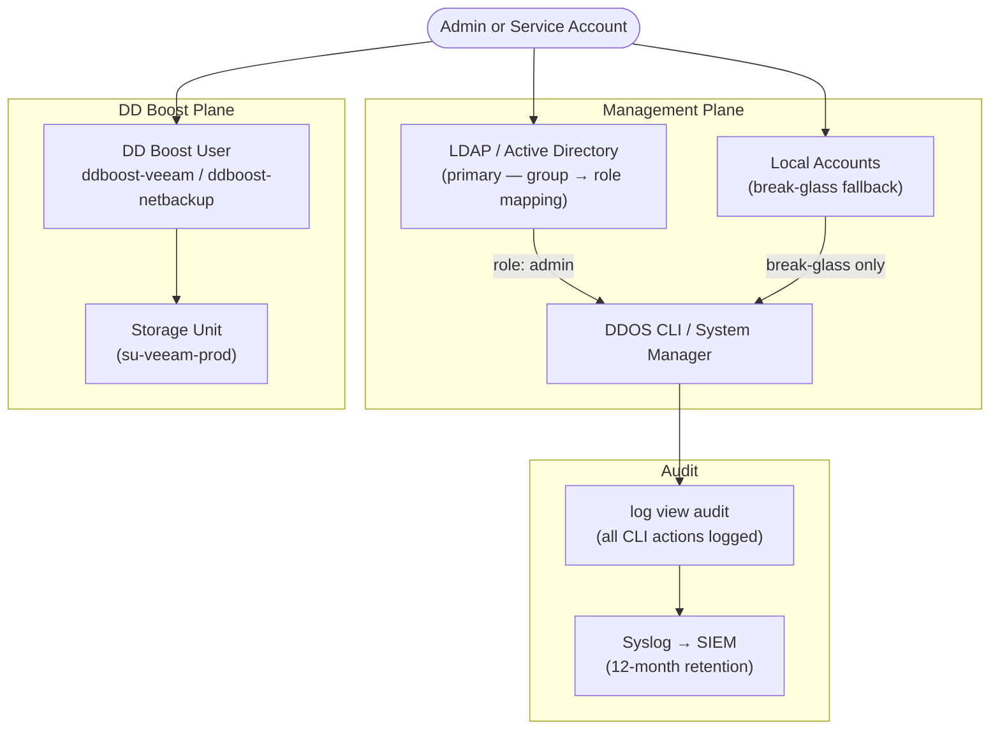

# Data Domain — Authentication


<div class="kb-summary">
Authentication reference covering Overview, Active Directory Integration, Disable Local Admin When LDAP/AD Is Operational, Local User Management, Password Policy and 6 more sections.
</div>

## Overview


┌─────────────────────────────────── Dell Data Domain Authentication ───────────────────────────────────┐
│                                                                                                       │
│   ┌───────────────────────────────────────────────────────────────────────────────────────────────┐   │
│   │               DD admin auth: LDAP/AD preferred; local admin as break-glass only               │   │
│   │           SSH key authentication supported for CLI; disable password auth post-setup          │   │
│   │             DDOS does not support native MFA; place jump server with MFA in front             │   │
│   └───────────────────────────────────────────────────────────────────────────────────────────────┘   │
│                                                                                                       │
│                          ▼                                                 ▼                          │
│                                                                                                       │
│   ┌──────────────────────────────────────────────┐  ┌─────────────────────────────────────────────┐   │
│   │             Admin Authentication             │  │                Configuration                │   │
│   │      ─────────────────────────────────       │  │      ─────────────────────────────────      │   │
│   │           LDAP/AD: primary method            │  │        authgroup add group-name role        │   │
│   │        Local admin: break-glass only         │  │          auth ldap set server <IP>          │   │
│   │           SSH key: scripted access           │  │             user ssh-pubkeys add            │   │
│   │      Roles: admin, limited admin, user       │  │            Audit: log all logins            │   │
│   │         Session timeout configurable         │  │           No shared admin accounts          │   │
│   └──────────────────────────────────────────────┘  └─────────────────────────────────────────────┘   │
│                                                                                                       │
│   │      Method      │     Use case     │      Command      │     Standard     │     MFA path     │   │
│   │ ──────────────── │ ──────────────── │ ───────────────── │ ──────────────── │──────────────────│   │
│   │     LDAP/AD      │   Daily admin    │   auth ldap set   │     Required     │   Jump server    │   │
│   │   Local admin    │   Break-glass    │    User add/mod   │    Vault only    │N/A (break-glass) │   │
│   │     SSH key      │    Automation    │  ssh-pubkeys add  │     Required     │ Key + passphrase │   │
│   │  DD Boost user   │    Backup app    │    ddboost user   │     Per app      │    App-level     │   │
│                                                                                                       │
│    Key terms:                                                                                         │
│                                                                                                       │
│    authgroup  = LDAP/AD group mapped to DDOS admin role; members inherit role permissions             │
│    Break-glass= Local admin account in vault; used only when LDAP unavailable                         │
│    Jump server= Hardened host with MFA in front of DD; all SSH tunnels through jump server            │
│    Session timeout= Idle CLI session terminates; default 10 min; configurable                         │
│                                                                                                       │
└───────────────────────────────────────────────────────────────────────────────────────────────────────┘
```
```text

### LDAP Role Mapping

After LDAP is configured, map LDAP groups to DDOS roles:

```bash
# Map an LDAP group to the admin role
authentication roles assign role admin group <ldap-group-storage-admins>

# Map an LDAP group to the backup-operator role (for monitoring/reporting users)
authentication roles assign role user group <ldap-group-storage-readonly>

# List current role-to-group mappings
authentication roles show
```

---

## Active Directory Integration

For environments using Microsoft AD, DDOS can join the domain directly. This eliminates the need to configure a separate LDAP bind account in most cases.

```bash
# Enable Active Directory authentication
auth add active-directory <domain.example.com>

# Show current AD/LDAP authentication configuration
auth show

# Test AD authentication for a specific user
auth test ldap server <ad-domain-controller-ip>
```

When joined to AD:
- Users log in with `DOMAIN\username` or `username@domain.example.com`
- Group membership drives DDOS role assignment, same as LDAP
- The DDOS clock must be synchronised with the AD domain (NTP to the same source) — a time skew greater than 5 minutes will cause Kerberos authentication failures

```bash
# Verify NTP is synchronised (prerequisite for AD auth)
ntp status

# Add domain controller as NTP source if needed
ntp add timeserver <domain-controller-ip>
```

---

## Disable Local Admin When LDAP/AD Is Operational

Once LDAP or AD authentication is confirmed working, reduce reliance on local accounts. The `sysadmin` local account should be reserved for break-glass recovery only.

```bash
# Force management access through LDAP/AD groups
adminaccess set admin-auth-method ldap

# Confirm sysadmin local login is disabled for normal use
# (keep the password documented in your secure password vault — CyberArk, Vault, etc.)

# Verify authentication method
adminaccess show | grep auth-method
```

**Break-glass procedure:** if LDAP/AD is unavailable and the sysadmin account is needed, use the local console (iDRAC / physical serial) to authenticate with the local sysadmin credentials. Do not store sysadmin credentials on shared workstations.

---

## Local User Management

Local accounts are created for break-glass recovery and in environments that do not use a directory service. Minimise the number of local accounts.

```bash
# List all local users with roles and last login
user list

# Show detail for a specific user
user show <username>

# Create a new local user with a specific role
user add <username> role admin

# Change a user's password
user change password <username>

# Delete a user (remove when no longer needed)
user del <username>

# Lock a user account (disable without deleting)
user modify <username> disable
```

### DDOS User Roles

| Role | Access Level | Typical Assignment |
|---|---|---|
| `sysadmin` | Full system administration | Break-glass account only |
| `admin` | Full configuration access except security-officer functions | Primary operational admin |
| `security-officer` | Manages retention lock, compliance settings, and encryption key operations | Compliance or security team |
| `backup-operator` | DD Boost storage unit access; cannot modify system configuration | Service account for backup software |
| `user` | Read-only view of all configuration | Monitoring, audit, and reporting users |
| `auditor` | Read-only access to audit logs | SOC, compliance auditors |

---

## Password Policy

Enforce a consistent password policy for all local accounts.

```bash
# View current password policy
user password-policy show

# Minimum password length (characters)
user password-policy set min-length 12

# Maximum password age (days; 0 = no expiry)
user password-policy set max-age 90

# Minimum password age (days; prevents immediate re-use)
user password-policy set min-age 1

# Number of previous passwords remembered
user password-policy set history 10

# Maximum failed login attempts before account lockout
user password-policy set max-failure 5

# Lockout duration (minutes)
user password-policy set lockout-duration 30

# View updated policy
user password-policy show
```

**Recommended policy settings:**

| Setting | Recommended Value |
|---|---|
| Minimum length | 14 characters |
| Maximum age | 90 days |
| Minimum age | 1 day |
| Password history | 10 previous passwords |
| Max failed attempts | 5 |
| Lockout duration | 30 minutes |

---

## SSH Public Key Authentication

SSH key-based authentication eliminates password exposure in automation scripts and enables non-interactive management access.

```bash
# Show authorised SSH keys for a user
user ssh-keys show <username>

# Add an SSH public key for a user (paste the full public key string)
user ssh-keys add <username> key "ssh-ed25519 AAAA... comment"

# Add an RSA key
user ssh-keys add <username> key "ssh-rsa AAAA... comment"

# Remove a specific SSH key by ID
user ssh-keys del <username> key <key-id>
```

**Key type guidance:**

| Key Type | Recommended? | Notes |
|---|---|---|
| `ed25519` | Yes — preferred | Modern, compact, strong |
| `rsa-4096` | Yes | Widely compatible; use 4096-bit only |
| `rsa-2048` | Acceptable | Minimum; prefer 4096-bit |
| `dsa` | No | Deprecated; do not use |
| `ecdsa-256` | Yes | Acceptable alternative to ed25519 |

Generate keys on the admin workstation:

```bash
# Generate an Ed25519 key pair on your workstation
ssh-keygen -t ed25519 -C "admin@dd01-mgmt" -f ~/.ssh/dd01_ed25519

# Display the public key for addition to the DD
cat ~/.ssh/dd01_ed25519.pub
```

---

## Session Management

### View Active Sessions

```bash
# List active login sessions on the DD
user login show
```

### Terminate a Session

```bash
# Terminate a specific active session by session ID
user login terminate <session-id>
```

### Idle Session Timeout

```bash
# Set idle timeout (minutes; 0 = never timeout — not recommended)
adminaccess set idle-timeout 15

# Verify
adminaccess show | grep idle-timeout
```

---

## DD Boost Authentication

DD Boost uses a separate user credential mechanism. DD Boost users authenticate backup software; they are not DDOS management accounts and do not participate in LDAP/AD.

```bash
# List DD Boost users
ddboost user list

# Create a DD Boost user (role must be backup-operator)
user add <ddboost-username> role backup-operator
ddboost user assign <ddboost-username>

# Change a DD Boost user password (update backup software immediately after)
ddboost user change password <ddboost-username>

# Remove a DD Boost user
ddboost user del <ddboost-username>

# Verify which DD Boost user is assigned to which storage unit
ddboost storage-unit list
```

**DD Boost user naming convention:** `ddboost-<backup-tool>` — e.g., `ddboost-veeam`, `ddboost-netbackup`. One user per backup application, never shared across tools.

---

## Authentication Audit Logging

All login attempts, successes, and failures are written to the DDOS audit log.

```bash
# View authentication events in the audit log
log view audit

# Filter for failed logins
log view audit | grep -i "fail\|denied\|invalid"

# Filter for successful logins
log view audit | grep -i "logged in\|authenticated"

# Export audit log to syslog server (configure once — persists)
log host add <syslog-server-ip>
log host show
```

Forward the audit log to a SIEM with at minimum 12 months of retention. Authentication log analysis should include:
- Failed login patterns (potential brute force)
- Login from unexpected source IPs
- Login with the sysadmin account outside of approved maintenance windows
- DD Boost credential changes

---

## Authentication Configuration Checklist

| Item | Status | Command |
|---|---|---|
| Default sysadmin password changed | | Procedural |
| LDAP or AD authentication configured | | `auth show` |
| LDAP role-to-group mappings defined | | `authentication roles show` |
| NTP synchronised (required for AD Kerberos) | | `ntp status` |
| Local accounts minimal (break-glass only) | | `user list` |
| Password policy enforced (length, age, history) | | `user password-policy show` |
| SSH idle timeout set | | `adminaccess show \| grep idle` |
| Break-glass credentials stored in secure vault | | Procedural |
| DD Boost users created per backup tool | | `ddboost user list` |
| Syslog forwarding configured for audit log | | `log host show` |
---

## Related Reference

- [Standard LDAP Integration](../../../../../security/ldap-integration/index.md) — field reference, service account standards, TLS requirements, and connectivity testing
