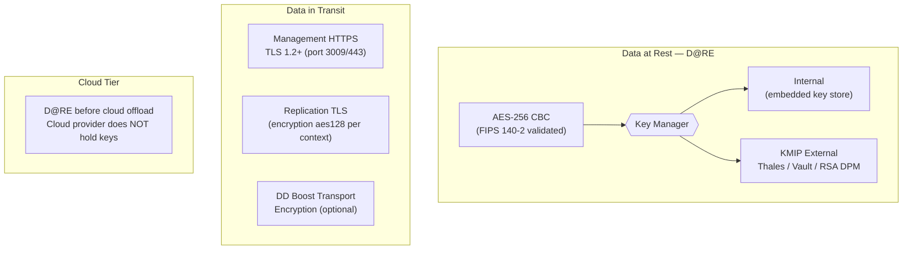

# Data Domain — Encryption


<div class="kb-summary">
Encryption reference covering Overview, Key Management, Key Rotation, FIPS Mode, Encryption in Transit (TLS) and 3 more sections.
</div>

## Overview


┌───────────────────────────────────── Dell Data Domain Encryption ─────────────────────────────────────┐
│                                                                                                       │
│   ┌───────────────────────────────────────────────────────────────────────────────────────────────┐   │
│   │           DD supports data-at-rest encryption (DAR) and in-transit encryption (TLS)           │   │
│   │            DAR: AES-256-GCM; key managed internally (keystore) or externally (KMIP)           │   │
│   │              In-transit: replication TLS, DD Boost over TLS, management HTTPS/SSH             │   │
│   └───────────────────────────────────────────────────────────────────────────────────────────────┘   │
│                                                                                                       │
│                  ▼                                ▼                                ▼                  │
│                                                                                                       │
│   ┌─────────────────────────────┐  ┌─────────────────────────────┐  ┌─────────────────────────────┐   │
│   │         Data at Rest        │  │       Data in Transit       │  │        Key Management       │   │
│   │      ─────────────────      │  │      ─────────────────      │  │      ─────────────────      │   │
│   │         AES-256-GCM         │  │       Replication TLS       │  │      Internal keystore      │   │
│   │       FIPS 140-2 mode       │  │         DD Boost TLS        │  │        KMIP external        │   │
│   │       Filesystem level      │  │        Mgmt HTTPS/SSH       │  │      RSA/Thales/SafeNet     │   │
│   │       License required      │  │           TLS 1.2+          │  │         Key rotation        │   │
│   │        Enable via GUI       │  │       Certificate mgmt      │  │      Backup key escrow      │   │
│   └─────────────────────────────┘  └─────────────────────────────┘  └─────────────────────────────┘   │
│                                                                                                       │
│   │     Feature      │     Standard     │      Command      │     License      │      Notes       │   │
│   │ ──────────────── │ ──────────────── │ ───────────────── │ ──────────────── │──────────────────│   │
│   │       DAR        │  Enable at init  │  filesys encrypt  │  DD Encryption   │  One-time setup  │   │
│   │       KMIP       │   External KMS   │    kmip enable    │  DD Encryption   │  Venafi/SafeNet  │   │
│   │     Rep TLS      │    Always on     │      Default      │       None       │     TLS 1.2+     │   │
│   │    FIPS mode     │ Gov requirement  │    fips enable    │   FIPS license   │ Restrict ciphers │   │
│                                                                                                       │
│    Key terms:                                                                                         │
│                                                                                                       │
│    DAR          = Data At Rest encryption; encrypts DDOS filesystem on disk using AES-256-GCM         │
│    KMIP         = Key Management Interoperability Protocol; external KMS for DD encryption keys       │
│    FIPS 140-2   = US federal cryptographic standard; DD can enforce FIPS-approved cipher suites       │
│    Key rotation = Periodic re-encryption with new key; online operation in newer DDOS versions        │
│    Key escrow   = Backup copy of encryption key in separate secure vault; needed for recovery         │
│                                                                                                       │
└───────────────────────────────────────────────────────────────────────────────────────────────────────┘
```
┌───────────────────────────────────── Dell Data Domain Encryption ─────────────────────────────────────┐
│                                                                                                       │
│   ┌───────────────────────────────────────────────────────────────────────────────────────────────┐   │
│   │           DD supports data-at-rest encryption (DAR) and in-transit encryption (TLS)           │   │
│   │            DAR: AES-256-GCM; key managed internally (keystore) or externally (KMIP)           │   │
│   │              In-transit: replication TLS, DD Boost over TLS, management HTTPS/SSH             │   │
│   └───────────────────────────────────────────────────────────────────────────────────────────────┘   │
│                                                                                                       │
│                  ▼                                ▼                                ▼                  │
│                                                                                                       │
│   ┌─────────────────────────────┐  ┌─────────────────────────────┐  ┌─────────────────────────────┐   │
│   │         Data at Rest        │  │       Data in Transit       │  │        Key Management       │   │
│   │      ─────────────────      │  │      ─────────────────      │  │      ─────────────────      │   │
│   │         AES-256-GCM         │  │       Replication TLS       │  │      Internal keystore      │   │
│   │       FIPS 140-2 mode       │  │         DD Boost TLS        │  │        KMIP external        │   │
│   │       Filesystem level      │  │        Mgmt HTTPS/SSH       │  │      RSA/Thales/SafeNet     │   │
│   │       License required      │  │           TLS 1.2+          │  │         Key rotation        │   │
│   │        Enable via GUI       │  │       Certificate mgmt      │  │      Backup key escrow      │   │
│   └─────────────────────────────┘  └─────────────────────────────┘  └─────────────────────────────┘   │
│                                                                                                       │
│   │     Feature      │     Standard     │      Command      │     License      │      Notes       │   │
│   │ ──────────────── │ ──────────────── │ ───────────────── │ ──────────────── │──────────────────│   │
│   │       DAR        │  Enable at init  │  filesys encrypt  │  DD Encryption   │  One-time setup  │   │
│   │       KMIP       │   External KMS   │    kmip enable    │  DD Encryption   │  Venafi/SafeNet  │   │
│   │     Rep TLS      │    Always on     │      Default      │       None       │     TLS 1.2+     │   │
│   │    FIPS mode     │ Gov requirement  │    fips enable    │   FIPS license   │ Restrict ciphers │   │
│                                                                                                       │
│    Key terms:                                                                                         │
│                                                                                                       │
│    DAR          = Data At Rest encryption; encrypts DDOS filesystem on disk using AES-256-GCM         │
│    KMIP         = Key Management Interoperability Protocol; external KMS for DD encryption keys       │
│    FIPS 140-2   = US federal cryptographic standard; DD can enforce FIPS-approved cipher suites       │
│    Key rotation = Periodic re-encryption with new key; online operation in newer DDOS versions        │
│    Key escrow   = Backup copy of encryption key in separate secure vault; needed for recovery         │
│                                                                                                       │
└───────────────────────────────────────────────────────────────────────────────────────────────────────┘
```

### Enable Encryption at Initial Commissioning

```bash
# Enable encryption — do this before writing any backup data
encryption enable

# Confirm it is active
encryption status
```

**Critical:** Enabling encryption on a Data Domain that already contains data requires a full filesystem rebuild (`filesys destroy` followed by `filesys create`), which deletes all existing backup data. Always enable D@RE during initial setup before any data is written.

### Encryption Algorithm

| Parameter | Value |
|---|---|
| Algorithm | AES-256 |
| Mode | CBC (Cipher Block Chaining) |
| Scope | Full DDFS container store (all MTrees) |
| Key granularity | Per-tier (active tier + cloud tier) |
| FIPS 140-2 | Validated (Certificate in NIST CMVP) |

D@RE cannot be selectively enabled per MTree — it applies to the entire DDFS when enabled.

---

## Key Management

DDOS supports three key manager modes. The correct choice depends on your compliance requirements and infrastructure.

| Key Manager | Description | When to Use |
|---|---|---|
| Internal (Embedded) | Keys stored on the DD appliance itself | Standalone deployments; acceptable for Governance-class workloads |
| RSA DPM (Dell Key Management) | Centralised Dell key management server | Enterprise environments requiring centralised key custody |
| KMIP External | Third-party KMIP-compatible key managers (Thales, Vormetric, HashiCorp Vault) | Compliance environments (SEC 17a-4, HIPAA) requiring external key custody and separation of duties |

### Configure Internal Key Manager

```bash
# Use internal key manager (default for new systems)
encryption change-key-manager internal

# Verify
encryption show config
```

### Configure KMIP External Key Manager

```bash
# Set the KMIP server address and port
encryption change-key-manager kmip server <kmip-server-ip> port 5696

# Set the KMIP username and certificate (certificate-based authentication)
encryption kmip set username <kmip-username>
encryption kmip set client-cert <certificate-path>

# Test connectivity to the KMIP server
encryption kmip test

# Verify configuration
encryption show config
```

### Configure RSA DPM

```bash
# Set RSA DPM server
encryption change-key-manager rsa-dpm server <dpm-server-ip>

# Register with the DPM server
encryption rsa-dpm register

# Verify
encryption show config
```

---

## Key Rotation

DDOS supports periodic encryption key rotation to limit the blast radius of a potential key compromise. Rotation generates a new active key and re-wraps existing data encryption keys without decrypting and re-encrypting all data.

### Check Last Key Rotation Date

```bash
encryption status | grep "Last Key Rotation"
```

### Perform a Manual Key Rotation

```bash
# Trigger key rotation
encryption rotate-keys

# Confirm new key is active
encryption status
```

Key rotation does not impact backup or restore operations — it can be performed online. Schedule annual or bi-annual key rotation per your security policy.

### Key Rotation Schedule Recommendation

| Environment | Rotation Frequency |
|---|---|
| Standard backup infrastructure | Annually |
| Compliance-regulated (SEC, HIPAA) | Every 6 months or per regulation |
| After any suspected key exposure | Immediately |

---

## FIPS Mode

DDOS D@RE is FIPS 140-2 validated. FIPS mode enforces:
- AES-256 for all on-disk encryption
- Approved key derivation and wrapping algorithms
- TLS 1.2+ for management and replication traffic when FIPS mode is active

### Verify FIPS Mode

```bash
# Check if FIPS mode is active
encryption status | grep -i fips

# System version for cross-referencing with NIST CMVP
system show version
```

FIPS 140-2 validation certificates for DDOS are listed on the [NIST CMVP website](https://csrc.nist.gov/projects/cryptographic-module-validation-program). Cross-reference the DDOS version against the active certificate when producing compliance evidence.

---

## Encryption in Transit (TLS)

All management traffic (HTTPS, REST API, System Manager GUI) and DD Boost communication use TLS. Replication between Data Domain appliances can also be encrypted at the transport layer.

### Management TLS

The DD System Manager runs on HTTPS (TCP 443 / 3009). The default certificate is self-signed. For enterprise deployments, replace the self-signed certificate with one signed by your internal CA or a public CA.

```bash
# Check current certificate details
adminaccess certificate show

# Generate a CSR (Certificate Signing Request) to submit to your CA
adminaccess certificate generate-csr common-name <dd-fqdn> \
    org "Your Organisation" country <two-letter-code>

# Install the CA-signed certificate after signing
adminaccess certificate install pem <certificate-pem-path>

# Verify the installed certificate
adminaccess certificate show
```

### Replication Encryption

By default, DDOS uses its own certificate exchange for replication authentication. Transport encryption for replication (SSL/TLS over the replication stream) can be explicitly enabled:

```bash
# Add an encrypted replication context
replication add source mtree://<src-dd>/data/col1/<mtree-name> \
    destination mtree://<dst-dd>/data/col1/<mtree-name> \
    encryption aes128

# Verify replication encryption setting
replication show all | grep -i encrypt
```

Replication encryption adds CPU overhead. For high-throughput environments (>10 TB/hr), evaluate the CPU impact on the source DD before enabling on all contexts.

### DD Boost Transport Encryption

DD Boost connections can optionally be encrypted when the backup client and DD support it:

```bash
# Enable DD Boost transport encryption
ddboost option set transport-encryption enabled

# Verify
ddboost option show | grep -i transport-enc
```

Supported by Veeam (DD Boost for Veeam plug-in), NetBackup (OST plug-in), and CommVault when using DD Boost.

---

## Encryption Considerations for Cloud Tier

When data is aged to Cloud Tier (S3 or Azure Blob), the data is encrypted with D@RE before being written to the cloud object store. The cloud provider does not hold the encryption keys — the DD key manager retains full control.

```bash
# Verify cloud tier encryption status
tier show detail cloud | grep -i encrypt
```

Additionally, configure server-side encryption on the cloud bucket as a defence-in-depth measure:
- **AWS S3:** Enable SSE-S3 or SSE-KMS on the target bucket
- **Azure Blob:** Enable Storage Service Encryption (enabled by default on Azure)

---

## Disk Disposal and Data Sanitisation

When a Data Domain disk fails and is replaced, or when decommissioning the array:

- **D@RE-encrypted disks:** Data is cryptographically inaccessible without the encryption keys. Destroying or migrating the keys effectively sanitises all encrypted data on the disk. This satisfies NIST SP 800-88 "cryptographic erase" requirements.
- **Non-encrypted disks:** Require physical destruction or NIST-compliant degaussing before disposal.

```bash
# Confirm encryption is active before disk disposal
encryption status

# On decommission — confirm key manager is inaccessible or keys are destroyed
# (coordinate with your key management policy and security team)
```

Dell ProSupport manages physical disk returns. Confirm with Dell support that returned disks under ProSupport Plus are destroyed or sanitised per their data handling policy.

---

## Encryption Checklist

| Item | Status | Command to Verify |
|---|---|---|
| D@RE enabled | | `encryption status` |
| AES-256 configured | | `encryption show config` |
| FIPS mode active (if required) | | `encryption status \| grep fips` |
| Key manager configured and active | | `encryption show config` |
| Last key rotation within policy period | | `encryption status \| grep rotation` |
| Management certificate is CA-signed (not self-signed) | | `adminaccess certificate show` |
| Replication encryption enabled on sensitive contexts | | `replication show all \| grep encrypt` |
| Cloud Tier data encrypted before offload | | `tier show detail cloud \| grep encrypt` |
