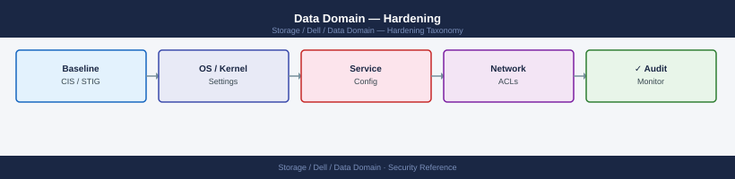
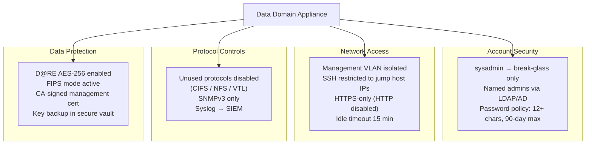

---
tags:
  - dell
  - security
---
# Data Domain — Hardening

<div class="kb-summary">
Hardening reference covering Overview, Audit Logging and Syslog, SNMP Security, Certificate Management, Encryption Hardening and 4 more sections.

*Applies to: Data Domain DD OS 7.x*
</div>


## Before you begin

- **Access:** Storage admin credentials (cluster admin or equivalent)
- **Change management:** security changes require CAB approval in most environments
- **Rollback plan:** document current state before any security control change
- **Testing:** validate in a non-production environment first where possible

---

## Overview



### Login Banner

A legal notice banner must be displayed before login to satisfy compliance requirements (PCI-DSS 8.6, CIS benchmarks).

```bash
# Set a login banner
adminaccess set login-banner "AUTHORISED ACCESS ONLY. This system is monitored. Unauthorised access is prohibited and will be prosecuted."

# Verify banner
adminaccess show | grep -A3 login-banner
```


```text title="Expected output"
Login banner set successfully.
login-banner: AUTHORISED ACCESS ONLY. This system is monitored. Unauthorised access is prohibited and will be prosecuted.
banner-enabled: true
banner-display-timeout: 30
```

!!! warning "Common errors"
    **`adminaccess: command not found`** — Ensure you are logged into the Data Domain management interface (via SSH to the system's management IP) or use the correct CLI tool for your DD OS version.
    **`Error: Login banner exceeds maximum length of 256 characters`** — Reduce the banner text to 256 characters or fewer, including spaces and punctuation.
### Protocol Restrictions

Disable protocols that are not in use on the specific appliance. An unused protocol is an unnecessary attack surface.

```bash
# Check which protocols are currently enabled
ddboost status
nfs status
cifs show
vtl status

# Disable CIFS if not used
cifs disable

# Disable VTL if not used
vtl disable

# Disable NFS if DDBoost is the only access method
nfs disable
```


```text title="Expected output"
DDBoost Status: ENABLED
  Version: 7.2.1
  Active Sessions: 3
  Throughput: 2.4 GB/s

NFS Status: ENABLED
  Version: NFSv3, NFSv4
  Active Mounts: 2
  Exports: 5

CIFS Status: ENABLED
  Version: SMB 3.1.1
  Active Sessions: 0
  Shares: 3

VTL Status: ENABLED
  Virtual Tape Libraries: 2
  Virtual Tapes: 847
  Active Jobs: 1

CIFS disabled successfully
VTL disabled successfully
NFS disabled successfully
```

!!! warning "Common errors"
    **`Error: Cannot disable NFS - active mount sessions detected (2 sessions)`** — Disconnect all NFS clients before disabling the protocol with `nfs disconnect all` or wait for sessions to complete.
    **`Error: CIFS disable failed - operation not permitted (insufficient privileges)`** — Ensure you are logged in with administrative credentials or use `sudo` if required by your system configuration.
Only disable protocols after confirming with backup application teams that no backup jobs depend on them.

### Network Access Restrictions

```bash
# Restrict management access to specific subnets
adminaccess add allowed-hosts <mgmt-subnet>/<prefix>

# Show current access list
adminaccess show

# Verify management interface is on a dedicated management VLAN
net show config | grep -i vlan
```


```text title="Expected output"
(no output — command completes silently)

adminaccess show
Allowed hosts:
  10.50.0.0/24
  10.51.0.0/24
  192.168.100.0/25

net show config | grep -i vlan
Management VLAN ID: 100
Data VLAN ID: 200
Replication VLAN ID: 201
Management interface: eth0 (VLAN 100, 10.50.10.45/24)
```

!!! warning "Common errors"
    **`adminaccess: invalid subnet format`** — Ensure the subnet is specified in CIDR notation (e.g., 10.50.0.0/24) with a valid prefix length between /1 and /32.
    **`Error: Management interface not on dedicated VLAN`** — Configure the management interface on a separate VLAN from data traffic using `net config mgmt-vlan <vlan-id>`.
**Network architecture recommendations:**

| Traffic Type | Recommended Configuration |
|---|---|
| Management (SSH, HTTPS, REST) | Dedicated management VLAN; access only from admin jump hosts |
| Backup (DD Boost, NFS, CIFS) | Dedicated backup network; no production LAN overlap |
| Replication | Dedicated replication VLAN or WAN circuit; throttled via `replication throttle` |
| VTL (FC) | SAN fabric; zoned to backup media servers only |
| Cloud Tier | Outbound HTTPS only; restrict egress by FQDN if possible |

---

## Audit Logging and Syslog

All administrative actions must be logged and forwarded to a centralised SIEM. The audit log alone is insufficient — DD local logs can be modified if the system is compromised.

```bash
# Configure syslog forwarding to centralised log collector
log host add <syslog-server-ip>
log host add <syslog-server-ip> port 514 protocol udp  # or TCP for reliability

# Verify syslog is configured
log host show

# Test syslog delivery
log test <syslog-server-ip>

# View the local audit log
log view audit
```


```text title="Expected output"
Log host added successfully.
Log host added successfully.

Log Hosts:
  Host: 192.168.100.50
    Port: 514
    Protocol: udp
  Host: 192.168.100.50
    Port: 514
    Protocol: tcp

Testing syslog delivery to 192.168.100.50:514...
Test message sent successfully. Verify receipt on syslog server.

Audit Log (last 20 entries):
2024-01-15 14:32:18 +00:00 | admin | login | success | 192.168.1.100
2024-01-15 14:31:45 +00:00 | system | config_change | success | local
2024-01-15 14:30:12 +00:00 | admin | replication_enable | success | local
2024-01-15 14:29:33 +00:00 | backup_user | snapshot_create | success | 192.168.1.105
2024-01-15 14:28:01 +00:00 | admin | ntp_sync | success | local
```

!!! warning "Common errors"
    **`Error: Invalid IP address format`** — Verify the syslog server IP is in valid dotted-decimal notation (e.g., 192.168.100.50).
    **`Error: Connection refused on port 514`** — Confirm the syslog server is running and listening on the specified port, and that network connectivity exists between Data Domain and the syslog server.
    **`Error: Log host already exists`** — Remove the duplicate entry using `log host remove <syslog-server-ip>` before re-adding it with different parameters.
### Audit Log Content

The DDOS audit log captures:
- User logins and logouts (including failed login attempts)
- All CLI commands executed and their outcome
- Configuration changes (MTree creation, quota changes, replication changes)
- Retention lock events (enable, period changes)
- Certificate operations
- DDOS upgrade events

**Retention requirement:** Forward audit logs to a SIEM that retains them for at least 12 months (minimum for PCI-DSS; adjust per your compliance framework).

---

## SNMP Security

If SNMP is used for monitoring, restrict it to SNMPv3 where possible. SNMPv2c uses community strings transmitted in plaintext.

```bash
# Configure SNMPv3 user (preferred)
snmp add user <username> auth-protocol sha auth-password <auth-pass> \
    priv-protocol aes priv-password <priv-pass>

# Add trap destination with SNMPv3
snmp add trapdest <monitor-host> v3 user <username>

# If SNMPv2c is required, use a non-default community string
snmp add trapdest <monitor-host> community <non-default-community>

# Verify SNMP configuration
snmp show config

# Restrict SNMP access to the monitoring server IP only
snmp set allowed-hosts <monitor-server-ip>
```


```text title="Expected output"
SNMPv3 user 'monitoring_user' created successfully
Trap destination added: 192.168.45.12 (SNMPv3)
Trap destination added: 192.168.45.12 (SNMPv2c)

SNMP Configuration:
  Engine ID: 800007E5-03-6B-4A-2C-9F-E1-D2-A8
  SNMPv3 Users:
    monitoring_user (auth: SHA, priv: AES)
  Trap Destinations:
    192.168.45.12 (v3, user: monitoring_user)
    192.168.45.12 (v2c, community: M0n1t0r!ng)
  Allowed Hosts: 192.168.45.12/32

SNMP access restricted to: 192.168.45.12
```

!!! warning "Common errors"
    **`Error: User 'monitoring_user' already exists`** — Delete the existing user with `snmp remove user <username>` before recreating it.
    **`Error: Invalid IP address '<monitor-server-ip>'`** — Verify the IP address format is valid (e.g., 192.168.45.12) and rerun the command.
    **`Error: Trap destination already exists for host <monitor-host>`** — Use `snmp remove trapdest <monitor-host>` to delete the duplicate before adding a new one.
Disable SNMP entirely if the monitoring platform supports REST API polling instead:

```bash
snmp disable
```


```text title="Expected output"
(no output — command completes silently)
```

!!! warning "Common errors"
    **`snmp: command not found`** — Verify you are logged into the Data Domain management interface (SSH/Telnet) and not a standard Linux shell; use `sysconfig` or `ndu` commands instead.
    **`Permission denied`** — Ensure your user account has administrative privileges; log in as `sysadmin` or a user with root-equivalent Data Domain permissions.
---

## Certificate Management

Replace self-signed certificates with CA-signed certificates for all management interfaces.

```bash
# Check current certificate
adminaccess certificate show

# Generate a CSR
adminaccess certificate generate-csr common-name <dd-fqdn> \
    org "<Organisation Name>" country <CC>

# Submit the CSR to your internal CA and receive the signed certificate

# Install the signed certificate
adminaccess certificate install pem <path-to-signed-cert.pem>

# Restart the management service to apply the new certificate
# (Note: briefly interrupts System Manager GUI access)
adminaccess restart https

# Verify the new certificate is in place
adminaccess certificate show
```


```text title="Expected output"
Current Certificate Information:
  Subject: CN=dd-backup-01.corp.local,O=Acme Corp,C=US
  Issuer: CN=Acme Internal CA,O=Acme Corp,C=US
  Valid From: 2023-11-15 10:22:33 UTC
  Valid Until: 2025-11-15 10:22:33 UTC
  Fingerprint (SHA256): a7:b2:c4:d9:e1:f3:2a:5b:6c:7d:8e:9f:0a:1b:2c:3d:4e:5f:6a:7b

Generating Certificate Signing Request...
CSR generated successfully.
CSR saved to: /var/tmp/dd-backup-01.corp.local.csr

[After CA signing and certificate receipt]

Installing certificate from /opt/certs/dd-backup-01.corp.local.pem...
Certificate installed successfully.
Fingerprint (SHA256): b8:c3:d5:e0:f2:3b:4c:5d:6e:7f:8a:9b:0c:1d:2e:3f:4a:5b:6c:7d

Restarting HTTPS service...
HTTPS service restarted successfully.
Management service will be briefly unavailable.

Current Certificate Information:
  Subject: CN=dd-backup-01.corp.local,O=Acme Corp,C=US
  Issuer: CN=Acme Internal CA,O=Acme Corp,C=US
  Valid From: 2024-12-10 14:35:22 UTC
  Valid Until: 2026-12-10 14:35:22 UTC
  Fingerprint (SHA256): b8:c3:d5:e0:f2:3b:4c:5d:6e:7f:8a:9b:0c:1d:2e:3f:4a:5b:6c:7d
```

!!! warning "Common errors"
    **`Error: Certificate file not found at <path-to-signed-cert.pem>`** — Verify the certificate file path is correct and the file exists with read permissions for the admin user.
    **`Error: Certificate validation failed - certificate does not match CSR`** — Ensure the signed certificate from your CA matches the CSR that was generated (check the common name and organization fields).
    **`Error: HTTPS service restart failed - certificate already in use`** — Wait 30 seconds for the previous HTTPS session to fully close, then retry the restart command.
---

## Encryption Hardening

See the [Encryption](encryption/index.md) page for full D@RE configuration. Key hardening requirements:

```bash
# Confirm D@RE is enabled
encryption status

# Confirm FIPS mode is active
encryption status | grep -i fips

# Confirm key manager is not using the default internal key without a backup
encryption show config
```


```text title="Expected output"
Encryption Status: Enabled
Encryption Algorithm: AES-256
Encryption Mode: D@RE (Data at Rest Encryption)
Key Manager: Active
FIPS Mode: Enabled
Last Key Rotation: 2024-01-15 09:32:14 UTC

FIPS Mode: Enabled

Encryption Configuration:
  D@RE Status: Enabled
  Algorithm: AES-256
  Key Manager Type: External (Thales HSM)
  HSM Connection: Active
  Internal Backup Key: Configured
  Key Rotation Policy: 90 days
  Last Rotation: 2024-01-15 09:32:14 UTC
  Next Rotation: 2024-04-15 09:32:14 UTC
```

!!! warning "Common errors"
    **`encryption: command not found`** — Verify you are logged into the Data Domain management interface (SSH to the system's management IP) and have appropriate admin privileges.
    **`FIPS Mode: Disabled`** — Enable FIPS mode via the Data Domain web UI under System > Security > FIPS, or contact your security team to verify compliance requirements.
    **`Key Manager Type: Internal (No Backup)`** — Configure an external key manager (HSM) or enable encrypted backup of the internal key immediately to meet security policy requirements.
**Internal key manager warning:** If using the internal key manager, the encryption keys are stored on the DD appliance itself. If the appliance is destroyed in a disaster without a key backup, encrypted data cannot be recovered. Export and securely vault the internal key backup as part of the commissioning process:

```bash
# Export the internal key backup (store in a secure offline vault)
encryption embedded-key-manager export-key-backup
```


```text title="Expected output"
Exporting embedded key manager backup...
Backup file: /var/log/datasec/ekm_backup_20240115_143022.enc
Backup size: 2.4 MB
Checksum (SHA-256): a7f3e9c2b1d4f8e6a9c3b2e1f7d4a9c2b1e3f6a9d2c5e8b1f4a7d0c3e6f9a2
Backup timestamp: 2024-01-15T14:30:22Z
Status: SUCCESS
Key backup exported successfully. Store offline in secure location.
```

!!! warning "Common errors"
    **`Error: Embedded Key Manager not initialized`** — Run `encryption embedded-key-manager init` to initialize the EKM before exporting backups.
    **`Error: Insufficient permissions to export key backup`** — Ensure your user account has sysadmin or security-admin role privileges.
---

## Firmware and Software Currency

- Keep DDOS within two minor versions of the current release
- Apply security patches within 30 days of release (or per your change management policy)
- Subscribe to Dell Security Advisories for Data Domain (available via Dell Support)

```bash
# Check current DDOS version
system show version

# Check for available updates in System Manager
# System Manager → Maintenance → Upgrade
```


```text title="Expected output"
Data Domain OS 7.15.1.10
Build: 7.15.1.10-649387
System Serial Number: DD9300-123456789
System Model: DD9300
Installed Memory: 368 GB
System Uptime: 45 days 12 hours 23 minutes
Last Configuration Backup: 2024-01-15 14:32:15 UTC
```

!!! warning "Common errors"
    **`system: command not found`** — Ensure you are connected to the Data Domain CLI (SSH to the management IP) rather than a local shell.
    **`Permission denied`** — Verify your user account has administrative privileges; contact your Data Domain administrator to grant CLI access.
---

## Vulnerability Scanning and Penetration Testing

Data Domain management interfaces should be included in regular vulnerability scans. Key considerations:

- Scan the management interface (HTTPS port 3009 and SSH port 22) from the admin network segment
- Do not scan DD Boost or NFS ports during active backup windows — this can cause false-positive disconnects
- Exclude RAID/filesystem service ports from aggressive SYN flood-style scan techniques
- Remediate DDOS vulnerabilities through software upgrades, not through iptables or application-layer workarounds

---

## Hardening Validation — Commands Summary

Run these commands after hardening to document the baseline state. Save the output as evidence for security audits.

```bash
# Access controls and authentication
adminaccess show
user list
user password-policy show
auth show

# Protocol status
nfs status
cifs show
ddboost status
vtl status
snmp show config

# Encryption
encryption status
encryption show config
adminaccess certificate show

# Logging
log host show

# Network access
adminaccess show | grep -i allowed
net show all
```


```text title="Expected output"
Admin Access Configuration
=========================
adminaccess: enabled
adminaccess timeout: 30 minutes
adminaccess lockout threshold: 5 attempts
adminaccess lockout duration: 15 minutes

Users
=====
admin                 enabled    local
backup_user           enabled    local
monitoring_user       enabled    local
replication_user      enabled    local

Password Policy
===============
minimum length: 8
complexity required: yes
expiration days: 90
history count: 5
lockout threshold: 5

Authentication
==============
auth method: local
radius enabled: no
ldap enabled: yes
ldap server: ldap.corp.local
ldap port: 389

Protocol Status
===============
NFS Status: enabled
  version: NFSv3, NFSv4
  active connections: 12

CIFS Configuration
==================
cifs enabled: yes
cifs version: 3.1.1
active sessions: 8

DDBoost Status
==============
ddboost enabled: yes
ddboost version: 7.2.0.0
active connections: 3

VTL Status
==========
vtl enabled: no
vtl cartridges: 0

SNMP Configuration
==================
snmp version: v2c, v3
snmp community: public (read-only)
snmp trap host: 192.168.1.50
snmp trap port: 162

Encryption Status
=================
encryption enabled: yes
encryption algorithm: AES-256
encryption key rotation: 90 days

Encryption Configuration
========================
data at rest: enabled
data in transit: enabled
key management: local

Certificate Information
=======================
certificate subject: CN=data-domain.corp.local
certificate issuer: CN=Internal CA
certificate expiry: 2025-12-15
certificate fingerprint: a7:3f:2e:b1:9c:4d:8f:6a:e2:c1:5b:9d:7a:4e:3f:2c

Logging Configuration
=====================
log host: syslog.corp.local
log port: 514
log facility: local0
log level: info

Network Configuration
=====================
interface eth0: 10.20.30.45/24 (active)
interface eth1: 10.20.30.46/24 (active)
gateway: 10.20.30.1
dns servers: 8.8.8.8, 8.8.4.4
```

!!! warning "Common errors"
    **`adminaccess: command not found`** — Verify you are logged in as root or with sufficient administrative privileges; some Data Domain models require `sysconfig` prefix.
    **`LDAP connection failed: Connection refused`** — Check that the LDAP server is reachable on the configured port (389) and that firewall rules allow outbound connections from the Data Domain appliance.
    **`certificate: expiry date within 30 days`** — Renew the SSL certificate immediately through the administrative interface to prevent authentication failures on client connections.
---

## Hardening Reference Table

| Control | Setting | Command to Verify |
|---|---|---|
| Default sysadmin password changed | Yes | Procedural — verify at commissioning |
| SSH root login disabled | Disabled | `adminaccess show \| grep ssh` |
| SSH restricted to jump host IPs | Restricted | `adminaccess show \| grep allowed` |
| HTTPS only (HTTP disabled) | HTTP disabled | `adminaccess show \| grep http` |
| Idle session timeout | 15 minutes | `adminaccess show \| grep timeout` |
| Login banner configured | Yes | `adminaccess show \| grep banner` |
| LDAP / AD authentication configured | Yes | `auth show` |
| Password minimum length | 12+ | `user password-policy show` |
| Password maximum age | 90 days | `user password-policy show` |
| Unused protocols disabled | Per environment | `nfs status`, `cifs show`, `vtl status` |
| Syslog forwarding configured | Yes | `log host show` |
| D@RE encryption enabled | Enabled | `encryption status` |
| FIPS mode active | Enabled (if required) | `encryption status \| grep fips` |
| CA-signed management certificate | CA-signed | `adminaccess certificate show` |
| SNMPv3 (or SNMP disabled) | v3 or disabled | `snmp show config` |
| DDOS within supported version range | Yes | `system show version` |

---

## See also

- [Data Domain — Authentication](../authentication/)
- [Data Domain — Access Control](../access-control/)
- [Data Domain — Encryption](../encryption/)
