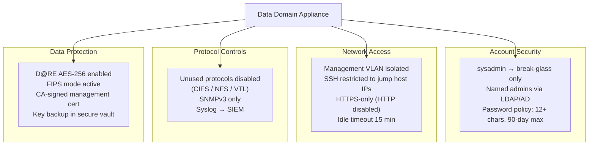

# Data Domain — Hardening

## Overview



This page documents the security hardening baseline for Dell Data Domain appliances running DDOS 7.x. These settings should be applied at initial commissioning and validated periodically. The goal is to reduce the attack surface, enforce least-privilege access, and ensure all administrative actions are auditable.

---

## Hardening Checklist

Apply these controls on every new Data Domain at commissioning. Use the checklist during quarterly security reviews.

### Account and Credential Security

- [ ] Change the default `sysadmin` password immediately on first access
- [ ] Create named admin accounts — do not use `sysadmin` for day-to-day operations; keep it as a break-glass account
- [ ] Configure LDAP or Active Directory authentication for all operational admin accounts
- [ ] Set a minimum password length of 12 characters
- [ ] Set a maximum password age of 90 days
- [ ] Rotate DD Boost service account credentials on the same cycle as the password policy

```bash
# Change sysadmin password
user change password sysadmin

# Set password minimum length
user password-policy set min-length 12

# Set password maximum age (days)
user password-policy set max-age 90

# View current password policy
user password-policy show
```

### SSH and Remote Access

- [ ] Disable SSH root login
- [ ] Restrict SSH access to the admin jump host or bastion server IP only
- [ ] Disable interactive SSH password authentication if key-based auth is configured
- [ ] Set session idle timeout to 15 minutes
- [ ] Disable the HTTP (non-TLS) management interface — enforce HTTPS only

```bash
# Disable SSH root login
adminaccess set ssh root disabled

# Restrict SSH to specific management IPs (repeat for each allowed host)
adminaccess add ssh allowed-hosts <jump-host-ip>

# Set session idle timeout (minutes)
adminaccess set idle-timeout 15

# Disable plain HTTP; enforce HTTPS only
adminaccess set http-auth disabled

# Verify current adminaccess settings
adminaccess show
```

### Login Banner

A legal notice banner must be displayed before login to satisfy compliance requirements (PCI-DSS 8.6, CIS benchmarks).

```bash
# Set a login banner
adminaccess set login-banner "AUTHORISED ACCESS ONLY. This system is monitored. Unauthorised access is prohibited and will be prosecuted."

# Verify banner
adminaccess show | grep -A3 login-banner
```

### Protocol Restrictions

Disable protocols that are not in use on the specific appliance. An unused protocol is an unnecessary attack surface.

```bash
# Check which protocols are currently enabled
ddboost status
nfs status
cifs show
vtl status

# Disable CIFS if not used
cifs disable

# Disable VTL if not used
vtl disable

# Disable NFS if DDBoost is the only access method
nfs disable
```

Only disable protocols after confirming with backup application teams that no backup jobs depend on them.

### Network Access Restrictions

```bash
# Restrict management access to specific subnets
adminaccess add allowed-hosts <mgmt-subnet>/<prefix>

# Show current access list
adminaccess show

# Verify management interface is on a dedicated management VLAN
net show config | grep -i vlan
```

**Network architecture recommendations:**

| Traffic Type | Recommended Configuration |
|---|---|
| Management (SSH, HTTPS, REST) | Dedicated management VLAN; access only from admin jump hosts |
| Backup (DD Boost, NFS, CIFS) | Dedicated backup network; no production LAN overlap |
| Replication | Dedicated replication VLAN or WAN circuit; throttled via `replication throttle` |
| VTL (FC) | SAN fabric; zoned to backup media servers only |
| Cloud Tier | Outbound HTTPS only; restrict egress by FQDN if possible |

---

## Audit Logging and Syslog

All administrative actions must be logged and forwarded to a centralised SIEM. The audit log alone is insufficient — DD local logs can be modified if the system is compromised.

```bash
# Configure syslog forwarding to centralised log collector
log host add <syslog-server-ip>
log host add <syslog-server-ip> port 514 protocol udp  # or TCP for reliability

# Verify syslog is configured
log host show

# Test syslog delivery
log test <syslog-server-ip>

# View the local audit log
log view audit
```

### Audit Log Content

The DDOS audit log captures:
- User logins and logouts (including failed login attempts)
- All CLI commands executed and their outcome
- Configuration changes (MTree creation, quota changes, replication changes)
- Retention lock events (enable, period changes)
- Certificate operations
- DDOS upgrade events

**Retention requirement:** Forward audit logs to a SIEM that retains them for at least 12 months (minimum for PCI-DSS; adjust per your compliance framework).

---

## SNMP Security

If SNMP is used for monitoring, restrict it to SNMPv3 where possible. SNMPv2c uses community strings transmitted in plaintext.

```bash
# Configure SNMPv3 user (preferred)
snmp add user <username> auth-protocol sha auth-password <auth-pass> \
    priv-protocol aes priv-password <priv-pass>

# Add trap destination with SNMPv3
snmp add trapdest <monitor-host> v3 user <username>

# If SNMPv2c is required, use a non-default community string
snmp add trapdest <monitor-host> community <non-default-community>

# Verify SNMP configuration
snmp show config

# Restrict SNMP access to the monitoring server IP only
snmp set allowed-hosts <monitor-server-ip>
```

Disable SNMP entirely if the monitoring platform supports REST API polling instead:

```bash
snmp disable
```

---

## Certificate Management

Replace self-signed certificates with CA-signed certificates for all management interfaces.

```bash
# Check current certificate
adminaccess certificate show

# Generate a CSR
adminaccess certificate generate-csr common-name <dd-fqdn> \
    org "<Organisation Name>" country <CC>

# Submit the CSR to your internal CA and receive the signed certificate

# Install the signed certificate
adminaccess certificate install pem <path-to-signed-cert.pem>

# Restart the management service to apply the new certificate
# (Note: briefly interrupts System Manager GUI access)
adminaccess restart https

# Verify the new certificate is in place
adminaccess certificate show
```

---

## Encryption Hardening

See the [Encryption](../encryption/index.md) page for full D@RE configuration. Key hardening requirements:

```bash
# Confirm D@RE is enabled
encryption status

# Confirm FIPS mode is active
encryption status | grep -i fips

# Confirm key manager is not using the default internal key without a backup
encryption show config
```

**Internal key manager warning:** If using the internal key manager, the encryption keys are stored on the DD appliance itself. If the appliance is destroyed in a disaster without a key backup, encrypted data cannot be recovered. Export and securely vault the internal key backup as part of the commissioning process:

```bash
# Export the internal key backup (store in a secure offline vault)
encryption embedded-key-manager export-key-backup
```

---

## Firmware and Software Currency

- Keep DDOS within two minor versions of the current release
- Apply security patches within 30 days of release (or per your change management policy)
- Subscribe to Dell Security Advisories for Data Domain (available via Dell Support)

```bash
# Check current DDOS version
system show version

# Check for available updates in System Manager
# System Manager → Maintenance → Upgrade
```

---

## Vulnerability Scanning and Penetration Testing

Data Domain management interfaces should be included in regular vulnerability scans. Key considerations:

- Scan the management interface (HTTPS port 3009 and SSH port 22) from the admin network segment
- Do not scan DD Boost or NFS ports during active backup windows — this can cause false-positive disconnects
- Exclude RAID/filesystem service ports from aggressive SYN flood-style scan techniques
- Remediate DDOS vulnerabilities through software upgrades, not through iptables or application-layer workarounds

---

## Hardening Validation — Commands Summary

Run these commands after hardening to document the baseline state. Save the output as evidence for security audits.

```bash
# Access controls and authentication
adminaccess show
user list
user password-policy show
auth show

# Protocol status
nfs status
cifs show
ddboost status
vtl status
snmp show config

# Encryption
encryption status
encryption show config
adminaccess certificate show

# Logging
log host show

# Network access
adminaccess show | grep -i allowed
net show all
```

---

## Hardening Reference Table

| Control | Setting | Command to Verify |
|---|---|---|
| Default sysadmin password changed | Yes | Procedural — verify at commissioning |
| SSH root login disabled | Disabled | `adminaccess show \| grep ssh` |
| SSH restricted to jump host IPs | Restricted | `adminaccess show \| grep allowed` |
| HTTPS only (HTTP disabled) | HTTP disabled | `adminaccess show \| grep http` |
| Idle session timeout | 15 minutes | `adminaccess show \| grep timeout` |
| Login banner configured | Yes | `adminaccess show \| grep banner` |
| LDAP / AD authentication configured | Yes | `auth show` |
| Password minimum length | 12+ | `user password-policy show` |
| Password maximum age | 90 days | `user password-policy show` |
| Unused protocols disabled | Per environment | `nfs status`, `cifs show`, `vtl status` |
| Syslog forwarding configured | Yes | `log host show` |
| D@RE encryption enabled | Enabled | `encryption status` |
| FIPS mode active | Enabled (if required) | `encryption status \| grep fips` |
| CA-signed management certificate | CA-signed | `adminaccess certificate show` |
| SNMPv3 (or SNMP disabled) | v3 or disabled | `snmp show config` |
| DDOS within supported version range | Yes | `system show version` |
