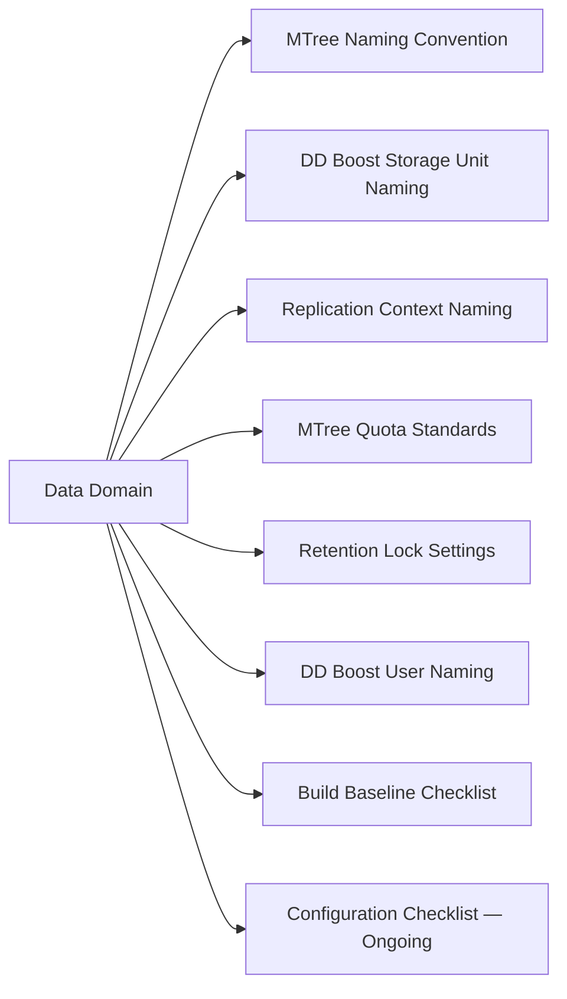

# Data Domain — Standards



## MTree Naming Convention

Pattern: `mtree-<backup-tool>-<client-group>`

| Token | Description | Examples |
|---|---|---|
| `backup-tool` | Lowercase name of the backup application writing to this MTree | `veeam`, `netbackup`, `commvault`, `avamar`, `networker` |
| `client-group` | Logical grouping of clients or data tier | `prod`, `dev`, `ora`, `sql`, `dmz`, `bu1` |

Examples:

```
mtree-veeam-prod
mtree-veeam-dev
mtree-netbackup-ora
mtree-commvault-sql
mtree-avamar-dmz
```

Never use spaces, uppercase letters, or special characters other than hyphens in MTree names. MTree names are permanent — they cannot be renamed after creation.

## DD Boost Storage Unit Naming

Storage units are the DD Boost-layer objects mapped to MTrees. Use the same pattern as the MTree:

Pattern: `su-<backup-tool>-<client-group>`

Examples:

```
su-veeam-prod
su-netbackup-ora
su-commvault-sql
```

Each storage unit maps to exactly one MTree. Create the MTree first, then create the storage unit pointing at it.

## Replication Context Naming

Pattern: `<src-dd-hostname>-to-<dst-dd-hostname>-<mtree-name>`

Example:

```
dd9900-prod-to-dd6400-dr-mtree-veeam-prod
```

This makes it immediately clear which source and destination are involved and which MTree is being replicated in each context.

## MTree Quota Standards

Every MTree must have both a soft quota and a hard quota configured at creation.

| Quota Type | Purpose | Recommended Value |
|---|---|---|
| Soft quota | Warning threshold — alerts when this usage is exceeded | 80% of expected max data |
| Hard quota | Hard cap — writes refused above this limit | 100–110% of expected max data |

Never leave MTrees with unlimited quotas. An unconstrained MTree can fill the global filesystem and impact all backup jobs on the array.

## Retention Lock Settings

Configure retention lock per MTree based on compliance requirements:

| Mode | Use Case | Key Behaviour |
|---|---|---|
| Governance | Internal data retention policies | Files locked; can be deleted by authorised admin with correct role |
| Compliance | Regulatory (SEC 17a-4, HIPAA, GDPR, etc.) | Files locked; cannot be deleted by any admin during the retention period |

Retention lock minimum and maximum periods must be set at MTree creation:

```bash
# Enable governance retention lock on an MTree
mtree retention-lock enable mode governance mtree /data/col1/mtree-veeam-prod

# Set retention period limits
mtree retention-lock set min-retention-period 30days mtree /data/col1/mtree-veeam-prod
mtree retention-lock set max-retention-period 7years mtree /data/col1/mtree-veeam-prod
```

## DD Boost User Naming

Pattern: `ddboost-<backup-tool>`

Examples:

```
ddboost-veeam
ddboost-netbackup
ddboost-commvault
```

Create a separate DD Boost user per backup application. Do not share a single DD Boost user across multiple backup tools — this prevents credential rotation from impacting unrelated backup systems.

## Build Baseline Checklist

Complete this checklist when commissioning a new Data Domain or adding a new MTree/integration:

- [ ] DDOS version confirmed and within supported version range for all connected backup applications
- [ ] Management IP, hostname, and DNS record registered
- [ ] NTP configured and synchronized (`ntp status`)
- [ ] Syslog forwarding configured to the central log collector (`log host add <syslog-host>`)
- [ ] SNMP configured for monitoring platform integration
- [ ] DD Encryption at Rest (D@RE) enabled (verify with `encryption status`)
- [ ] LDAP or local user accounts created; default `sysadmin` password changed
- [ ] MTrees created with soft and hard quotas defined
- [ ] DD Boost storage units created, mapped to MTrees, and DD Boost users configured
- [ ] Replication contexts created and confirmed in `Normal` state (`replication show`)
- [ ] CloudIQ telemetry active via SCG registration (confirm in CloudIQ portal)
- [ ] SupportAssist / AutoSupport configured (`autosupport enable`)
- [ ] Filesystem cleaning scheduled (`filesys clean set-frequency weeks 1`)
- [ ] Monitoring alert thresholds set in CloudIQ or SNMP manager
- [ ] Backup software registered to DD Boost storage units and test backup completed

## Configuration Checklist — Ongoing

- [ ] Replication contexts all in `Normal` state — verify weekly
- [ ] Global dedup ratio above 10:1 — investigate if below
- [ ] Active capacity below 80% — plan expansion if approaching
- [ ] No active hardware alerts (`alerts show current`)
- [ ] DD Boost user credentials rotated per password policy cycle
- [ ] Retention lock periods reviewed against current compliance requirements annually
