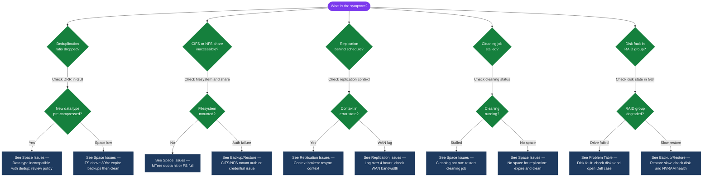

---
tags:
  - dell
  - troubleshooting
search:
  boost: 1.5
---
# Dell Data Domain Common Issues

```bash
replication disable <context>
replication enable <context>
```
```text
┌─────────────────────────────────── Dell Data Domain Common Issues ────────────────────────────────────┐
│                                                                                                       │
│   ┌───────────────────────────────────────────────────────────────────────────────────────────────┐   │
│   │       Top issues: filesystem full, replication broken, restore slow, backup job failures      │   │
│   │           Most root-cause to space exhaustion, network issues, or credential expiry           │   │
│   └───────────────────────────────────────────────────────────────────────────────────────────────┘   │
│                                                                                                       │
│                  ▼                                ▼                                ▼                  │
│                                                                                                       │
│   ┌─────────────────────────────┐  ┌─────────────────────────────┐  ┌─────────────────────────────┐   │
│   │         Space Issues        │  │      Replication Issues     │  │        Backup/Restore       │   │
│   │      ─────────────────      │  │      ─────────────────      │  │      ─────────────────      │   │
│   │        FS > 80% full        │  │        Context broken       │  │         Backup fails        │   │
│   │       Cleaning not run      │  │        Lag > 4 hours        │  │         Restore slow        │   │
│   │       MTree quota hit       │  │         Auth failure        │  │       Cannot mount NFS      │   │
│   │       No space for rep      │  │     Network packet drop     │  │       Boost conn fail       │   │
│   │       Cloud tier fail       │  │        WAN bandwidth        │  │        Corrupt backup       │   │
│   └─────────────────────────────┘  └─────────────────────────────┘  └─────────────────────────────┘   │
│                                                                                                       │
│   │     Problem      │   First check    │        Fix        │      Verify      │   Escalate if    │   │
│   │ ──────────────── │ ──────────────── │ ───────────────── │ ──────────────── │──────────────────│   │
│   │     FS full      │filesys show space│   Expire backups  │   Space freed    │  No space freed  │   │
│   │    Rep broken    │ replication show │   resync context  │    Lag drops     │ Persistent break │   │
│   │   Backup fail    │ Backup app logs  │   Check DD space  │   Job succeeds   │  Hardware fault  │   │
│   │   Slow restore   │ Disk show state  │    Check disks    │     Speed OK     │   NVRAM fault    │   │
│                                                                                                       │
│    Key terms:                                                                                         │
│                                                                                                       │
│    Context broken   = Replication context in error state; typically network or auth failure           │
│    replication resync= Re-establish broken replication context without full reinitialisation          │
│    Expire backups   = Delete old backup images via backup application; cleaning then frees space      │
│                                                                                                       │
└───────────────────────────────────────────────────────────────────────────────────────────────────────┘
```

## Diagnostic Flow



---

## Before you begin

- **Access:** Storage admin credentials (cluster admin or equivalent)
- **Gather first:** recent error message text, event timestamps, and affected object names
- **Scope:** confirm whether the issue affects a single object, host, cluster, or site
- **Escalation:** open a vendor support ticket before running any destructive step
- **Logging:** document each command and output — required if escalation is needed

---

---

## Verify resolution

- Confirm the original symptom no longer occurs
- Check logs for any residual errors related to the issue
- Monitor for 10–15 minutes to confirm the fix is stable
