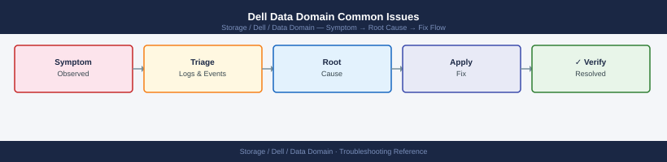

---
tags:
  - dell
  - troubleshooting
search:
  boost: 1.5
---
# Dell Data Domain Common Issues


```bash
replication disable <context>
replication enable <context>
```

```d2
direction: down

symptom: Identify Symptom {shape: diamond}
diagnostic_flow: "Diagnostic Flow" {shape: rectangle}
verify_resolution: "Verify resolution" {shape: rectangle}
resolution: Resolve or Escalate {shape: oval}

symptom -> diagnostic_flow: investigate
symptom -> verify_resolution: investigate
diagnostic_flow -> resolution
verify_resolution -> resolution
```

## Diagnostic Flow

```d2
direction: right

D1: "D1" {shape: rectangle}
R1: "See Space Issues —\nData type incompatible with dedup: review policy" {shape: rectangle}
R2: "See Space Issues —\nFS above 80%: expire backups then clean" {shape: rectangle}
D2: "D2" {shape: rectangle}
R3: "See Space Issues —\nMTree quota hit or FS full" {shape: rectangle}
R4: "See Backup/Restore —\nCIFS/NFS mount auth or credential issue" {shape: rectangle}
D3: "D3" {shape: rectangle}
R5: "See Replication Issues —\nContext broken: resync context" {shape: rectangle}
R6: "See Replication Issues —\nLag over 4 hours: check WAN bandwidth" {shape: rectangle}
D4: "D4" {shape: rectangle}
R7: "See Space Issues —\nCleaning not run: restart cleaning job" {shape: rectangle}
R8: "See Space Issues —\nNo space for replication: expire and clean" {shape: rectangle}
D5: "D5" {shape: rectangle}
R9: "See Problem Table —\nDisk fault: check disks and open Dell case" {shape: rectangle}
R10: "See Backup/Restore —\nRestore slow: check disk and NVRAM health" {shape: rectangle}
S: "What is the symptom?" {shape: rectangle}
B1: "B1" {shape: rectangle}
B2: "B2" {shape: rectangle}
B3: "B3" {shape: rectangle}
B4: "B4" {shape: rectangle}
B5: "B5" {shape: rectangle}

D1 -> R1
D1 -> R2
D2 -> R3
D2 -> R4
D3 -> R5
D3 -> R6
D4 -> R7
D4 -> R8
D5 -> R9
D5 -> R10
```

---

## Before you begin

- **Access:** Storage admin credentials (cluster admin or equivalent)
- **Gather first:** recent error message text, event timestamps, and affected object names
- **Scope:** confirm whether the issue affects a single object, host, cluster, or site
- **Escalation:** open a vendor support ticket before running any destructive step
- **Logging:** document each command and output — required if escalation is needed

---

---

## Verify resolution

- Confirm the original symptom no longer occurs
- Check logs for any residual errors related to the issue
- Monitor for 10–15 minutes to confirm the fix is stable

---

## See also

- [Data Domain — Diagnostics](../diagnostics/)
- [Data Domain — Escalation](../escalation/)
- [Data Domain — Health Checks](../../operations/health-checks/)
