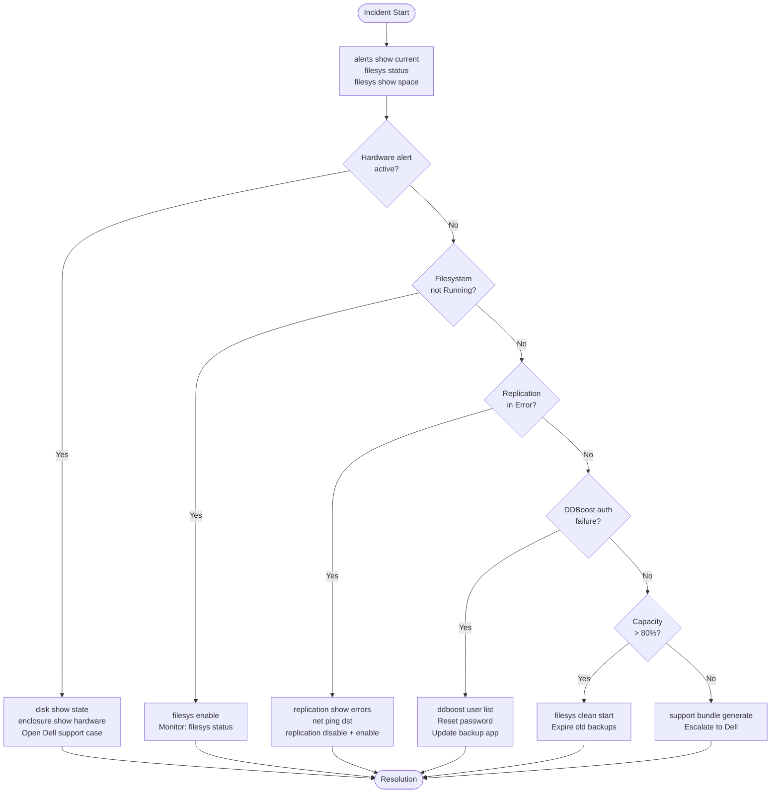

# Data Domain — Diagnostics


<div class="kb-summary">
Diagnostics reference covering Overview, Filesystem Diagnostics, Replication Diagnostics, DD Boost Diagnostics, Disk and Hardware Diagnostics and 5 more sections.
</div>

## Overview


┌──────────────────────────────────── Dell Data Domain Diagnostics ─────────────────────────────────────┐
│                                                                                                       │
│   ┌───────────────────────────────────────────────────────────────────────────────────────────────┐   │
│   │            Diagnose DD issues with DDOS CLI commands and support bundle collection            │   │
│   │          support bundle save: bundles logs, config, and diagnostics for Dell support          │   │
│   └───────────────────────────────────────────────────────────────────────────────────────────────┘   │
│                                                                                                       │
│   ┌───────────────────────────────────────────────────────────────────────────────────────────────┐   │
│   │                                   # Step 1 — System overview                                  │   │
│   │                       system show version      — DDOS version and serial                      │   │
│   │                      system show hardware     — hardware components state                     │   │
│   │                                                                                               │   │
│   │                                # Step 2 — Filesystem and space                                │   │
│   │                 filesys show space       — total/used/available + dedup ratio                 │   │
│   │                      filesys show status      — filesystem health status                      │   │
│   │                                                                                               │   │
│   │                                     # Step 3 — Disk health                                    │   │
│   │              disk show state          — show all disk states (OK/Unknown/Absent)              │   │
│   │              disk show detailed-info  — S.M.A.R.T. data and error counts per disk             │   │
│   │                                                                                               │   │
│   │                                  # Step 4 — Alerts and events                                 │   │
│   │                     alerts show current      — active alerts with severity                    │   │
│   │                        alerts show history      — recent alert history                        │   │
│   │                                                                                               │   │
│   │                               # Step 5 — Collect support bundle                               │   │
│   │                 support bundle save /data/col1/support/bundle-$(date +%F).tar                 │   │
│   │                 # SCP bundle off DD to workstation for upload to Dell support                 │   │
│   └───────────────────────────────────────────────────────────────────────────────────────────────┘   │
│                                                                                                       │
│    Key terms:                                                                                         │
│                                                                                                       │
│    support bundle = Comprehensive DDOS diagnostic archive; always collect before calling Dell         │
│    disk show state= Verify no drives in Unknown or Reconstructing state                               │
│    alerts show    = Check for active hardware or software alerts; review before escalating            │
│                                                                                                       │
└───────────────────────────────────────────────────────────────────────────────────────────────────────┘
```

---

## Filesystem Diagnostics

### Check Filesystem State

```bash
# State: should show Enabled / Running
filesys status

# Space usage (pre-comp, post-comp, physical)
filesys show space

# Dedup and compression ratios (global and per-stream)
filesys show compression

# Compression trend (shows changes over time)
filesys show compression summary

# Cleaning state
filesys clean status
filesys clean show history

# Filesystem event log (recent filesystem-layer events)
filesys show log
```

### Interpret `filesys show space` Output

| Field | Meaning |
|---|---|
| Pre-comp used | Total logical data written by backup software (before dedup/compression) |
| Post-comp used | Physical disk space consumed after dedup and compression |
| Physical capacity | Total raw disk capacity of the array |
| Available | Physical capacity minus post-comp used |
| Compression factor | Pre-comp / post-comp — the effective dedup ratio |

A healthy system shows post-comp used below 80% of physical capacity and a compression factor above 10x.

### Check Filesystem Integrity

```bash
# Run an online filesystem check
filesys check

# View check results
filesys show log | grep -i check
```

Note: `filesys check` is a non-destructive read-only integrity scan. It may take hours on large arrays. Run it only when integrity is suspected, not as a routine check.

---

## Replication Diagnostics

### State Triage

```bash
# All contexts and their state
replication show

# Detailed per-context status with lag, throughput, and estimated completion
replication status

# Configuration of each context (source, destination, schedule)
replication show config

# Statistics per context (bytes sent, compression ratio, lag)
replication show stats

# Context-specific errors
replication show errors
```

### Interpreting Replication State

| State | Meaning | Urgency |
|---|---|---|
| `Replicating` | Actively syncing data | None |
| `Idle` | Fully synced; waiting for next scheduled sync | None |
| `Initializing` | First-time sync in progress (can take hours/days for large data) | Monitor |
| `Disabled` | Replication paused — intentional or unintentional | Investigate |
| `Error` | Replication failed — immediate investigation required | High |
| `Idle-Error` | Last sync encountered an error but context is idle now | Investigate |

### Lag Measurement and Analysis

```bash
# Lag in bytes remaining to replicate
replication show stats | grep -i "pre-comp remaining\|lag"

# Throughput in MB/s
replication status | grep -i throughput

# Estimated completion
replication status | grep -i "estimated completion"
```

Convert bytes to time: if pre-comp remaining is 500 GB and throughput is 100 MB/s, estimated catchup is approximately 84 minutes (500 * 1024 / 100 / 60). A growing lag when throughput is non-zero means the source ingest rate exceeds replication drain rate.

### Network Path Verification

```bash
# Test connectivity to the destination DD
net ping <destination-dd-hostname>

# Trace the network path
net traceroute <destination-dd-hostname>

# Check for interface errors and drops on the replication interface
net show stats | grep -iE "error|drop|collision"

# Check that the correct interface is used for replication
net show all  # identify which interface carries the replication route
net route show
```

---

## DD Boost Diagnostics

### Service and Client Status

```bash
# Is the DD Boost service running?
ddboost status

# All connected clients and their state
ddboost show clients

# Verbose client information (connection time, throughput)
ddboost show clients --verbose

# Storage unit list and their mapped MTrees
ddboost storage-unit list
ddboost storage-unit show <name>

# DD Boost throughput statistics
ddboost show stats

# Distributed Segment Processing (DSP) status
ddboost option show | grep -i dist-seg
```

### Diagnosing a DDBoost Authentication Failure

```bash
# 1. Confirm the expected user exists
ddboost user list

# 2. Confirm the user is assigned to a storage unit
ddboost user list | grep <username>

# 3. Check whether the client appears in the connected list at all
ddboost show clients | grep <backup-server-hostname>

# 4. Review recent authentication events in the audit log
log view audit | grep -i "ddboost\|boost\|auth"
```

---

## Disk and Hardware Diagnostics

### Disk Health

```bash
# All disks with state
disk show state

# Full hardware detail per disk (firmware, model, S/N)
disk show hardware

# Per-disk error statistics
disk show detail | grep -iE "slot|error|sector|reallocated"

# Identify any disk not in 'normal' or 'spare' state
disk show state | grep -ivE "normal|spare"
```

### Disk States Reference

| State | Meaning | Action |
|---|---|---|
| `normal` | Healthy and in use | None |
| `spare` | Hot spare, available for automatic rebuild | None |
| `reconstructing` | Rebuilding RAID — do not remove any disk | Monitor rebuild progress |
| `failed` | Hard failure — cannot be read or written | Open Dell support case immediately |
| `unknown` | Not recognised — new disk or seating issue | Check physical seating; do not pull other disks |
| `absent` | Empty bay | Expected if slot is intentionally unused |

### RAID Group Status

```bash
# RAID group overview
raid show all

# Detailed RAID group status with member disks
raid show detail

# Rebuild progress
raid show detail | grep -iE "rebuild|reconstruct|percent complete"
```

### Enclosure Health

```bash
# Full hardware inventory: power, fans, temperature
enclosure show hardware

# All enclosures with state
enclosure show all

# Filter for any faults
enclosure show hardware | grep -iE "fault|fail|warn|critical"
```

---

## Network Diagnostics

### Interface State

```bash
# All interfaces — IP, speed, state, MTU
net show all

# Interface configuration (bonding, VLAN, MTU)
net show config

# Network statistics per interface (rx/tx, errors, drops)
net show stats

# Network settings (DNS, gateway, hostname)
net show settings
```

### Connectivity Testing

```bash
# Ping from the Data Domain to a target
net ping <ip-or-hostname>
net ping <ip-or-hostname> count 20

# Traceroute
net traceroute <ip-or-hostname>

# Verify DNS resolution
net show settings | grep -i dns
```

### Bonding and LACP

```bash
# Show bonding configuration and active links
net config bond show

# Verify LACP negotiation is successful
net show stats | grep -A5 <bond-interface-name>
```

If a bonded interface is degraded (one link down), throughput is reduced by 50% and the interface will appear as active but with fewer physical links in `net config bond show`.

---

## Log Analysis

### Log Locations

| Log | Command | Contains |
|---|---|---|
| System log | `log view` | DDOS events, service restarts, hardware events |
| Audit log | `log view audit` | User logins, config changes, all CLI commands |
| Replication log | `log view replication` | Replication events, errors, throughput history |
| Debug log (full bundle) | `support bundle generate` | All logs; for Dell support cases |

### Viewing Logs

```bash
# Most recent system log entries (scrollable)
log view

# List available log files
log list

# Dump full system log to stdout
log dump system

# Follow system log in real time
log watch

# View a specific named log
log view <log-filename>

# Filter for specific keywords
log view | grep -i "error\|critical\|fail"

# Time-bounded search (last 2 hours)
log view | grep "$(date -d '2 hours ago' '+%Y-%m-%d %H')\|$(date '+%Y-%m-%d %H')"
```

### Common Log Patterns

| Log Pattern | Meaning |
|---|---|
| `EVT-FILESYS-FULL` | Filesystem at capacity; backup writes will fail |
| `EVT-DISK-FAILED` | Physical disk failure; open support case |
| `EVT-REPL-ERROR` | Replication context entered error state |
| `EVT-DDBOOST-AUTH-FAIL` | DD Boost authentication failure from backup server |
| `EVT-NTP-DRIFT` | Clock drift detected; verify NTP server reachability |
| `EVT-CLEAN-COMPLETE` | Cleaning cycle completed; check `filesys show space` |
| `EVT-CERT-EXPIRE` | TLS certificate approaching expiry; renew |

---

## Advanced Diagnostics with `ddsh`

`ddsh` is the Data Domain diagnostic shell. It provides access to Unix-like diagnostic tools not available in the standard DDOS CLI.

```bash
# Enter the diagnostic shell
ddsh

# Inside ddsh:
diagnose all           # full built-in system diagnostic run

iostat -x 1 30         # I/O statistics (30 samples at 1-second intervals)
vmstat 1 10            # Virtual memory, CPU, and I/O stats
netstat -an            # Active network connections
df -h                  # Filesystem usage from OS perspective
top                    # Real-time process list

# Exit ddsh
exit
```

### Interpreting `iostat` in `ddsh`

High `%util` on a disk device during backup operations is expected. A concern arises when:
- `await` (average I/O wait time) exceeds 50–100 ms during writes
- `%util` is at 100% on multiple devices simultaneously without explanation
- `r_await` is high during restore operations (indicates disk read saturation)

---

## Support Bundle

For Dell support cases, generate a support bundle that includes all logs, system state, and diagnostics automatically.

```bash
# Generate a support bundle
support bundle generate

# List available bundles
support bundle show

# Transfer bundle to a remote server via SCP
support bundle export scp://user@<jump-host>:/path/bundles/

# Send directly to Dell for an open case
autosupport send <case-number>
```

The support bundle is saved to `/ddr/var/support/` on the DD. For large arrays, the bundle can be several gigabytes. Transfer via SCP from a host with network access to the DD management interface.

---

## Diagnostics Checklist — Per Incident Type

| Incident | Key Commands |
|---|---|
| Backup job failure | `filesys status`, `filesys show space`, `ddboost show clients`, `alerts show current` |
| Replication lag | `replication status`, `replication show stats`, `net show stats`, `net ping <dst>` |
| Disk alert | `disk show state`, `disk show hardware`, `raid show detail`, `enclosure show hardware` |
| Low dedup ratio | `filesys show compression`, `mtree show compression mtree /data/col1/<name>` |
| Slow restore | `filesys clean status`, `ddboost show stats`, `system show stats` |
| Authentication failure | `log view audit`, `ddboost user list`, `auth show` |
| Network connectivity | `net show all`, `net show stats`, `net ping <target>`, `net traceroute <target>` |
| CloudIQ / AutoSupport offline | `autosupport status`, `autosupport test`, `net ping <scg-ip>` |
