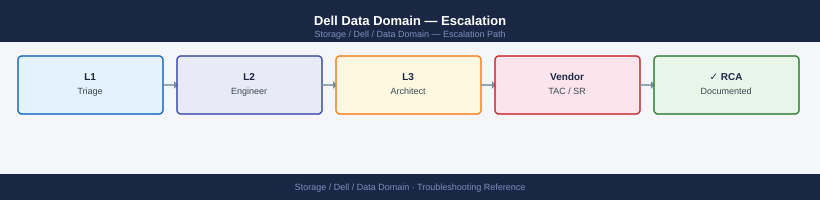
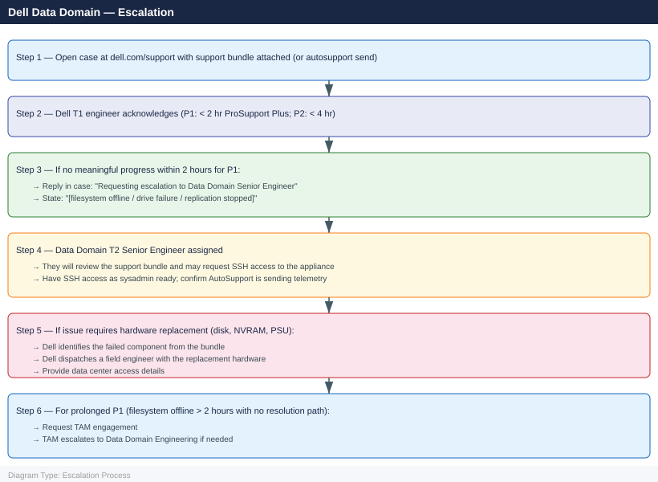

---
tags:
  - dell
  - troubleshooting
search:
  boost: 1.5
---
# Dell Data Domain — Escalation

<div class="kb-summary">
How to escalate Dell Data Domain (PowerProtect DD) issues to Dell Technologies support: what data to collect, how to generate the support bundle, step-by-step case creation on dell.com/support, and the escalation path when progress stalls.

*Applies to: Dell Data Domain / PowerProtect DD running DDOS 7.x*
</div>



---

## Before you begin

- **Access required:** SSH to the Data Domain appliance as sysadmin; Dell support account at dell.com/support linked to the DD system serial number
- **AutoSupport configured:** if AutoSupport is enabled (`autosupport show`), Dell can receive the diagnostic bundle automatically. Use `autosupport send <case-number>` once the case is created to push the bundle directly to the case
- **Do NOT restart the filesystem** (`filesys enable`) on an offline filesystem without Dell guidance — the filesystem goes offline for a reason; forcing it back online without diagnosing the root cause can cause data corruption
- **Do NOT pull a disk** from a RAID-protected shelf without Dell identifying the exact failed drive — removing the wrong disk can push the RAID below its protection threshold and cause a second fault

---

## Pre-Escalation Self-Check

Run these before opening the case.

| Check | Command | Expected result |
|---|---|---|
| DDOS version | `system show version` | Note full version string |
| Serial number | `system show serialno` | Note the DD serial (for case registration) |
| Filesystem status | `filesys status` | Filesystem: enabled, status: running |
| Active alerts | `alerts show current` | No critical alerts |
| Disk state | `disk show state` | No drives in FAILED or ABSENT state |
| Space usage | `filesys show space` | Used capacity below 80% of available |
| Replication state | `replication show` | All contexts in Normal state |
| AutoSupport status | `autosupport show` | Enabled; last send successful |
| Network status | `net show all` | All interfaces Up |

---

## Step-by-Step Data Collection

### 1. Get the system version and serial number

```bash
# SSH to the DD appliance as sysadmin
ssh sysadmin@<dd-ip>

# Full system information (version, model, serial)
system show

# DDOS version only
system show version

# Serial number (required for case registration)
system show serialno
```

### 2. Capture filesystem and capacity status

```bash
# Filesystem status (is it enabled and running?)
filesys status

# Capacity and space usage
filesys show space

# Deduplication ratio and compression stats
filesys show compression

# MTree list and per-MTree usage
mtree list
```

### 3. Capture alert and event state

```bash
# All current (active) alerts
alerts show current

# Alert history (last 72 hours)
alerts show history

# System event log
log show syslog | tail -200
```

### 4. Capture disk and hardware health

```bash
# Disk states (look for FAILED or ABSENT disks)
disk show state

# Physical disk locations and health
disk show hardware

# RAID reconstruction progress (if rebuilding after a drive failure)
disk show reconstruction
```

### 5. Capture replication status (if replication is involved)

```bash
# All replication contexts and their state
replication show

# Replication statistics (lag, bytes transferred)
replication status

# Per-context detail
replication show context=<context-name>
```

### 6. Generate the support bundle

```bash
# Generate a local support bundle (saved to /ddr/var/support/)
support bundle generate

# Find the bundle
ls -lh /ddr/var/support/

# If AutoSupport is configured and a case number is available:
# Send bundle directly to the Dell case (preferred — no manual upload needed)
autosupport send <case-number>

# Otherwise, SCP the bundle to your workstation for manual upload
# scp sysadmin@<dd-ip>:/ddr/var/support/<bundle-file>.tar /tmp/
```

### 7. Write the timeline

```text
Data Domain model: DD9400
DDOS version: 7.10.1.0-653009
Serial number: XXXXXXXX
Configuration: DD9400 (source) → DD6400 (replication target, site B)
Backup clients: NetWorker 19.9 (30 hosts), Commvault 11.26 (15 hosts)
Issue first observed: 2026-06-15 09:00 UTC
Last confirmed healthy: 2026-06-15 07:00 UTC
Changes in 24h before the issue:
  - 07:00: DDOS upgrade from 7.10.0 to 7.10.1 completed
  - 09:00: filesys status shows "Filesystem: disabled, status: offline"
  - 09:05: alerts show current: "ALERT-003: Filesystem is offline — disk 3.7 reported unreadable sector"
SupportAssist: enabled; autosupport configured; case not yet created
Steps already taken:
  - Did NOT run filesys enable (awaiting Dell guidance)
  - Did NOT pull disk 3.7 (awaiting Dell identification of correct disk)
  - Replication to site B: context in Initializing (stopped when filesys went offline)
Blast radius: All backup jobs failing; cannot write new backups; DR copy stale since 09:00 UTC
```

---

## How to Open the Case on dell.com/support

1. Go to **dell.com/support** and sign in with your Dell account.

2. Click **My Cases** → **Create New Case**.

3. Under **Product**, enter the Data Domain serial number from Step 1. Select **Dell PowerProtect DD** or **Dell Data Domain** as the product family.

4. Under **Severity**, select:
   - **Severity 1 — Production Down**: Filesystem is offline; no backups can be written or read; replication has stopped; no workaround; backup SLA breach in progress
   - **Severity 2 — Degraded**: Filesystem accessible but approaching capacity; replication lagging > 4 hours; a drive is failed and RAID rebuild has not started; workaround is partial
   - **Severity 3 — Non-Critical**: Single alert; specific protocol issue (NFS/CIFS/DDBoost for one client); replication minor lag; workaround exists
   - **Severity 4 — General**: How-to, upgrade planning, capacity planning, protocol configuration question

5. In the **Summary** field: symptom + scope. Example: `Data Domain DD9400 — filesystem offline since 09:00 UTC after DDOS upgrade, all backup clients failing, disk 3.7 unreadable sector alert`.

6. In the **Description** field, paste:
   - DDOS version and serial number from Step 1
   - `filesys status` and `alerts show current` output
   - Disk state from Step 4
   - The timeline from Step 7

7. Under **Attachments**, upload the support bundle from Step 6 (or use `autosupport send <case-number>` to push it directly to the case).

8. Click **Submit**. You receive a case number immediately.

9. **Severity 1 only:** call Dell support after submission:
    - North America: +1 800 945 3355 (24×7 for production-down)
    - State "Severity 1 — Data Domain filesystem offline, all backup jobs failing, case XXXXXXXX" at the start of the call.

---

## Escalation Path



---

## What NOT to Do

| Do NOT do this | Why | What to do instead |
|---|---|---|
| Run `filesys enable` on an offline filesystem without Dell guidance | The filesystem goes offline to protect data integrity; forcing it online without knowing the root cause can trigger additional disk errors or corruption | Let Dell review the alert and disk state before any filesystem restart |
| Pull a drive that is showing errors without Dell confirming the correct drive | Removing an incorrectly identified drive in a RAID-6 group can add a second fault and push the array below its protection threshold | Let Dell identify the exact failed drive from the support bundle before any physical removal |
| Disable filesystem cleaning during the investigation | Disabling cleaning allows garbage to accumulate; if capacity fills, the filesystem goes offline | Only disable cleaning if Dell explicitly instructs, and only for a defined time window |
| Restart replication without Dell guidance when the filesystem is offline | Restarting replication on a filesystem that is offline or in an inconsistent state can cause the replication context to enter an Initializing loop | Let Dell restore the filesystem first, then confirm replication restart is safe |
| Upgrade DDOS again immediately after a failed upgrade | A second upgrade on a partially failed state can push the DDOS into an inconsistent version | Let Dell review the upgrade log and the current filesystem state before any retry |
| Delete backup data to free space during a capacity emergency | Deleting backup data may cause the cleaning process to behave unexpectedly and the freed space may not be immediately reclaimed | Engage Dell to assess whether space reclamation can be accelerated safely |

---

## Useful Commands for Case Updates

```bash
# SSH to Data Domain as sysadmin — paste into every case update

# System version and serial
system show

# Filesystem status
filesys status

# Active alerts
alerts show current

# Disk health
disk show state

# Space usage
filesys show space

# Replication state
replication show
```

---

## Support SLA Reference

| Tier | Severity | Definition | Initial Response SLA |
|---|---|---|---|
| ProSupport Plus | P1 — Production Down | Filesystem offline; no backups possible; data at risk | < 2 hours (24×7) |
| ProSupport Plus | P2 — Degraded | Capacity critical; drive failed; replication lagging | < 4 hours (24×7) |
| ProSupport Plus | P3 — Non-Critical | Single protocol issue; minor alert; workaround exists | Next business day |
| ProSupport Plus | P4 — General | How-to, planning, protocol configuration | Next business day |
| ProSupport | P1 | As above | < 4 hours (24×7) |

---

## See also

- [Data Domain — Diagnostics](diagnostics/)
- [Data Domain — Common Issues](common-issues/)

---

## Verify resolution

- Run `filesys status` and confirm the filesystem shows `enabled, status: running`
- Run `alerts show current` and confirm no active critical or error alerts
- Run `disk show state` and confirm no drives are in FAILED or ABSENT state
- Run `filesys show space` and confirm capacity is below 80% used
- Run `replication show` and confirm all replication contexts show Normal state and lag is below RPO
- Confirm backup clients can connect and write: run a test backup job from one client and confirm it completes
- Run `autosupport send` to close the diagnostic loop with Dell and attach post-resolution state
- Monitor `alerts show current` for 15 minutes to confirm no new alerts appear
